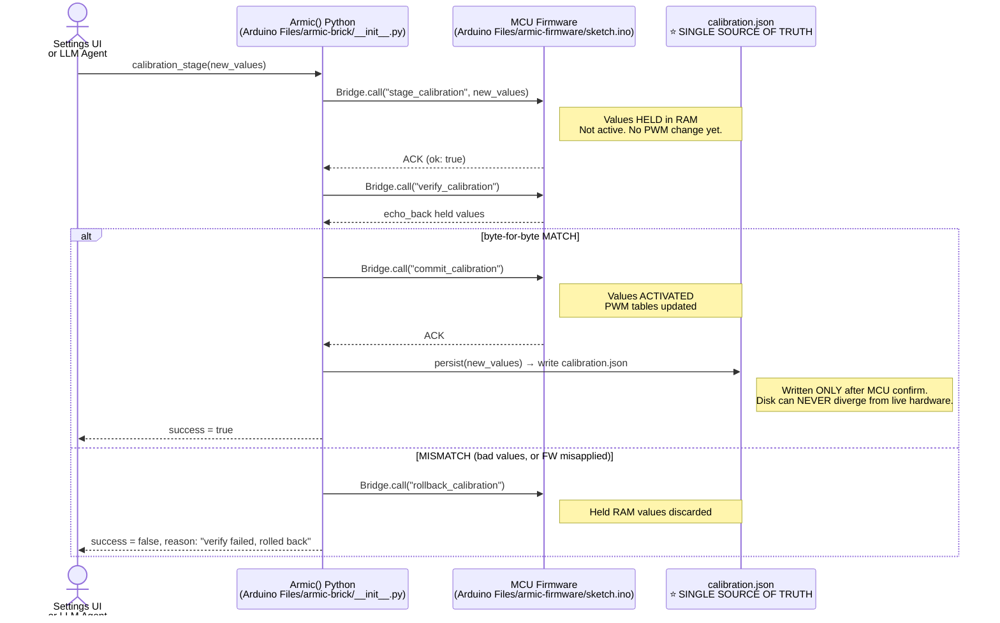
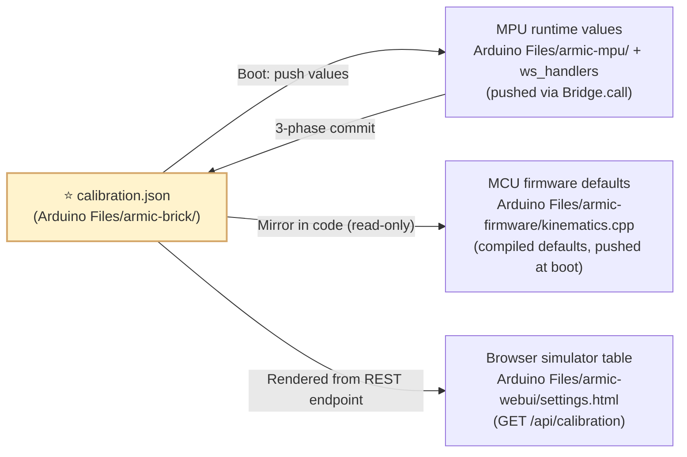

# armic-brick / Shared Calibration + Brick API (SSoT)

> 🚩 **DEPLOYS TO:** UNO Q MPU — mounted shared `/data/armic/` volume shared between ALL 3 App Lab containers (`arduino:python`, `arduino:llm`, `arduino:web_ui`). Declared in `brick_compose.yaml` compose root. This folder boots with the board (not manually started).
> **Critical safety invariant:** `calibration.json` exists exactly ONCE here. `Side/` gitignored backup copy doesn't count. Three consumers MUST never drift.

**Purpose:** Single source of truth for:
1. **`calibration.json`** — one file, three consumers read it:
   - MCU firmware defaults (values are mirrored to `Arduino Files/armic-firmware/kinematics.cpp`)
   - MPU Python backend (`CAL_PATH` in `__init__.py` — pushed to MCU at boot)
   - Browser UI (`/api/calibration` served by web_ui brick — simulator renders the *exact same* table)
2. **Armic() Python class** — the high-level API exposed to:
   - MPU backend code (`Arduino Files/armic-mpu/main.py`, rehab agents, ws_handlers)
   - LLM agent tool-use actions (`Arduino Files/armic-mpu/agent/tools.py`)
   - External scripts / CLI one-offs

## Why this is a separate folder

The old Side structure kept calibration inside `ArduinoApps/armic/bricks/armic/` — which meant three copies could drift: firmware defaults, MPU runtime values, browser UI. Now the filesystem tree **physically enforces** one location:

```
Arduino Files/armic-brick/
├── calibration.json        ← SINGLE SOURCE OF TRUTH. Edit this → all 3 sync at boot.
├── gripper_state.json      ← Last known open/claw % (persisted across boots)
├── __init__.py             ← Armic() class. 500 lines. Exposes:
│   ├── Armic.protocol(name)        # bicep / lateral / elbowflex / htl / orbital / ...
│   ├── Armic.exercise(name, reps=3)# rehab 3-rep + 650ms hold leg
│   ├── Armic.target(x,y,z,pitch)   # cartesian → IK → Planner
│   ├── Armic.joints(b,sh,el,wr)    # joint space
│   ├── Armic.gripper(pct)          # 0 (open) ... 100 (closed), aliased as claw
│   ├── Armic.park()                # stable home [90,90,95,90]
│   ├── Armic.estop()               # broadcast stop, MCU invalidates write cache
│   ├── Armic.dry_run(on_off)       # post-boot gating
│   ├── on_state(callback)          # 20 Hz pose + joint_angles dictionary
│   └── on_telemetry(callback)      # wearable/inference event subscriber
├── brick_config.yaml        # web_ui mount + llm brick defaults
├── brick_compose.yaml       # mosquitto MQTT broker service (binds ../Arduino Files/armic-wearable/mosquitto.conf)
└── README.md
```

## Calibration.json — structure

```json
{
  "pwm": {
    "base":   {"min":100, "max":500, "inverted":false, "ch":0},
    "shoulder":{"min":90, "max":490, "inverted":true,  "ch":1},
    "elbow":  {"min":100, "max":500, "inverted":false, "ch":2},
    "wrist":  {"min":100, "max":500, "inverted":true,  "ch":3},
    "gripper":{"min":236, "max":440, "inverted":false, "ch":4}
  },
  "joint_limits_deg": {
    "base":[0,180], "shoulder":[0,180], "elbow":[90,180], "wrist":[0,180]
  }
}
```

`elbow` min is **90°** by design — that is the hard anti-folded-under guard (soft limit). The MCU applies a second independent clamp after IK, so a bad value here alone cannot fold the arm.

## Safety invariant

`Armic.calibration_commit()` works as a **3-phase roundtrip** — disk is never written unless the MCU verifies it applied the values exactly. This is the reason the three consumers (firmware, MPU, simulator) can never drift out of sync.



### Three consumers, one copy



| Step | Ordering guarantee |
|---|---|
| Boot | MPU reads `calibration.json` → sends to MCU → firmware activates → then simulator reads the same bytes via REST |
| Calibration edit | MCU holds → MCU verify → disk write → simulator reads back → *guaranteed* simulator sees exactly what servos are using |
| Restore defaults | Settings UI → `restore_defaults()` → writes defaults to disk → pushes to MCU → simulator refreshes → one roundtrip, one place to edit defaults |
