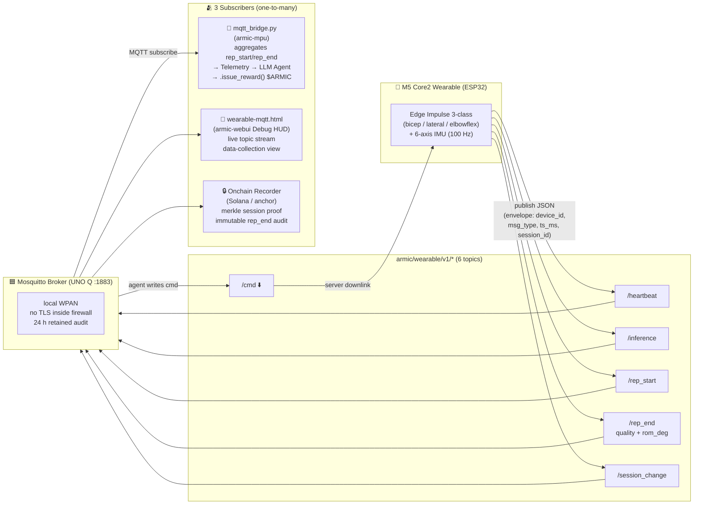

# armic-wearable — MQTT contract + broker config

> 🚩 **Deploy target:** **NOT on the UNO Q.** Files here describe the **wearable / AI Node** side: an external Wi-Fi device that publishes IMU inference to the UNO Q Mosquitto broker on port **1883**.
>
> **M5Stack Core2 is the reference AI Node** (convenient screen + IMU + battery). **Any device** can implement the same contract — see **[armic-ai-node/](../armic-ai-node/)** for the full PlatformIO build kit, Edge Impulse placement, and step-by-step porting guide.

`mosquitto.conf` in this folder is **server-side** broker config on UNO Q MPU (`arduino:python` container via `brick_compose.yaml`).

## Files

| File | Purpose |
|---|---|
| [M5CORE2_AGENT_SPEC.md](M5CORE2_AGENT_SPEC.md) | Topic list, JSON schema, msg_type rules — agent contract |
| [M5CORE2_FIRMWARE_TEMPLATE.ino](M5CORE2_FIRMWARE_TEMPLATE.ino) | Minimal Arduino IDE starter (PubSubClient stub) |
| [mosquitto.conf](mosquitto.conf) | Mosquitto broker config for UNO Q (LAN anonymous, contest/demo only) |
| **[../armic-ai-node/README.md](../armic-ai-node/README.md)** | **Build a production AI Node** (PlatformIO + Edge Impulse reference firmware) |

## Topics (6 total — `armic/wearable/v1/*`)

Canonical schema: [../armic-ai-node/MQTT_CONTRACT.md](../armic-ai-node/MQTT_CONTRACT.md). MPU subscribes to `armic/wearable/v1/#`.

| Topic | msg_type | Notes |
|---|---|---|
| `armic/wearable/v1/heartbeat` | heartbeat | ~5 s keepalive |
| `armic/wearable/v1/inference` | inference | Live EI window output |
| `armic/wearable/v1/rep_start` | rep_start | Rep FSM active |
| `armic/wearable/v1/rep_end` | rep_end | **Authoritative rep count** (+ optional quality/ROM) |
| `armic/wearable/v1/session_change` | session_change | Exercise type changed, reset counter |
| `armic/orchestrator/v1/cmd` | cmd | Downlink to node (subscribe) |

## Topology & subscribers

Every message carries the same 4-field **envelope** (`device_id`, `msg_type`, `ts_ms`, `session_id`) so subscribers can correlate events across reboots. The `/rep_end` topic carries the two facts that close the loop: `quality_score` (did they actually do the work?) and `rom_deg` (how far did they reach?).

## How it wires into the rest of ARMIC

1. **MQTT → Arduino Files/armic-mpu/mqtt_bridge.py** — subscribes to `armic/wearable/v1/#`, aggregates rep_start/rep_end pairs, emits unified rep telemetry.
2. **Agent** (`Arduino Files/armic-mpu/agent/llm_agent.py`) reads the rep events. For every 3-rep set complete above 0.75 quality → `.issue_reward()` → onchain recorder → $ARMIC reward tx.
3. **Debug UI** (`Arduino Files/armic-webui/wearable-mqtt.html`) shows the raw topic stream live, useful during data-collection sessions.
4. **Arduino Files/armic-webui/exercise-hud.js** mirrors rep progress to the browser so the patient sees their rep count in real time.

## Why MQTT and not direct Bridge.call

MQTT on a wearable is robust in ways the Bridge is not:

- The M5 Core2 can roam between APs; it reconnects to mosquitto automatically with no session loss.
- Topics are one-to-many. Adding a second subscriber (analytics, onchain recorder) is a new MQTT client — zero changes to wearable code.
- `rep_end/rom_deg` is audit data. The broker keeps it for 24 h; the onchain recorder picks it up after the fact if it lags.

## Data collection tip for Hackster judges

The @projectarmic Jun 15 tweet (4.4K views) shows the 3-class Edge Impulse model trained. To repeat: `edge-impulse-data-forwarder --device /dev/ttyUSB0 --frequency 100 --sensor 2` → capture 5 minutes per class → MobileNetV2-TD 0.1 → deploy as EON compiled binary.
