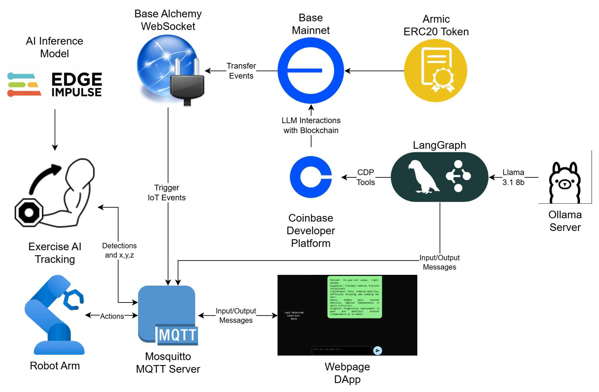
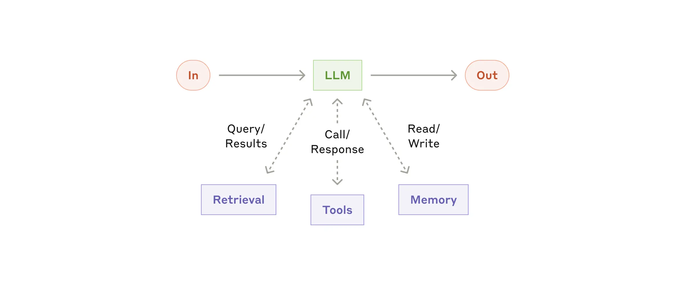
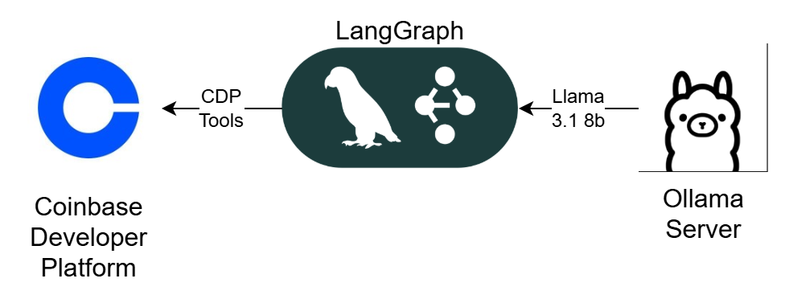
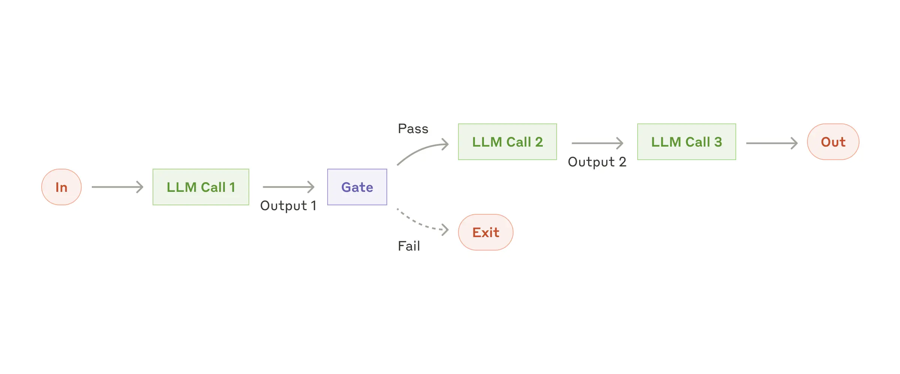
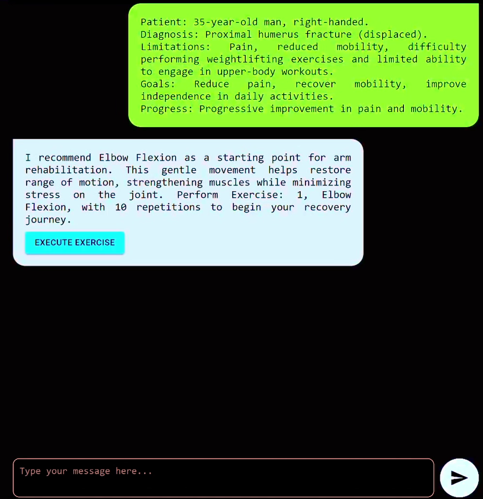
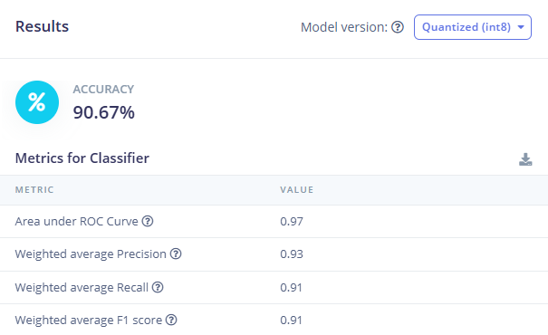
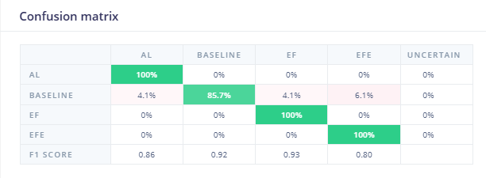
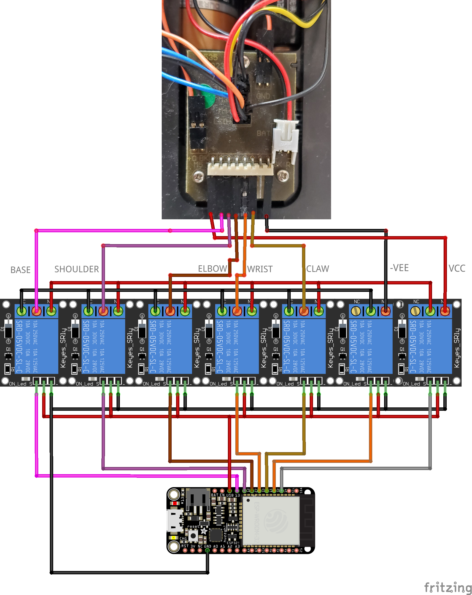
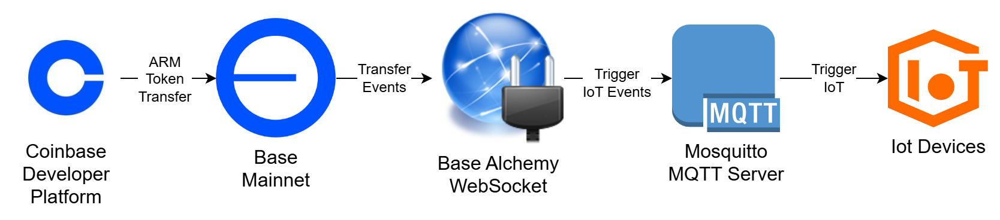
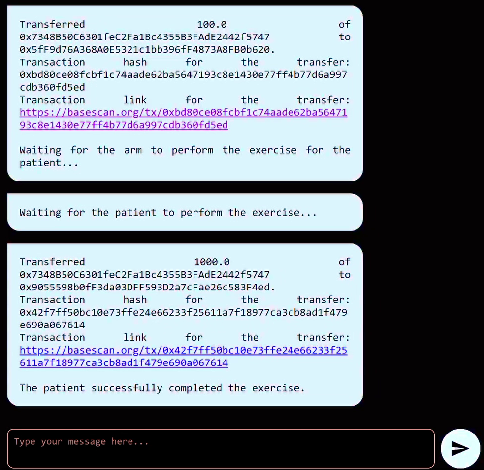

# Armic

ARMIC is a Platform that fuses advanced robotics, Blockchain and AI Agents to transform patient rehabilitation.

# Fast Links:

[**Demo Video**](pending...)
[**Web Page**](https://armic.vercel.app)

**If you're a judge and want to go directly to any category, here are some important links:**

- [**Nethermind**](#nethermind)
- [**Coinbase Developer Platform**](#coinbase-developer-platform)
- [**Base**](#base)

# Materials:

Hardware:
- [**ESP32. 2x**](https://www.adafruit.com/product/3405)
- [**ADXL335. 1x**](https://www.adafruit.com/product/163)
- [**Robotic Arm x1.**](https://www.amazon.com/OWI-Robotic-Soldering-Required-Extensive/dp/B0017OFRCY)
- [**8 Channel DC 5V Relay Module with Optocoupler x1.**](https://www.amazon.com/Elegoo-Module-Optocoupler-Arduino-Raspberry/dp/B07F623PHG)

Software:
- [**Base**](https://base.org/)
- [**CDP Agentkit**](https://python.langchain.com/docs/integrations/tools/cdp_agentkit/)
- [**Remix IDE**](https://remix.ethereum.org/)
- [**Eclipse Mosquitto**](https://github.com/eclipse-mosquitto/mosquitto)
- [**Arduino IDE**](https://www.arduino.cc/en/software)
- [**Ollama**](https://ollama.com/)
- [**LangGraph**](https://www.langchain.com/langgraph)
- [**Edge Impulse**](https://edgeimpulse.com/)
- [**Alchemy**](https://www.alchemy.com/)
- [**NextJS**](https://nextjs.org/)

## System Diagram:

- **Base**: Main Blockchain, thanks to its transaction speed, communication between IoT devices, Web Platform and AI Agents is not compromised.
- **CDP Platform**: All interactions between agents and the blockchain are done through this LangGraph-compatible toolkit.
- **LangGraph**: LangGraph was used to generate the AI ​​Agents pipelines.
- **Base Alchemy**: Alchemy RPC was used as a WebSocket to capture events on the chain.
- **Edge Impulse**: This AI Framework was used to develop the IoT exercise detection AI.
- **Eclipse Mosquitto**: Performs communication between all IoT devices, Web Platform and AI Agents.
  
# Nethermind:

Within our AI Agents system we rely entirely on the diagrams from the Anthropic company's article [1](#references).

## LLM:

Our entire LLM server is based on two main services, which are Ollama and LangGraph.

- Ollama:

   This service allows us to easily run any LLM model without the need for additional configurations. In addition to being able to run the most popular models locally.

- LangGraph:

   This framework allows us to create complex agent systems, as well as manage tool calls and, above all, allowing Agents to control interactions with the blockchain thanks to its AgentKit CDP integration.

## Workflow: Prompt chaining

Within our agent infrastructure we create several agent chains, this in order to activate tools and generate responses for users with natural language, this being a pre-processing stage.

The section of code that best represents this is the first call to the AI ​​Agent, where we first execute a query to the agent to obtain a structure and then pass this response to the second agent which provides the final message to the user.

    exercise = model_with_structure.invoke(setPrompt(my_payload["message"]))
    events = model.invoke(setPrompt2(exercise))
    client.publish("webpage/input", events.content)

In the UI of our website you will be able to see the response that the user receives.

We can see that although the user receives a human-readable response, the LLM server is obtaining variables and information about the exercise that it will execute in a next stage.

The complete code for this fragment is in the following link:

[**LLM SERVER**](./LLM%20Server/Armic_Final.ipynb)

### IoT Devices:

All devices were developed with open source components and libraries, as well as interconnected with the blockchain through Web Sockets RPC and MQTT.

    # EVM Events Setup
    contract = w3.eth.contract(address=contract_address, abi=contract_abi)
    # EVM Sub Topics
    transfer_event_topic = w3.keccak(text=topic_w3)
    filter_params = {
        "address": contract_address,
        "topics": [transfer_event_topic],
    }
    subscription_id = await w3.eth.subscribe("logs", filter_params)

    print(f"Subscribing to transfer events for Contract at {subscription_id}")

The complete code for this snippet is at the following link:

[**LLM SERVER**](./LLM%20Server/Armic_Final.ipynb)

### AI Exercise Tracker:

AI Exercise Tracker Diagram:

The Exercise Tracker was made with an ESP32 board which is a very popular hardware platform for carrying out IoT projects with internet connectivity and in turn the board is running on Edge an AI model that allows the recognition of complex accelerometer patterns to detect exercises, for this the Edge Impulse web platform was used to train and deploy the model.

The resulting model from these trainings was as follows.

Edge Model Accuracy:

Edge Model Confusion Matrix:

While the detection is not perfect, for an AI model like this it is best to avoid underfitting and overfitting.

The full code for this IoT device is as follows.

[**AI EXERCISE TRACKER**](./AI%20Exercise%20Tracker/Armic_EdgeImpulse_MQTT.ino)

### Arm Digital Driver:

Arm Digital Driver Diagram:

The Arm Digital Driver was made in the same way with an ESP32 board and mechanical relays, since our arm works with DC motors.

The complete code of this IoT device is as follows.

[**ARM DRIVER**](./Robotic%20Arm%20Driver/Armic_Driver_MQTT.ino)

# Coinbase Developer Platform:

A crucial part of the project was to be able to easily interact with [**Base**](#base) through the AI ​​Agent, to achieve this we used CDP's AgentKit (Coinbase Developer Platform) compatible with LangGraph Python to achieve this.

The complete server code is at the following link:

[**LLM SERVER**](./LLM%20Server/Armic_Final.ipynb)

### Setup CDP Credentials:

First of all, it is necessary to configure the CDP credentials in our [.env](./LLM%20Server/envexample) file. Once the credentials are configured in this file, you will be able to use the Agent Kit without problems. In our case, it is important to use base-mainnet.

    ...
    CDP_API_KEY_NAME=XXXXX
    CDP_API_KEY_PRIVATE_KEY=XXXXX
    NETWORK_ID=base-mainnet
    ...

### CDP LangChain Setup:

In the case of the CDP Toolkit, it is only necessary to use the following code snippet, which allows us to persistently maintain the agent wallet, in order to avoid losing assets or control over them. In addition, for this particular project, we show how to only import certain tools from the CDP Toolkit in order to improve the agent's responses and avoid confusion with certain prompts.

    # Setup Cdp and Wallet:

    wallet_data_file = "wallet_data.txt"
    wallet_data = None

    # Check if wallet exist

    if os.path.exists(wallet_data_file):
        with open(wallet_data_file) as f:
            wallet_data = f.read()

    # Load the wallet data

    if wallet_data is not None:
        values = {"cdp_wallet_data": wallet_data}

    agentkit = CdpAgentkitWrapper(**values)

    # persist the agent's CDP MPC Wallet Data.
    wallet_data = agentkit.export_wallet()
    with open(wallet_data_file, "w") as f:
        f.write(wallet_data)

    # Import Only Certain Tools     
    cdp_toolkit = CdpToolkit.from_cdp_agentkit_wrapper(agentkit)
    tools_cdp = cdp_toolkit.get_tools()
    import_tools = ["get_balance", "get_wallet_details", "request_faucet_funds"]
    tools = [next(tool for tool in tools_cdp if tool.name == tool_name) for tool_name in import_tools]

### PreFlight CPD Prompt:

AI models can have certain inconsistencies when making calls to tools in the langchain, so it is sometimes necessary to make modifications to them before they are passed to the tool. In this specific case, we made the modification to the transfer tool to ensure that the input was always an integer in the form of **str**.

    # Pre flight modificators
    # https://github.com/coinbase/agentkit/tree/master/python/cdp-agentkit-core/cdp_agentkit_core/actions

    # If You want modify the preflight of any CDP function use this part
    @tool
    def transfer(amount: float, asset_id: str, destination: str, gasless: bool = False) -> str:
        """Transfer a specified amount of an asset to a destination onchain. USDC Transfers on Base Sepolia and Mainnet can be gasless. Always use the gasless option when available."""
        preFlightAmount = amount
        if(amount < 0):
            preFlightAmount = amount*10**18

        fx = next(tool for tool in tools_cdp if tool.name == "transfer")
        result = fx.run({"amount":str(preFlightAmount),"asset_id":asset_id, "destination":destination, "gassless":gasless})
        return result

    mod_tools = [transfer]

### CDP with Ollama Server:

An important part of the project was to make the toolkit work with any Open Source AI Model, since most examples made in the community are done with the OpenAI API. And as an example of this, we used the Open Source model Llama 3.1 for this entire project. In addition, by running the model locally we avoid leaks of sensitive patient data.

    model = ChatOllama(model="llama3.1:8b", keep_alive="1h")
    model_with_tools = model.bind_tools(tools + mod_tools, tool_choice="auto")

# Base:

Base Mainnet was used as the main blockchain for the project, as it is fast and has low fees. It allowed us to deploy our own ERC20 Token and to communicate with IoT Devices. Above all, AgentKit allowed us to quickly and easily carry out all transfers automatically using our AI Agents.

[**Web Page**](https://armic.vercel.app)

NOTE: By not having the physical hardware, you will not be able to see the IoT interactions physically, however you will be able to perform the transfer executions.

Prompt Example:

    Patient: 62-year-old woman, right-handed.
    Diagnosis: Proximal humerus fracture (displaced).
    Limitations: Pain, reduced mobility, difficulty dressing and combing her hair.
    Goals: Reduce pain, recover mobility, improve independence in daily activities.
    Progress: Progressive improvement in pain and mobility. Greater independence at 12 weeks. Patient: 62-year-old woman, right-handed.

### ARM Token:

Our ERC20 Tokens serve as a utility token for patients and IoT devices. By transferring this token to the wallets of the devices, they can perform actions and users can receive rewards.

ARM Token Contract: [**CODE**](./Contract/ArmicToken.sol)
ARM Token Contract Address: https://basescan.org/token/0x7348b50c6301fec2fa1bc4355b3fade2442f5747

### IoT, Agents and Transactions:

A fundamental aspect of the project was to be able to control IoT devices when carrying out transactions on the blockchain and in turn allow AI Agents to carry out these transactions.

1. CDP is activated by the AI ​​Agent.
2. Base Mainnet performs the token transaction from the AgentKit account to the Robotic Arm account.
3. Our Alchemy WebSocket detects the transfer event and sends the information to the MQTT Server.
4. The MQTT Server receives the event information and sends it to the IoT device corresponding to the address.
5. Finally, the IoT device receives the information about the action it must perform.

This event pipeline looks like this on the platform.

# References:

1. https://www.anthropic.com/research/building-effective-agents
