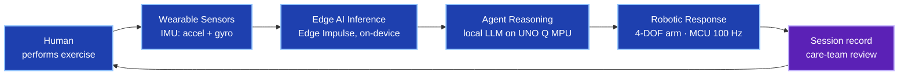
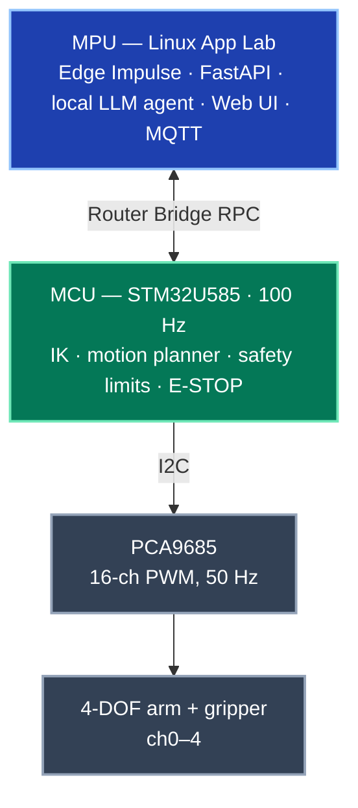
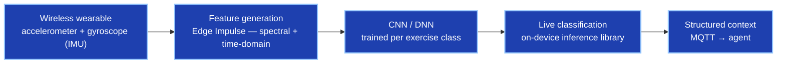

# ARMIC — Teaching Physical AI How Humans Move

<p align="center">
  
</p>

> ⚠️ **Not a medical device.** ARMIC is an experimental research prototype and proof of concept. It is not intended for diagnosis, treatment, or unsupervised clinical rehabilitation. **Maria** is a design vignette, not a real patient or trial result.

**ARMIC** uses **Arduino UNO Q**, wearable motion capture, and Edge AI to turn rehabilitation movements into structured context an AI agent — and eventually a robot — can understand and act on.

**Try it:** [**Online Simulator**](https://onlinesimulator.expo.app) (no board) · [**docs/**](docs/README.md) (math & setup) · [**AGENTS.md**](AGENTS.md) (judge & agent spec)

---

## 30 seconds

Robots are getting more physically capable every year. But before a robot can act well *around* a human, it needs a structured, machine-readable understanding of *how that human moves*. Rehabilitation gives us exactly that: movements that are repetitive, measurable, labeled, and safety-critical.

ARMIC captures a rehab movement, recognizes it **locally** with Edge AI, turns it into structured context, and feeds that context to an agent that reasons about the session. An **Action Layer** that lets a robot respond to that understanding is the next step, not a shipped feature yet.

```
Human Movement
      │
      ▼
Wearable Motion Capture (IMU)
      │
      ▼
Edge AI Exercise Recognition (Edge Impulse, on-device)
      │
      ▼
Structured Rehabilitation Context (MQTT → agent)
      │
      ▼
Agent Reasoning (local LLM on UNO Q)
      │
      ▼
Robotic Response (4-DOF arm today · Action Layer next)
```

**One-minute test:** after reading this README you should be able to say *"ARMIC captures how a person moves, recognizes that movement locally using Edge AI, turns it into context an agent can reason about, and is building toward robotic systems that respond intelligently to the human"* — not just *"it's an AI-controlled robot with a token."*

---

## Demo — what's actually running

| UNO Q edge LLM warming up | Agent ready — 4 tools registered | Wearable MQTT HUD live |
|---|---|---|
|  |  |  |

| Bicep curl — recognized + assisted | Lateral raise | Elbow flexion |
|---|---|---|
|  |  |  |

These are the same firmware and inference paths that run on the bench, not renders. Full protocol set: [docs/demos-and-exercises.md](docs/demos-and-exercises.md). No hardware yet? Try the [**Online Simulator**](https://onlinesimulator.expo.app) — same motion math, in-browser.

---

## Why this matters for Physical AI

Modern Physical AI increasingly learns from human demonstrations and motion data. Before robots can adapt intelligently around humans, they need structured representations of human activity — not raw sensor streams a model has to re-discover meaning in every time.

ARMIC explores this problem through rehabilitation, where movements are structured, repetitive, and measurable. We are **not** claiming general-purpose imitation learning yet. We are building the **capture → recognition → context** pipeline that could support it, with rehabilitation as the first concrete, socially useful application.

**"Edge models handle perception. Agents handle reasoning."**

---

## Rehabilitation: the first application, not the whole story

ARMIC uses rehabilitation as a structured environment for exploring how Physical AI systems can understand human movement. Rehab exercises are repetitive, measurable, labeled, and naturally suited to human-robot interaction — which makes them a good proving ground for the human-motion-intelligence pipeline before it generalizes to other physical-AI use cases.

The problem it targets is real and well documented:

- **60%** of home-PT patients drop out — [NCBI PMC5931387](https://www.ncbi.nlm.nih.gov/pmc/articles/PMC5931387/)
- **70%** of clinicians can't trust self-reported progress — [PubMed 29467038](https://pubmed.ncbi.nlm.nih.gov/29467038/)
- **50%** of post-stroke patients skip prescribed therapy within 90 days — [AHA Stroke 2019](https://www.ahajournals.org/doi/10.1161/STROKEAHA.119.025763)
- **~$700B** annual global cost of stroke recovery — [WHO 2021](https://www.who.int/publications/i/item/9789240064221)

Home rehab is prescribed — bicep curls, lateral raises, elbow flexion, three sets a day — but the clinic visit is brief and the homework is long, unsupervised, and unverifiable. Wearables that just stream raw IMU data to a dashboard don't close that gap; a clinician still has to interpret the noise. ARMIC's bet is that **local recognition + structured context** is what turns a motion sensor into something a clinician (or an agent) can actually reason about.

> 📌 **Maria** (used above and below) is a narrative design vignette we use to keep the problem concrete — not a real patient or clinical outcome.

We are a team of biomedical engineers who have built health IoT on Hackster before — [HealthSphere](https://www.hackster.io/308917/healthsphere-4e0430) (Impact Prize), [AI cardiac detection](https://www.hackster.io/Altaga/ai-detection-of-cardiac-abnormalities-2ead56) (Best Overall), [AgroNordic](https://www.hackster.io/Edoliver/agronordic-69949d) and [AgroLoRa](https://www.hackster.io/Edoliver/agrolora-1c5452) (sustainability prizes). ARMIC is where that thread lands on programmable rehabilitation as a Physical AI testbed.

---

## System architecture


```mermaid
flowchart LR
    H["Human\nperforms exercise"]
    S["Wearable Sensors\nIMU: accel + gyro"]
    E["Edge AI Inference\nEdge Impulse, on-device"]
    A["Agent Reasoning\nlocal LLM on UNO Q MPU"]
    R["Robotic Response\n4-DOF arm · MCU 100 Hz"]
    T["Session record\ncare-team review"]

    H --> S --> E --> A --> R --> T --> H

    classDef step fill:#1e40af,color:#ffffff,stroke:#93c5fd,stroke-width:2px
    classDef record fill:#5b21b6,color:#ffffff,stroke:#c4b5fd,stroke-width:2px
    class H,S,E,A,R step
    class T record
```

Everything from **Wearable Sensors** through **Robotic Response** runs locally on the bench — no cloud round-trip is on the critical path. Full narrative: [docs/architecture.md](docs/architecture.md).

---

## Arduino UNO Q: the central computing platform

ARMIC exists because the UNO Q puts a **brain** and a **real-time hardware layer** on the same board, close to the patient. That split is the whole reason this runs on a UNO Q and not a bare ESP32 or a tethered PC.


```mermaid
flowchart TB
  MPU["MPU — Linux App Lab\nEdge Impulse · FastAPI · local LLM agent · Web UI · MQTT"]
  MCU["MCU — STM32U585 · 100 Hz\nIK · motion planner · safety limits · E-STOP"]
  MPU <-->|Router Bridge RPC| MCU
  MCU -->|I2C| PCA["PCA9685\n16-ch PWM, 50 Hz"]
  PCA --> ARM["4-DOF arm + gripper\nch0–4"]

  classDef mpu fill:#1e40af,color:#ffffff,stroke:#93c5fd,stroke-width:2px
  classDef mcu fill:#047857,color:#ffffff,stroke:#6ee7b7,stroke-width:2px
  classDef hw fill:#334155,color:#ffffff,stroke:#94a3b8,stroke-width:2px
  class MPU mpu
  class MCU mcu
  class PCA,ARM hw
```

| Side | Owns | Never does |
|------|------|------------|
| **MPU** (Linux App Lab) | Local AI / LLM inference · agent reasoning · Edge Impulse · telemetry · Web UI · MQTT · higher-level session logic | Deterministic real-time PWM |
| **MCU** (STM32U585) | Deterministic motion — IK, planner, PWM, joint limits, watchdog, E-STOP at 100 Hz | Waiting on Python, network, or the LLM |

The MPU can crash, reconnect, or take a slow LLM turn without the arm ever losing its real-time safety loop — because that loop lives entirely on the MCU. Detail: [docs/architecture.md](docs/architecture.md) · [docs/control-stack.md](docs/control-stack.md).

---

## Human Motion Intelligence Pipeline

This is the flagship pipeline of the project — the part that generalizes beyond rehab.


```mermaid
flowchart LR
  IMU["Wireless wearable\naccelerometer + gyroscope (IMU)"]
  FEAT["Feature generation\nEdge Impulse — spectral + time-domain"]
  MODEL["CNN / DNN\ntrained per exercise class"]
  LABEL["Live classification\non-device inference library"]
  CTX["Structured context\nMQTT → agent"]

  IMU --> FEAT --> MODEL --> LABEL --> CTX

  classDef step fill:#1e40af,color:#ffffff,stroke:#93c5fd,stroke-width:2px
  class IMU,FEAT,MODEL,LABEL,CTX step
```

Concretely, on the current bench:

1. **Human performs exercise** — bicep curl, lateral raise, or elbow flexion.
2. **IMU captures accelerometer + gyroscope data** on a wireless wearable (M5 Core2 reference; any Wi-Fi device works).
3. **Edge Impulse** builds features and trains a model from that 6-axis IMU stream — 50 Hz sampling, 2000 ms window, 500 ms stride.
4. **CNN/DNN classifies the movement** on-device, in the exported inference library — no cloud call.
5. **Classification becomes structured context** — an MQTT message (`rep_start`, `rep_end`, rep quality, ROM) rather than a raw waveform.
6. **Agent reasons over recent movements** — the local LLM on the UNO Q MPU consumes that context to adapt range-of-motion and give feedback.
7. **Future robotic system adapts** — the Action Layer (next, not yet shipped) would let a robot use this same structured context to respond physically.

Pipeline building blocks: wireless wearable · IMU · accelerometer + gyroscope · Edge Impulse · feature generation · DNN/CNN training · live classification · exported inference library · agent context. Full contract and message schemas: [MQTT_CONTRACT.md](Arduino%20Files/armic-ai-node/MQTT_CONTRACT.md) · build kit: [armic-ai-node/](Arduino%20Files/armic-ai-node/).

---

## Edge AI vs. LLM agent: two different jobs

We are **not** using an LLM for every AI task in this project — that would be too slow and too unpredictable for movement recognition. Perception and reasoning are deliberately split:

| | Specialized embedded model (Edge Impulse CNN/DNN) | LLM / agent (Qwen on UNO Q MPU) |
|---|---|---|
| Job | Fast movement recognition, raw sensor interpretation | Session context, reasoning, feedback |
| Runs | On the wearable, on-device, every inference window | On the UNO Q MPU, between/after reps |
| Output | A label + confidence (`bicep`, `lateral`, `elbowflex`) | Natural-language feedback, exercise recommendations, tool calls |
| Latency needs | Milliseconds, deterministic | Seconds is fine — it reasons between reps, not inside them |

**"Edge models handle perception. Agents handle reasoning."** The LLM never receives raw IMU data and never emits raw joint angles — see the safety section below for why that boundary is enforced in firmware, not in a prompt.

---

## Real-time inference and agent feedback

The rehab agent runs **locally** on the UNO Q MPU via llama.cpp in the `arduino:llm` App Lab container — not a cloud hook, not a deferred upgrade.

**Why on-device?** Privacy (session data stays on the table) · latency (adapts between reps, not between visits) · resilience (router down, arm still safe) · scale (no per-rep cloud bill).

**Why a small model?** The UNO Q MPU is not a data-center server. At ~600 MB (Q4), **Qwen3.5 0.8B** is the largest model that keeps App Lab + MQTT + Web UI + the 20 Hz telemetry bridge alive at once (~85–90% tool-call accuracy in our tests). Larger models we tried (Llama-3.1 8B, Phi-3 Mini, Gemma 2 2B) blew RAM or starved telemetry — matrix in [docs/agent.md](docs/agent.md).

**4-tool brick — structured control, not raw joint angles.** The LLM calls JSON tools; the MCU enforces limits:

- `run_arm_protocol(protocol)` — demo motions only: `home`, `htl`, `snake`, `cobra`, …
- `list_rehab_routes()` — show light / medium / heavy session cards — display only
- `suggest_rehab_intent(description)` — match a route from natural language — display only
- `show_rehab_route(route_id)` — one route card — display only

Adaptation rule from the wearable: three reps at quality ≥ 0.75 widens ROM +5°; three below 0.40 narrows ROM −5° and cuts speed −2°/s. **Rehab motion only starts when the user presses Execute on a route card — never from chat alone.**

Spec: [AGENTS.md](AGENTS.md) · [`agent/tools.py`](Arduino%20Files/armic-mpu/agent/tools.py) · prompt scenarios: [docs/agent.md](docs/agent.md).

<p align="center"></p>

Firmware, backend, and rehab protocols were developed **on the UNO Q itself** via App Lab SSH and [AgentSSH/](AgentSSH/) — 16 MCP tools for laptop → `uno-q.local`.

---

## Action Layer — today's arm, tomorrow's robotic response

**Today:** a standard 4-DOF MG90 hobby arm kit, driven through a PCA9685, with firmware-level FK/IK, S-curves, floor guards, and photo-matched rehab trajectories layered on top. Without that firmware layer, a $50 MG90 kit stalls, jitters, and flips posture under load; with it, motion is smooth, repeatable, and gravity-safe (elbow home at **95°**, not 90°, to avoid gravity hunt).

> This is a research prototype, not a clinical or industrial-grade actuator — treat "industrial-style motion" as a description of the software layering, not a claim about hardware-grade precision.

<p align="center">
  
</p>

**Next (not yet shipped):** an Action Layer that lets the robot use the structured motion context from the pipeline above to respond — assisting, resisting, or adjusting in real time based on what the agent understands about the human's movement, rather than only replaying pre-authored trajectories.

Full stack detail: [docs/demos-and-exercises.md](docs/demos-and-exercises.md#why-this-is-not-a-raw-servo-arm) · [docs/control-stack.md](docs/control-stack.md).

### Demo repertoire — capability + calibration check

| HTL tucked carry | Orbital trace | Cobra strike | Transport pose | Loaded hold |
|---|---|---|---|---|
|  |  |  |  |  |

Each validates a different part of the motion stack (IK, floor guard, brake clamp, idle hold, payload stress). Details: [docs/demos-and-exercises.md](docs/demos-and-exercises.md).

---

## No board? Enter the Online Simulator

<p align="center">
  <a href="https://onlinesimulator.expo.app"></a>
</p>

[**Open Online Simulator →**](https://onlinesimulator.expo.app) — same firmware math as hardware: presets, sliders, rehab routes, HTL, orbital, bicep/lateral/elbowflex. No install, no wiring; phone or laptop. Source: [`OnlineSimulator/`](OnlineSimulator/).

When you're ready for the full closed loop — real servos, edge LLM, MQTT wearable, calibration SSoT — deploy on UNO Q at `http://uno-q.local:7000`.

---

## Hardware / Bill of Materials

**Core arm station: ~$154 USD** (4 GB UNO Q). Add **$36** for the optional M5 Core2 wearable reference. Full line items, power budget, and alternatives: [docs/bom.md](docs/bom.md).

| # | Item | Role |
|---|------|------|
| 1 | **Arduino UNO Q** (4 GB $79 / 2 GB $59) — [Arduino Store](https://store.arduino.cc/products/arduino-uno-q) · [DigiKey](https://www.digikey.com/en/products/detail/arduino-srl/A000099/21279461) | Dual brain: MCU real-time motion + MPU local AI / App Lab |
| 2 | **Arduino App Lab** | Deploys the FastAPI + LLM + MQTT + Web UI containers to the MPU |
| 3 | **12 V · 5 A DC adapter** (5.5×2.1 mm) $12 | MG90 stalls need ≥2 A at 5 V — USB alone can't drive servos under load |
| 4 | **HW-688** buck (9–36 V → 5 V, 5 A) $4 | Stable 5 V rail for logic + servos |
| 5 | **PCA9685** 16-ch PWM + I2C $4 — [Adafruit 815](https://www.adafruit.com/product/815) | ch0–4 = Base · Shoulder · Elbow · Wrist · Gripper |
| 6 | **4-DOF MG90 arm kit** $50 — [Mercado Libre MX](https://listado.mercadolibre.com.mx/kit-brazo-robotico-armado-servo-mg90s) | Physical plant; recalibrate `calibration.json` if you swap kits |
| 7 | **M5Stack Core2** (optional, reference wearable) $36 — [M5 Store](https://shop.m5stack.com/products/m5stack-core2-esp32-iot-development-kit) | IMU + Edge Impulse classifier; any Wi-Fi device can implement the same MQTT contract |
| — | Barrel → screw terminal adapter, Dupont/Qwiic cables, breadboard ~$5 | Wiring |

<p align="center">
  <a href="./Images/Armic_bb.png"></a>
</p>

*Click for full size · source: `Images/Armic.fzz` (Fritzing → Schematic view → Export PNG).*

---

## How to reproduce

**~20 minutes** from wired bench to closed loop. Full checklist: [docs/setup.md](docs/setup.md).

1. **Hardware** — gather the BOM above; recalibrate `calibration.json` if your kit differs.
2. **Wiring** — 12 V → HW-688 → 5 V rail → UNO Q logic + PCA9685 + servos. PCA9685 on I2C at `0x40`, OE pin 17, channels 0–4 = Base/Shoulder/Elbow/Wrist/Gripper. Never put 12 V on UNO Q logic headers. Schematic above.
3. **UNO Q setup** — flash [`armic-firmware/`](Arduino%20Files/armic-firmware/) to the MCU at serial **115200**. Boot should park at home: elbow 95°, claw open.
4. **Arduino App Lab setup** — deploy [`brick_compose.yaml`](Arduino%20Files/armic-brick/brick_compose.yaml) + [`armic-mpu/`](Arduino%20Files/armic-mpu/). Pass condition: 3/3 containers up — FastAPI, local LLM, Web UI on `:7000`, MQTT broker on `:1883`.
5. **Wearable setup** — flash an [AI Node](Arduino%20Files/armic-ai-node/) (M5 Core2 reference, or port the [MQTT contract](Arduino%20Files/armic-ai-node/MQTT_CONTRACT.md) to your own board).
6. **Edge Impulse setup** — train or reuse the 4-class model (`Baseline`, `Bicepcurl`, `Lateralraise`, `Elbowflexion`) at 50 Hz / 2000 ms window / 500 ms stride, export as an Arduino/C++ inference library, flash to the wearable.
7. **Run inference** — open `http://uno-q.local:7000/wearable-mqtt.html`; confirm all 6 MQTT topic badges go green as the wearable publishes.
8. **Run the agent** — open `http://uno-q.local:7000`, commit calibration (stage → verify → disk), press **Enable Motion** to leave `dry_run`.
9. **Test movements** — run `exercise bicep` or execute a route card (light/medium/heavy) and confirm the wearable HUD, agent feedback, and arm motion all agree.

---

## Safety architecture — firmware first, not prompts

Because this touches a human body, safety is enforced in **firmware**, on the MCU — never delegated to the LLM or to prompt instructions.

1. **`dry_run` gate** — motors OFF by default until the UI's **Enable Motion** is pressed.
2. **Watchdog** — ~1500 ms of MPU silence → halt and hold.
3. **Angle + floor limits** — elbow clamped to [90°, 180°] · tip FK Z ≥ ~15 mm.
4. **PWM hard limits** — per-channel calibrated MIN/CENTER/MAX, never exceeded regardless of what the agent requests.
5. **E-STOP** — halts the pipeline and parks at stable home (elbow 95°).

Key invariants: E-STOP home at elbow 95° (not 90° — avoids gravity hunt) · calibration single source of truth in [`calibration.json`](Arduino%20Files/armic-brick/calibration.json) with a 3-phase commit · therapy speed cap 18°/s · the MPU cannot widen PWM beyond [50, 600] or angles beyond [0, 180]° no matter what the agent outputs.

Detail: [docs/control-stack.md](docs/control-stack.md) · [AGENTS.md](AGENTS.md) §3.

---

## Current capabilities

**Working now**

- ✓ Arduino UNO Q local AI (MPU) + real-time motion (MCU) coordination
- ✓ llama.cpp / Qwen3.5 0.8B running fully on-device
- ✓ Wireless motion sensing — accelerometer + gyroscope acquisition
- ✓ Edge Impulse training and on-device exercise classification
- ✓ Real-time embedded inference (no cloud round-trip)
- ✓ MQTT pipeline carrying structured rep/session context
- ✓ Agent consuming recent movement context (rep quality, ROM streaks)
- ✓ Feedback, exercise suggestion, and rest suggestion from the agent
- ✓ 4-DOF arm executing photo-matched rehab and demo trajectories
- ✓ Firmware-enforced safety stack (dry_run, watchdog, limits, E-STOP)

**Next**

- ○ Robotic Action Layer — robot response driven by motion understanding, not just pre-authored trajectories
- ○ Sensor-driven robotic behavior beyond fixed protocols
- ○ Richer movement-quality metrics (beyond rep count + coarse quality score)
- ○ Additional rehabilitation movements and exercise classes
- ○ Adaptive assistance (resistance/assistance that responds mid-rep)
- ○ Broader human-motion datasets beyond the current 3-exercise set

---

## Roadmap

| When | Milestone |
|------|-----------|
| Hackster submission | Docs, BOM, schematics, code, demo reel, safety gates |
| Near term | UNO Q `dry_run` → live motion gate hardening |
| Q4 2026 | Clinical pilot vignette (3 patients, 4 weeks, with ethics review) — ROM / dropout / quality metrics |
| Q1 2027 | Explore onchain session-proof pilot (audit infrastructure, not pay-for-reps) |
| Q2 2027 | Open-hardware kit v2 — PCB, tuned linkages, broader movement set, early Action Layer work |

Contest context: [docs/project.md](docs/project.md).

---

## Prior work / hardware reuse — the Aether disclosure

ARMIC is developed by the same team behind **Aether**, which placed 4th in the Agentic track at Sui Overflow 2026. The physical robotic arm on this bench is reused as a general-purpose research testbed — not hidden, and worth being explicit about:

| | Aether | ARMIC |
|---|---|---|
| Explored | Agent → authorization/payment → machine execution | Human → motion capture → embedded inference → agent understanding → adaptive rehabilitation interaction |

The UNO Q integration, rehabilitation sensing pipeline, exercise-recognition models, motion-capture workflow, and rehabilitation agent logic in this repository are **ARMIC-specific work**, built and demoed on this bench. Reusing the arm as a testbed is a resourcing decision, not a claim that this is new hardware — we'd rather disclose that than have it discovered.

---

## $ARMIC — onchain funding layer (short)

ARMIC also experiments with an onchain funding/coordination layer for future robotics and x402-style applications. **This layer is independent of the rehabilitation perception and control pipeline** described above — nothing in the therapy loop reads from or depends on it.

- **Network:** Solana SPL · **Contract:** `DcTVUogWykX1JeBmTq48Fzj2Lc3Y7zwHQS1CyZ9SHnXf`
- **Freeze authority:** removed. **Mint authority:** active — intentionally retained while ARMIC is experimental, in case future issuance is needed for robotics/x402 utility.
- **Creator fees:** 100% route to a dedicated rehab-hardware fund, not to rep bounties or clinical incentives.
- Not a patient reward, not wired into rep-quality adaptation, not a substitute for clinical evidence.

Full history (including a prior LP wallet compromise that shaped this contract's custody design), tokenomics, and onchain verification links: **[docs/TOKEN_TRANSPARENCY.md](docs/TOKEN_TRANSPARENCY.md)**.

---

## Medical & research disclaimer

**ARMIC is an experimental research prototype and is not a medical device.** It is not intended for diagnosis, treatment, or unsupervised clinical rehabilitation. Nothing in this repository constitutes medical advice, a validated clinical outcome, or a substitute for a licensed clinician. **Maria** is a narrative design vignette used to make the problem concrete — not a real patient, and not real trial data. Any language describing future clinical use refers to a proposed, ethics-reviewed pilot, not a current capability.

---

## Credits

Three biomedical engineers · four prior Hackster wins · Maker Faire Rome alumni.

- **Victor Alonso Altamirano Izquierdo** ([Altaga](https://www.hackster.io/Altaga)) — Best Overall AI cardiac · Helium Creative AgroLoRa · Impact Prize HealthSphere
- **Luis Eduardo Arevalo Oliver** ([EdOliver](https://www.hackster.io/Edoliver)) — AgroNordic 3rd · AgroLoRa Helium winner
- **Alejandro Sanchez Gutierrez** ([Alejandro_S_G](https://www.hackster.io/Alejandro_S_G)) — Spresense × Edge Impulse facemask prize

---

## Code

- [`Arduino Files/armic-firmware/`](Arduino%20Files/armic-firmware/) — MCU sketch: Bridge RPC, 100 Hz loop, IK, E-STOP
- [`Arduino Files/armic-mpu/`](Arduino%20Files/armic-mpu/) — FastAPI · WebSocket · local LLM agent · MQTT bridge
- [`Arduino Files/armic-webui/`](Arduino%20Files/armic-webui/) — Static browser UI · Three.js twin · calibration gate
- [`Arduino Files/armic-brick/`](Arduino%20Files/armic-brick/) — `calibration.json` SSoT · compose root
- [`Arduino Files/armic-ai-node/`](Arduino%20Files/armic-ai-node/) — Wearable MQTT contract · Edge Impulse reference
- [`OnlineSimulator/`](OnlineSimulator/) — Hosted browser twin
- [`AgentSSH/`](AgentSSH/) — MCP SSH tools · laptop agent → UNO Q
- [`AI Skills/`](AI%20Skills/) — 31 agent skills + 3 rules

---

## Deep dive — for judges who want the math

Narrative lives here. Equations and layer diagrams live in **[docs/](docs/)** (+ [docs/README.md](docs/README.md) hub).

Architecture & dual brain → [architecture.md](docs/architecture.md) · FK/IK & PWM → [kinematics.md](docs/kinematics.md) · S-curves → [motion-planning.md](docs/motion-planning.md) · Torque → [dynamics.md](docs/dynamics.md) · Safety → [control-stack.md](docs/control-stack.md) · BOM & setup → [bom.md](docs/bom.md) · [hardware.md](docs/hardware.md) · [setup.md](docs/setup.md) · Exercises & serial → [exercises.md](docs/exercises.md) · [htl-reference.md](docs/htl-reference.md) · [serial-protocol.md](docs/serial-protocol.md) · Agent & UI → [agent.md](docs/agent.md) · [interface.md](docs/interface.md) · Token → [TOKEN_TRANSPARENCY.md](docs/TOKEN_TRANSPARENCY.md)

---

> **ARMIC — an experimental Physical AI research platform, exploring human-motion understanding through Arduino UNO Q, Edge AI, motion capture, and rehabilitation.**
> Rehabilitation is the first application, not the whole story. We start with one arm, one UNO Q, one movement pipeline at a time.

---

*Submitted to the Hackster "Invent the Future with Arduino UNO Q and App Lab" contest — September 2026. Robotics (primary) · Social Impact (secondary).*
