# ARMIC — Autonomous Rehabilitation on Arduino UNO Q

  

> ⚠️ **Not a medical device.** Proof-of-concept demo only — not clinically reviewed. Do not use on patients or as medical advice. **Maria** is a design vignette, not a real patient or trial result.

**ARMIC** is a 4-DOF rehabilitation robotic arm with an edge AI agent, built on the **Arduino UNO Q**. A patient wears a small IMU band. An on-device classifier scores their form. A local LLM personalizes range-of-motion between sets. The arm assists through photo-matched trajectories — and every verified rep becomes progress a care team can actually trust.

**Try it:** [**Online Simulator**](https://onlinesimulator.expo.app) (no board) · [**docs/**](docs/README.md) (math & setup) · [**AGENTS.md**](AGENTS.md) (judge & agent spec)

---

## Story

### Introduction

Our heart beats **115,200 times a day**. It is a machine that does not stop. Yet millions of people recovering from stroke, injury, or surgery face a quieter problem: **the arm that should move again often has no coach in the room when it matters.**

Rehabilitation is prescribed at home — bicep curls, lateral raises, elbow flexion — **three sets a day for weeks**. The clinic visit is brief. The homework is long. And between those two worlds, something breaks: form uncertainty, dropout, and progress that nobody can verify.

We are biomedical engineers who have spent years building health IoT on Hackster — [HealthSphere](https://www.hackster.io/308917/healthsphere-4e0430) (Hackster Impact Prize), [AI cardiac detection](https://www.hackster.io/Altaga/ai-detection-of-cardiac-abnormalities-2ead56) (Best Overall), [AgroNordic](https://www.hackster.io/Edoliver/agronordic-69949d) and [AgroLoRa](https://www.hackster.io/Edoliver/agrolora-1c5452) (sustainability prizes). ARMIC is where that thread lands on **programmable rehabilitation**: not a $50k lab robot, but a **UNO Q on a kitchen table** with a hobby arm kit, a wearable, and software that behaves like industrial motion control.

| Arduino UNO Q on the bench | 4-DOF arm — real hardware |
|---|---|
|  |  |

*Actual build photos — not a render.*

This is not medical advice. It is a **proof-of-concept** for the Arduino UNO Q contest — but we built it the way we build contest winners: real firmware, real closed loop, real bench time.

### Problem

> 📌 **Narrative example, not a real patient.**

Maria had a stroke last March. Her doctor prescribed **12 weeks** of daily home PT — bicep curls, lateral raises, and elbow flexion, **3 sets per day**. Week 1: perfect attendance. Week 3: form uncertainty, clinic booked **10 days** out. Week 5: stopped tracking — no feedback loop. Week 8: inconclusive follow-up. *"Just keep going."*

  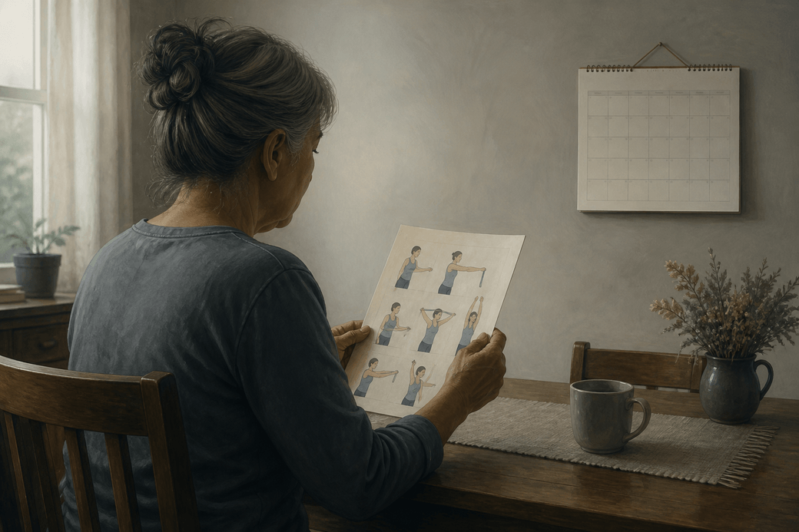

*Illustration — **Maria** design vignette only (older woman). Not a real patient or clinical photograph.*

Maria is not an edge case. The gap is systemic:

- **60%** of home-PT patients drop out — [NCBI PMC5931387](https://www.ncbi.nlm.nih.gov/pmc/articles/PMC5931387/)
- **70%** of clinicians can't trust self-reported progress — [PubMed 29467038](https://pubmed.ncbi.nlm.nih.gov/29467038/)
- **50%** of post-stroke patients skip prescribed therapy within 90 days — [AHA Stroke 2019](https://www.ahajournals.org/doi/10.1161/STROKEAHA.119.025763)
- **~$700B** annual global cost of stroke recovery — [WHO 2021](https://www.who.int/publications/i/item/9789240064221)

**Rehabilitation is broken** — manual, inconsistent, untrackable, and inaccessible without private in-home care.

The wearables that exist today flood clinicians with raw IMU streams. Think of the internet before search engines: **too much signal, no interpretation.** A solution must aggregate reps, score quality, adapt ROM, and log a session a human can read in thirty seconds.

ARMIC exists for Maria. And for millions more like her.

### Solution

Our solution is a **closed-loop rehab station** that runs entirely on one board:

1. **Patient** performs a prescribed exercise at home.
2. **Wearable** (M5 Core2 class AI Node, or any Wi-Fi device) runs Edge Impulse and publishes rep boundaries over MQTT.
3. **UNO Q MPU** runs FastAPI, a **Qwen 0.8B** agent, and a 20 Hz WebSocket bridge — it widens or narrows ROM based on rep quality streaks.
4. **UNO Q MCU** runs **100 Hz** inverse kinematics, S-curves, floor guards, and E-STOP — motion never depends on Python staying alive.
5. **4-DOF arm** assists through the same trajectories a PT would sketch: hold at peak, return to **elbow 95°** home (not 90° — gravity hunt is real on MG90s).

**Five steps. Zero clinician in the room. One hundred percent measurable.**

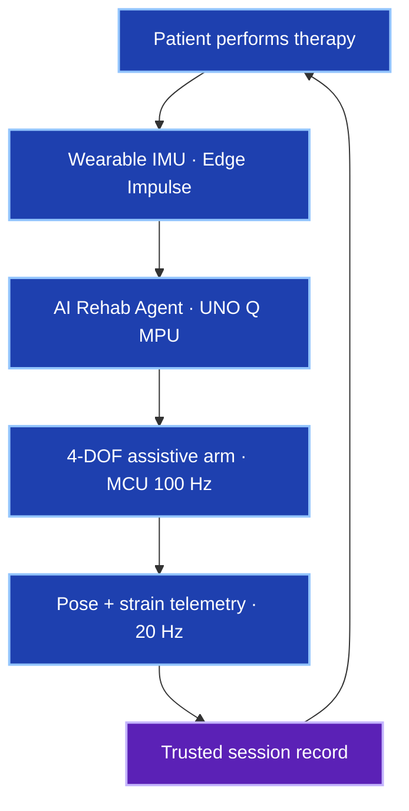
```mermaid
flowchart TD
    A["Patient performs therapy"]
    B["Wearable IMU · Edge Impulse"]
    C["AI Rehab Agent · UNO Q MPU"]
    D["4-DOF assistive arm · MCU 100 Hz"]
    E["Pose + strain telemetry · 20 Hz"]
    F["Trusted session record"]

    A --> B --> C --> D --> E --> F --> A

    classDef step fill:#1e40af,color:#ffffff,stroke:#93c5fd,stroke-width:2px
    classDef record fill:#5b21b6,color:#ffffff,stroke:#c4b5fd,stroke-width:2px
    class A,B,C,D,E step
    class F record
```

The arm is not waving blindly. **Three smooth reps · hold at peak · return to elbow 95°.** Same shape a PT would prescribe and document. Three strong reps widen ROM **+5°**; fatigue streaks narrow **−5°** and slow the cap. Telemetry lands in session history at **20 Hz**.

### Connection Diagram

ARMIC is a **dual-brain** system. That is not marketing — it is the only architecture that works on a UNO Q. Every part is off-the-shelf; no custom machining; target **~20 minutes** for a workshop build. Power runs **12 V brick → HW-688 buck → 5 V rail** to UNO Q logic, the PCA9685, and five MG90-class servos — USB cannot drive servos under load. The PCA9685 sits on **I2C (Wire2)** at address `0x40`, **OE pin 17**, channels **0 Base · 1 Shoulder · 2 Elbow · 3 Wrist · 4 Gripper**.

- **MCU (STM32U585)** owns motion — IK, planner, PWM, limits, protocols, E-STOP at **100 Hz**.
- **MPU (Linux App Lab)** owns commands, telemetry, LLM, and MQTT — not real-time PWM.
- **Wearable / AI Node** publishes `armic/wearable/v1/*`; **`rep_end`** is authoritative for rep count.
- **Browser** is UI only — calibration gate, route cards, agent chat.

If Python dies, firmware watchdog + hold behavior must keep the arm safe. We enforced that in code, not in prompt text.

  

*Click for full size · source: `Images/Armic.fzz` (Fritzing → Schematic view → Export PNG).*

| The UNO Q bench — dual-brain rehab host | The 4-DOF arm at bicep pose |
|---|---|
|  |  |

| Power chain: HW-688 + PCA9685 |
|---|
|  |

---

## Things used in this project

**Core arm station: ~$154 USD** (4 GB UNO Q). Add **$36** for the optional M5 Core2 wearable reference. Full line-item costs, power budget, and alternatives: [docs/bom.md](docs/bom.md).

- **Arduino UNO Q** (4 GB **$79**; 2 GB **$59**) — [Arduino Store](https://store.arduino.cc/products/arduino-uno-q) · [DigiKey](https://www.digikey.com/en/products/detail/arduino-srl/A000099/21279461) — dual brain: MCU motion + MPU App Lab
- **12 V · 5 A DC adapter** (5.5 × 2.1 mm) **$12** — [Amazon](https://www.amazon.com/s?k=12V+5A+DC+power+supply+5.5mm+x+2.1mm) · [Adafruit 1526](https://www.adafruit.com/product/1526) — MG90 stalls need ≥2 A at 5 V
- **Barrel → screw terminal adapter** **$2** — clean 12 V bus without soldering
- **HW-688** buck (9–36 V → 5 V 5 A) **$4** — stable 5 V for logic + servos
- **PCA9685** 16-ch PWM + I2C **$4** — [Adafruit 815](https://www.adafruit.com/product/815) — ch0–4 = Base · Shoulder · Elbow · Wrist · Gripper
- **4-DOF MG90 arm kit** **$50** — [Mercado Libre MX](https://listado.mercadolibre.com.mx/kit-brazo-robotico-armado-servo-mg90s) · [Amazon](https://www.amazon.com/s?k=4+dof+robot+arm+mg90s+kit) — recalibrate `calibration.json` if you swap kits
- **M5Stack Core2** (optional) **$36** — [M5 Store](https://shop.m5stack.com/products/m5stack-core2-esp32-iot-development-kit) — reference wearable; any Wi-Fi device can use the MQTT contract
- Dupont / Qwiic cables, breadboard **~$3**

| Reference wearable — M5 Core2 on glove | Edge Impulse → MQTT `armic/wearable/v1/*` |
|---|---|
|  | Any Wi-Fi device can implement the same contract. Build kit: [armic-ai-node/](Arduino%20Files/armic-ai-node/). HUD lives on the board at **`/wearable-mqtt.html`** (step 6 below). |

---

## Step-by-step build

**~20 minutes** from wired bench to closed loop. Each step below matches what you should see on the bench — full checklist in [docs/setup.md](docs/setup.md).

| **1 · Wire the bench** | **2 · Flash firmware** | **3 · Deploy App Lab** |
|---|---|---|
| [Connection schematic](#connection-diagram) · **12 V → HW-688 → 5 V** · PCA9685 ch **0–4**. Logic stays on **5 V** — never 12 V on UNO Q headers. | Flash [`armic-firmware/`](Arduino%20Files/armic-firmware/). Serial **115200**. Boot should park at home: elbow **95°**, claw open. | Deploy [`brick_compose.yaml`](Arduino%20Files/armic-brick/brick_compose.yaml) + [`armic-mpu/`](Arduino%20Files/armic-mpu/). **Pass:** 3/3 containers UP — FastAPI, Qwen, Web UI **:7000**, MQTT **:1883**. |
|  |  |  |

| **4 · Calibrate** | **5 · First exercise** | **6 · Wearable HUD** |
|---|---|---|
| Open **`http://uno-q.local:7000`**. Commit [`calibration.json`](Arduino%20Files/armic-brick/calibration.json) — stage → verify → disk. Press **Enable Motion** to leave `dry_run`. | `exercise bicep` or **Execute** on a route card (**light** / **medium** / **heavy**) — not chat. | Connect wearable ([**Things used**](#things-used-in-this-project) ↑) · open **`/wearable-mqtt.html`** · count **`rep_end`**, not inference. |
|  | 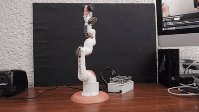 |  |

---

## Rehabilitation in motion — the 3 protocols

**3 upper-limb exercises** · **3 reps each** · cubic ease · hold at peak · gravity-safe home (elbow **95°**).

| Bicep curl | Lateral raise | Elbow flexion |
|---|---|---|
|  | 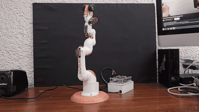 | 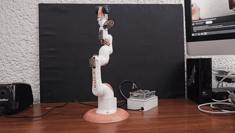 |

- **`bicep`** — Bicep curl. Locked shoulder + elbow · wrist **180° → 25°**.
- **`lateral`** — Lateral raise. Locked shoulder + elbow · wrist tip-out → tip-down.
- **`elbowflex`** — Elbow flexion. Shoulder horizontal · elbow **95° → 180°**.

**Rehab routes** (multi-exercise sessions): `light` (3 reps each), `medium` (6), `heavy` (6) — bicep → lateral → elbowflex. Waypoints: [docs/exercises.md](docs/exercises.md). Live twin: [**Online Simulator**](https://onlinesimulator.expo.app).

### Demo repertoire — your post-wiring self-check

Five demo protocols double as a **calibration check**. If all land without scrape, flip, or stall, `calibration.json` matches your kit.

| HTL tucked carry | Orbital trace | Cobra strike | Transport pose | Loaded hold |
|---|---|---|---|---|
| 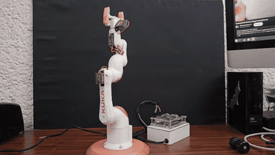 | 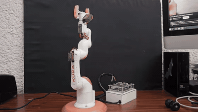 | 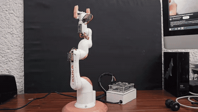 | 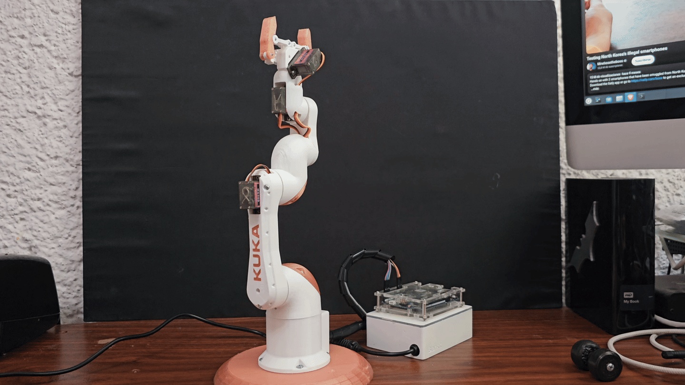 | 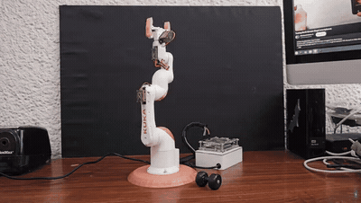 |

**Orbital trace** validates IK + wrist calibration. **HTL tucked carry** validates floor guard (tip Z ≥ 15 mm). **Cobra strike** validates delta snap / brake clamp. **Transport pose** holds 60 s with no hunt. **Loaded dumbbell hold** checks manipulability ≥ 0.4.

Details: [docs/demos-and-exercises.md](docs/demos-and-exercises.md).

---

## Meet the arm: $40 servos, industrial-grade software

**MG90 hobby servos** on a standard 4-DOF kit — nothing custom machined. ARMIC adds FK/IK, S-curves, floor guards, HTL carries, and photo-matched rehab trajectories so a **~$50 kit moves like lab hardware**.

  

Without ARMIC you get stall, jitter, and posture flip on ~$50 hardware. With ARMIC on UNO Q you get FK/IK, micro-step planning, and an **18°/s** therapy cap — **~$40k-class motion behavior** from firmware alone.

Full **10-layer software stack**: [docs/demos-and-exercises.md](docs/demos-and-exercises.md#why-this-is-not-a-raw-servo-arm) · [control-stack.md](docs/control-stack.md).

---

## The agent inside — Qwen3.5 0.8B on the UNO Q MPU

**Edge-first AI.** Qwen runs **locally** on the UNO Q via llama.cpp in the `arduino:llm` container. Not a cloud hook. Not a deferred upgrade.

| Warming up (~8 s boot) | Ready — 4 tools registered |
|---|---|
|  |  |

**Why on-device?** Privacy — session data stays on the table. Latency — adapts between reps. Resilience — router down, arm still safe. Scale — no per-rep cloud API bill.

**Why Qwen 0.8B?** The UNO Q is not a $5,000 server. At **~600 MB** Q4, Qwen3.5 0.8B is the largest model that keeps App Lab + MQTT + Web UI + 20 Hz bridge alive (~85–90% tool-call accuracy). Llama 8B, Phi-3, and Gemma 2 blow RAM or starve telemetry — we tested the matrix in [docs/agent.md](docs/agent.md).

### 4-tool brick — structured control, not raw joint angles

The LLM **never** emits joint targets. It calls JSON tools; the MCU enforces limits.

- **`run_arm_protocol`** (`protocol`) — demo motions only: `home`, `htl`, `snake`, `cobra`, …
- **`list_rehab_routes`** — show light / medium / heavy cards — **display only**
- **`suggest_rehab_intent`** (`description`) — match route from NL — **display only**
- **`show_rehab_route`** (`route_id`) — one route card — **display only**

Adaptation from the wearable: three reps at quality **≥ 0.75** widens ROM **+5°**; three below **0.40** narrows **−5°** and cuts speed **−2°/s**. Rehab motion starts only when the user presses **Execute** on a route card — never from chat alone.

Spec: [`AGENTS.md`](AGENTS.md) · [`agent/tools.py`](Arduino%20Files/armic-mpu/agent/tools.py). Prompt scenarios: [docs/agent.md](docs/agent.md).

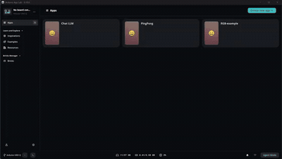

Firmware, backend, and rehab protocols were developed **on the UNO Q** via App Lab SSH and [AgentSSH/](AgentSSH/) — 16 MCP tools for laptop → `uno-q.local`. Safety lives in **firmware**, not prompts.

---

## No board? No problem — enter the Online Simulator

  

[**Open Online Simulator →**](https://onlinesimulator.expo.app) — same firmware math as hardware: presets, sliders, rehab routes, HTL, orbital, bicep/lateral/elbowflex. No install, no wiring; phone or laptop. Source: [`OnlineSimulator/`](OnlineSimulator/).

When you are ready for the full closed loop — real servos, edge LLM, MQTT wearable, calibration SSoT — deploy on UNO Q at `http://uno-q.local:7000`.

---

## Safety — firmware first, not prompts

Five layers enforced on the MCU. We did not delegate this to the LLM.

1. **dry_run gate** — motors OFF by default until UI **Enable Motion**
2. **Watchdog** — ~1500 ms MPU silence → halt and hold
3. **Angle + floor** — elbow **[90°, 180°]** · tip FK **Z ≥ ~15 mm**
4. **PWM hard limits** — per-channel calibrated MIN / CENTER / MAX
5. **E-STOP** — halt pipeline · park stable home · elbow **95°**

Key invariants: E-STOP home at elbow **95°** (not 90° — no gravity hunt). Calibration SSoT in [`calibration.json`](Arduino%20Files/armic-brick/calibration.json) with 3-phase commit. Therapy speed cap **18°/s**. MPU cannot widen PWM beyond **[50, 600]** or angles beyond **[0, 180]°**.

Detail: [control-stack.md](docs/control-stack.md) · [AGENTS.md](AGENTS.md) §3.

---

## Our Epic DEMO

*Replace this section with your contest video embed when published.*

Until then: run **exercise bicep** with the wearable HUD green, or open the [**Online Simulator**](https://onlinesimulator.expo.app) and execute a **light** route card. The GIFs in the protocol section above are recorded from the same motion planner that runs on hardware.

---

## Commentary and Future Rollout

Because of the nature of healthcare information, **security and safety are not optional** — they are the product. The UNO Q gave us an MCU that can hold real-time motion while the MPU runs containers. That split is why this project exists on Arduino and not on a bare ESP32.

**What we proved on the bench:**

- A **$154** station can run closed-loop rehab with on-device LLM and MQTT wearable adaptation.
- **MG90 kits** can move with lab-grade trajectories when firmware owns IK and limits.
- **Agents** can control hardware through a **4-tool brick** without emitting dangerous joint angles.

**Proposed improvements:** Hackster submission (docs, BOM, Fritzing, code, demo video) → hardened `dry_run` → live motion gate → clinical pilot vignette (Q4 2026, with ethics review) → open-hardware kit v2 with PCB and tuned linkages (Q2 2027).

Contest context: [docs/project.md](docs/project.md).

---

## Why we launched $ARMIC — making the project real

People ask: *"Why onchain? Why a token? This is a rehab robot."*

Fair question. The **product** is the UNO Q station — edge agent, 5-layer safety, wearable closed loop, calibration SSoT. **$ARMIC** is a separate **project-funding and launch layer**. It funds the build; it is **not** the therapy loop and **not** a patient reward.

**$ARMIC** exists to put more benches in the world: UNO Q boards, arm kits, wearables, and pilot time. Creator fees route **100%** to a rehab hardware fund — not to rep bounties or clinical incentives.

### The wallet we lost — why custody changed

ARMIC did not start with a clean ledger.

On a **prior token launch**, the **hot wallet tied to the LP** was **hacked**. That wallet was how we were supposed to **collect creator commissions** — the buy/sell fees on every trade that were meant to fund hardware, kits, and bench time. Not a theoretical risk. The key that controlled those fee flows was compromised, and we **lost the ability to capture that commission stream**.

Every swap that should have been reinvesting into the build went somewhere else. Block-explorer refreshes at 3 a.m. A community still watching. Hardware bills still on the calendar — but the **fee rail** that was supposed to pay them was gone.

We reported it. We chased traces. We could not rewind the LP fee wallet.

That failure is the tragic part of this story — and it is why **$ARMIC** is structured differently from the first attempt:

- The **LP / fee wallet is not a single hot key on a dev laptop** — **multisig** and custody hardening came **before** this launch.
- **Mint and freeze authority disabled** on the current contract — no midnight supply surprise.
- **100% of creator fees** on buys and sells routed to a dedicated **rehab hardware fund** wallet with rules we set **before** liquidity mattered.
- **No patient rep rewards** wired into the therapy loop — ROM adaptation runs on quality alone; the token funds **builds**, not clinical incentives we are not qualified to run yet.

The parallel to firmware is deliberate. ARMIC parks at **elbow 95°** on E-STOP because gravity hunt on a MG90 is dangerous. We learned the same lesson on the LP: **when the fee wallet breaks, the project starves.**

This Easya launch (**2026-08-30**) is our second public attempt to fund rehabilitation hardware — with the **commission wallet** treated as seriously as the robot itself.

### What the token proves (that a GitHub repo alone cannot)

1. **We can launch** — liquidity, graduated fees, transparent routing to hardware for more stations and kits.
2. **We can build audience** — [@projectarmic](https://x.com/projectarmic) and demo traction for clinic and partner conversations.
3. **We failed once and changed** — the **LP hot wallet hack** above is why multisig, disabled mint/freeze, and locked fee routing exist on **this** contract.

### What it is not

- **Not** a rep-quality reward for patients completing therapy.
- **Not** a substitute for clinical evidence, IRB review, or regulated care.
- **Not** wired into on-device adaptation — ROM widen/narrow runs on rep quality alone ([agent.md](docs/agent.md)).

Session telemetry (`rep_end`, WebSocket history) is for **measurement and care-team review**. Any future onchain session proofs would be **audit infrastructure**, not pay-for-reps.

### Token facts

- **Network:** Solana SPL
- **Contract:** `DcTVUogWykX1JeBmTq48Fzj2Lc3Y7zwHQS1CyZ9SHnXf`
- **Mint / freeze authority:** disabled
- **Creator fees:** 100% → rehab hardware fund wallet
- **Launch:** Easya.io Kickstart · **2026-08-30**

Merkle-rooted session records for insurer-grade evidence remain **planned** — separate from token economics and patient-facing incentives.

Full policy and rationale: [docs/project-token.md](docs/project-token.md).

---

## Credits

Three biomedical engineers · four prior Hackster wins · Maker Faire Rome alumni.

- **Victor Alonso Altamirano Izquierdo** ([Altaga](https://www.hackster.io/Altaga)) — Best Overall AI cardiac · Helium Creative AgroLoRa · Impact Prize HealthSphere
- **Luis Eduardo Arevalo Oliver** ([EdOliver](https://www.hackster.io/Edoliver)) — AgroNordic 3rd · AgroLoRa Helium winner
- **Alejandro Sanchez Gutierrez** ([Alejandro_S_G](https://www.hackster.io/Alejandro_S_G)) — Spresense × Edge Impulse facemask prize

---

## Code

- [`Arduino Files/armic-firmware/`](Arduino%20Files/armic-firmware/) — MCU sketch: Bridge RPC, 100 Hz loop, IK, E-STOP
- [`Arduino Files/armic-mpu/`](Arduino%20Files/armic-mpu/) — FastAPI · WebSocket · LLM agent · MQTT bridge
- [`Arduino Files/armic-webui/`](Arduino%20Files/armic-webui/) — Static browser UI · Three.js twin · calibration gate
- [`Arduino Files/armic-brick/`](Arduino%20Files/armic-brick/) — `calibration.json` SSoT · compose root
- [`Arduino Files/armic-ai-node/`](Arduino%20Files/armic-ai-node/) — Wearable MQTT contract · Edge Impulse reference
- [`OnlineSimulator/`](OnlineSimulator/) — Hosted browser twin
- [`AgentSSH/`](AgentSSH/) — MCP SSH tools · laptop agent → UNO Q
- [`AI Skills/`](AI%20Skills/) — 31 agent skills + 3 rules

---

## Deep dive — for judges who want the math

Narrative lives here. Equations and layer diagrams live in **[docs/](docs/)** (+ [docs/README.md](docs/README.md) hub).

Architecture & dual brain → [architecture.md](docs/architecture.md) · FK/IK & PWM → [kinematics.md](docs/kinematics.md) · S-curves → [motion-planning.md](docs/motion-planning.md) · Torque → [dynamics.md](docs/dynamics.md) · Safety → [control-stack.md](docs/control-stack.md) · BOM & setup → [bom.md](docs/bom.md) · [hardware.md](docs/hardware.md) · [setup.md](docs/setup.md) · Exercises & serial → [exercises.md](docs/exercises.md) · [htl-reference.md](docs/htl-reference.md) · [serial-protocol.md](docs/serial-protocol.md) · Agent & UI → [agent.md](docs/agent.md) · [project-token.md](docs/project-token.md) · [interface.md](docs/interface.md)

---

> **ARMIC — programmable, intelligent, human-centered rehabilitation on Arduino UNO Q.**  
> Because Maria shouldn't have to wait for a clinic opening. Neither should 750 million other people recovering from stroke, injury, or surgery every year.  
> We start with one arm, one UNO Q, one home at a time.

---

*Submitted to the Hackster "Invent the Future with Arduino UNO Q and App Lab" contest — September 2026. Robotics (primary) · Social Impact (secondary).*
