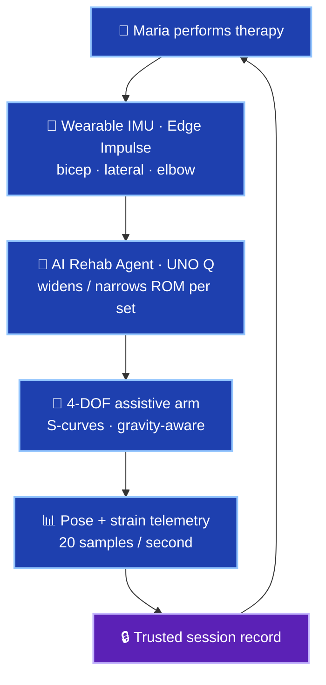
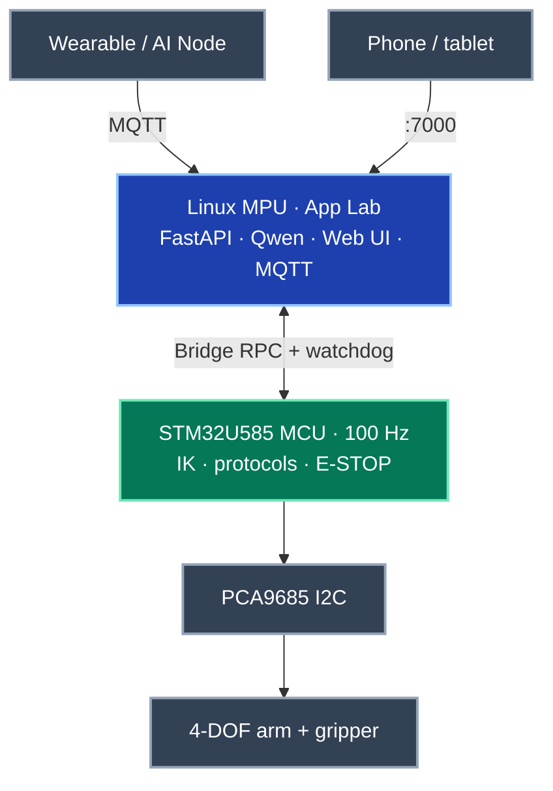
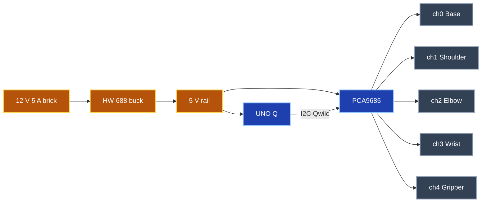
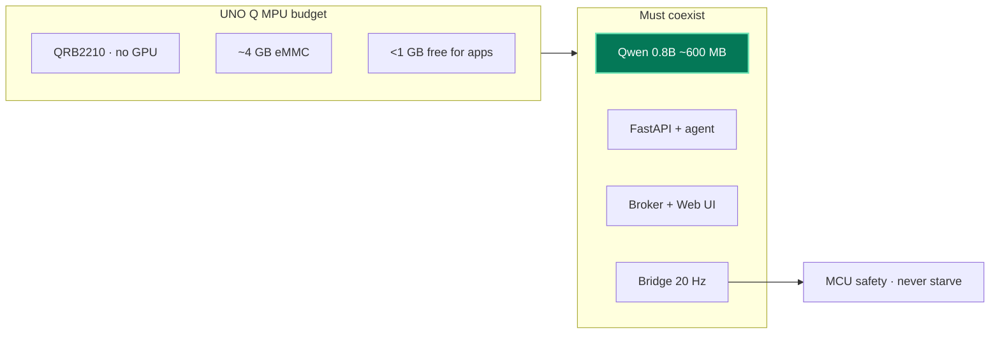
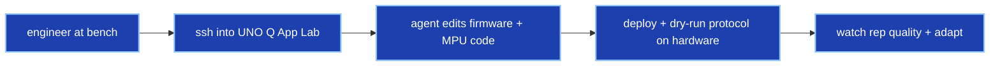
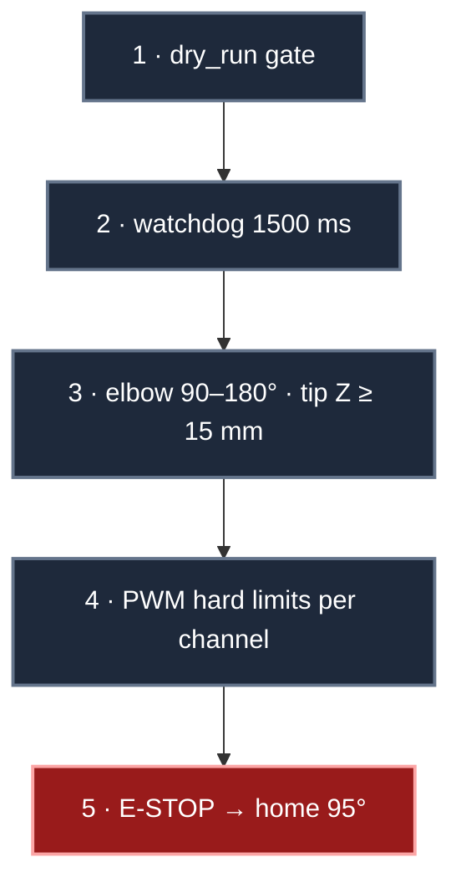

# ARMIC — Autonomous Rehabilitation on Arduino UNO Q

<p align="center">
  
</p>

> ⚠️ **Proof-of-concept only. Not a medical or diagnostic device.**
>
> ARMIC is an engineering prototype built for a robotics contest. It is **not reviewed, cleared, or approved** by any regulatory body for use in clinical care, diagnosis, or treatment of any medical condition. The rehabilitation protocols, agent logic, and wearable IMU inferences described in this document are **demonstration examples only**. Do not use this hardware or software on patients or as a substitute for professional medical advice, diagnosis, or treatment. Always consult a licensed physical therapist or physician for any rehabilitation program.
>
> All "Maria" patient narratives, statistics, and outcomes below are **illustrative examples** (not real-world clinical results) and are used solely to explain the design intent of the system.


**ARMIC** is a 4-DOF rehabilitation robotic arm + edge AI agent system built on the **Arduino UNO Q**. A patient wears a small IMU band. An on-device ML model classifies their exercise form. An AI personalizes the range-of-motion in real time. The arm assists — and every verified rep becomes progress a doctor, insurer, or care team can actually trust.

| 🎮 Try now | 📖 Deep docs | 🤖 Agent spec |
|------------|--------------|---------------|
| [**Online Simulator →**](https://onlinesimulator.expo.app) | [docs/README.md](docs/README.md) | [AGENTS.md](AGENTS.md) |
| No board required | Kinematics, setup, serial | Judges & coding agents |

### At a glance

| | |
|---|---|
| **Hardware** | Arduino UNO Q + PCA9685 + 4-DOF MG90 arm · ~**$154** core BOM (4 GB UNO Q) |
| **Motion** | 3 rehab exercises · 9 demo protocols · 100 Hz MCU safety |
| **AI** | Edge Impulse wearable · Qwen 0.8B agent · 4-tool brick |
| **Interface** | `http://uno-q.local:7000` · MQTT wearable HUD · 20 Hz telemetry |

### Contents

| Section | Jump to |
|---------|---------|
| Build | [BOM](#things-used--bill-of-materials-bom) · [Hardware](#hardware--off-the-shelf-wired-cleanly) · [Deploy](#deploy-on-arduino-uno-q--the-real-system) · [Run](#how-to-run-it--6-steps-20-minutes) |
| Story | [Problem](#the-problem-we-built-this-for) · [Session loop](#what-if-therapy-happened-with-you--not-to-you) · [UNO Q](#why-arduino-uno-q-because-its-two-brains-in-one) |
| Motion | [Rehab GIFs](#rehabilitation-in-motion--the-3-protocols) · [Demo repertoire](#bonus-motion-repertoire--demo-capability-and-calibration-self-check) |
| Software | [UI screens](#the-full-interface--four-screens-one-board) · [Simulator](#no-board-no-problem--enter-the-online-simulator) · [Agent](#the-agent-inside-qwen35-08b-on-the-uno-q-mpu--why-edge-llm-why-this-model) |
| Project | [Token](#why-we-launched-armic--making-the-project-real-the-honest-story) · [Team](#the-team-behind-armic--biomedical-engineers-not-crypto-bros-heres-the-proof) · [Roadmap](#whats-next--hackster-submission-is-the-milestone-not-the-finish-line) · [Math docs](#deep-dive--for-judges-who-want-the-math) |

---

## Things used — Bill of Materials (BOM)

Every item below is off-the-shelf. No custom machining. **Core arm station $154 USD** with the **4 GB RAM** UNO Q (**$134** with 2 GB). Add **$36** for the optional M5 Core2 wearable. Total = **sum of line items below**. Full line-item table below.

| # | Component | Qty | Cost (USD) | Where to buy | Why it matters |
|---|-----------|-----|------------|--------------|----------------|
| 1 | **Arduino UNO Q** (4 GB RAM; 2 GB **$59**) | 1 | $79 | [Arduino Store](https://store.arduino.cc/products/arduino-uno-q) · [Digikey](https://www.digikey.com/en/products/detail/arduino-srl/A000099/21279461) | **Dual brain.** MCU runs 100 Hz arm tick + safety; MPU runs App Lab containers (FastAPI, LLM, Web UI, MQTT broker, Edge Impulse). **4 GB recommended** for the full agent stack. |
| 2 | **12 V · 5 A DC adapter** (laptop-style brick, 5.5 × 2.1 mm) | 1 | $12 | [Amazon](https://www.amazon.com/s?k=12V+5A+DC+power+supply+5.5mm+x+2.1mm) · [Adafruit 1526](https://www.adafruit.com/product/1526) | **Main power.** 5× MG90 stalls need ≥2 A at 5 V. USB cannot power servos under load. |
| 2b | **5.5 mm × 2.1 mm DC barrel → screw terminal adapter** | 1 | $2 | [Amazon](https://www.amazon.com/s?k=5.5mm+x+2.1mm+barrel+to+screw+terminal) | Reliable 12 V bus wiring without soldering. |
| 3 | **HW-688** DC-DC step-down buck (9–36 V in → 5 V 5 A out) | 1 | $4 | [Amazon](https://www.amazon.com/s?k=HW-688+DC+DC+buck+5V+5A) · [AliExpress](https://www.aliexpress.com/wholesale?SearchText=hw-688+5a) | Stable 5 V rail for UNO Q logic, PCA9685, and MG90 servos. |
| 4 | **PCA9685** 16-channel 12-bit PWM + I2C | 1 | $4 | [Adafruit 815](https://www.adafruit.com/product/815) · [Amazon](https://www.amazon.com/s?k=pca9685+16+channel+pwm+servo+driver+i2c) | Hardware 50 Hz servo timing. No jitter, no MCU CPU burn. **ch0–4 = Base · Shoulder · Elbow · Wrist · Gripper.** |
| 5 | **4-DOF desktop arm kit** (MG90-class, assembled) | 1 | $50 | [Mercado Libre MX — Kit Brazo MG90s](https://listado.mercadolibre.com.mx/kit-brazo-robotico-armado-servo-mg90s) · [Amazon 4-DOF MG90 arm](https://www.amazon.com/s?k=4+dof+robot+arm+mg90s+kit) | Mechanical plant (KUKA-style MG90 kit). Firmware kinematics calibrated to LINK_1 = 90 mm / LINK_2 = 110 mm. Swap kit = re-calibrate 4 constants in `calibration.json`. |
| 6 | **M5Stack Core2** (optional AI Node / wearable) | 0–1 | $36 | [M5 Store](https://shop.m5stack.com/products/m5stack-core2-esp32-iot-development-kit) · [DigiKey](https://www.digikey.com/en/products/detail/m5stack-technology-co-ltd/K010/15606850) | Reference **AI Node**: Edge Impulse on-device classifier → 6-topic MQTT to UNO Q. Any Wi-Fi device can implement the same contract — see [armic-ai-node/](Arduino%20Files/armic-ai-node/). |
| — | Dupont / Qwiic cables, heat-shrink, breadboard | — | $3 | Any | UNO Q ↔ PCA9685 I2C + ground bus. |

**Full extended BOM** (servo counts, power budget, alternatives): [docs/bom.md](docs/bom.md).

| Editable schematics source (Fritzing — `.fzz` project) |
|---|
| **`Images/Armic.fzz`** · open in Fritzing desktop → Export PNG / PCB / SVG → Schematics view |

### Breadboard wiring — full schematic

<p align="center">
  <a href="./Images/Armic_bb.png"></a>
</p>

*Click the diagram to open full size.*

---

| The Arduino UNO Q bench — dual-brain host for rehab AI | The 4-DOF arm at calibrated Bicep Curl pose (bottom / top / return), ready for a session |
|---|---|
|  |  |

---

## The problem we built this for

> 📌 **Narrative example, not a real patient.** Maria's story is a design-pattern vignette we use to explain the problem space. The statistics cited below come from peer-reviewed and industry literature (links inline).

Maria had a stroke last March. Her doctor prescribed **12 weeks** of daily home PT — bicep curls, lateral raises, and elbow flexion, **3 sets per day**.

| Week | What happened |
|------|----------------|
| **1** | Perfect attendance |
| **3** | Form uncertainty · clinic booked **10 days** out |
| **5** | Stopped tracking · no feedback loop |
| **8** | Inconclusive follow-up · *"just keep going"* |

Maria is not an edge case. The gap is systemic:

| Stat | Finding | Source |
|------|---------|--------|
| **60%** | Home-PT patients drop out | [NCBI PMC5931387](https://www.ncbi.nlm.nih.gov/pmc/articles/PMC5931387/) |
| **70%** | Clinicians can't trust self-reported progress | [PubMed 29467038](https://pubmed.ncbi.nlm.nih.gov/29467038/) |
| **50%** | Post-stroke patients skip prescribed therapy (90 days) | [AHA Stroke 2019](https://www.ahajournals.org/doi/10.1161/STROKEAHA.119.025763) |
| **~$700B** | Annual global cost of stroke recovery | [WHO 2021](https://www.who.int/publications/i/item/9789240064221) |

> Rehabilitation is broken — manual, inconsistent, untrackable, and inaccessible without private in-home care.

ARMIC exists for Maria. And for millions more like her.

---

## What if therapy happened *with* you — not *to* you?

Imagine this loop running **every single session** — automatically, on your kitchen table, for the cost of an Arduino and a hobby arm kit:


```mermaid
flowchart TD
    A["👤 Maria performs therapy"]
    B["📡 Wearable IMU · Edge Impulse\nbicep · lateral · elbow"]
    C["🧠 AI Rehab Agent · UNO Q\nwidens / narrows ROM per set"]
    D["🦾 4-DOF assistive arm\nS-curves · gravity-aware"]
    E["📊 Pose + strain telemetry\n20 samples / second"]
    F["🔒 Trusted session record"]

    A --> B --> C --> D --> E --> F --> A

    classDef step fill:#1e40af,color:#ffffff,stroke:#93c5fd,stroke-width:2px
    classDef record fill:#5b21b6,color:#ffffff,stroke:#c4b5fd,stroke-width:2px
    class A,B,C,D,E step
    class F record
```

**5 steps · zero clinician in the room · 100% measurable**

| Step | Who | What happens |
|------|-----|--------------|
| **1** | 👤 Patient | Moves through prescribed protocol at home |
| **2** | 📡 Wearable | Edge Impulse scores rep quality, ROM, hold time |
| **3** | 🧠 Agent | 3 strong reps → widen ROM **+5°** · fatigue → narrow + slow |
| **4** | 🦾 Arm | Photo-matched trajectories · S-curves · gravity-safe home |
| **5** | 🔒 Record | Telemetry logged for care teams · ROM and rep quality in session history |

> The arm isn't waving blindly — **3 smooth reps · hold at peak · return to elbow 95° home.** Same shape a PT would prescribe and document.

---

## Why Arduino UNO Q? Because it's two brains in one.

This project simply would not work on a regular UNO. Rehabilitation needs two things simultaneously:


```mermaid
flowchart TB
  MPU["Linux MPU · App Lab\nFastAPI · Qwen · Web UI · MQTT"]
  MCU["STM32U585 MCU · 100 Hz\nIK · protocols · E-STOP"]
  MPU <-->|Bridge RPC + watchdog| MCU
  MCU --> PCA["PCA9685 I2C"] --> ARM["4-DOF arm + gripper"]
  WEAR["Wearable / AI Node"] -->|MQTT| MPU
  USER["Phone / tablet"] -->|:7000| MPU

  classDef mpu fill:#1e40af,color:#ffffff,stroke:#93c5fd,stroke-width:2px
  classDef mcu fill:#047857,color:#ffffff,stroke:#6ee7b7,stroke-width:2px
  classDef io fill:#334155,color:#ffffff,stroke:#94a3b8,stroke-width:2px
  class MPU mpu
  class MCU mcu
  class PCA,ARM,WEAR,USER io
```

| Layer | Component | Role |
|-------|-----------|------|
| **Brain** | **STM32U585 MCU** | Real-time arm control at 100 Hz. Motion planning, inverse kinematics, PWM to 5 servos. Physical safety layer. |
| **Brain** | **Linux MPU (App Lab)** | Python backend, LLM agent, Edge Impulse inference, static browser UI. Three App Lab containers per session. |
| **I/O** | Wi-Fi | Browser UI at `:7000` |
| **I/O** | USB-C | Power + serial debug |
| **I/O** | Qwiic / headers | PCA9685 joint driver |
| **I/O** | Bridge RPC | MCU↔MPU with safety gate |

> **Deploy form-factor:** not a $50k lab robot · not a dev-board that needs a PC — **the UNO Q is the whole computer** in Maria's living room.

---

## Meet the arm: 4 DOF, $40 servos, industrial-grade software

Under the hood: **MG90 hobby servos** on a standard 4-DOF desktop kit — nothing custom machined.

<p align="center">
  
</p>

| Without ARMIC | With ARMIC on UNO Q |
|---------------|---------------------|
| Stall · jitter · posture flip | FK/IK · S-curves · floor guards · HTL tuck |
| ~$40 hardware | ~$40,000-class *motion behavior* via software |

> **Contest thesis:** hobby kits fail therapy — we fixed it in firmware so a kitchen-table arm can run repeatable, safe, measurable rehab.

### The 10 reasons this doesn't behave like a "normal hobby servo arm"

| — | If you took the MG90s and ran raw PWM… | With ARMIC software running on UNO Q… |
|---|---|---|
| 1. FK / IK | Guess angles with a protractor. Hand-tune. | Analytical Law-of-Cosines solver. Dual branch. 0.5 mm self-verify. |
| 2. Per-servo calibration | "90°" on one servo ≠ 90° on another. Gear grind. | Measured MIN/CENTER/MAX per channel. Shoulder inverted. Wrist non-linear. |
| 3. Waypoint planning | One big IK jump → SNAP, posture flip, scraped table. | 2 mm micro-steps. IK at every step. Continuous smooth path. |
| 4. Loaded carries | Shoulder stalls. Buzzes. Sags. PSU trips. | Heavy-Tucked-Lift sequence: reach → fold → carry tucked → home. **67% less shoulder torque.** |
| 5. Motion profiles | Linear snaps. Servo ringing. Current spikes. Deadly for rehab. | Cubic ease-in-out. 7-segment S-curves. 18°/s therapy speed cap. |
| 6. Torque derating | Full speed into heavy poses. Thermal shutdown. Lost steps. | Pose + payload estimation. 80% strain → 50% velocity. Safety first. |
| 7. Branch continuity | Mid-path "elbow flip." Orbital demos stutter. | Nearest-previous + manipulability pick. Never random. |
| 8. Floor guards | Tip drags table. Elbow past 90° → stripped gears. | Tip Z ≥ 15 mm. Elbow ∈ [90, 180]. Every target, every tick. |
| 9. Safe home pose | IK to origin → singularity. Jitter hunt at 90°. | Joint-space home {90, 90, 95, 90}. Elbow 95° specifically to resist gravity hunt. |
| 10. Synced rehab trajectories | Wrong muscle group. Jerky. Zero hold. | Photo-matched waypoints. Cubic sync ALL joints. Hold at peak. 3 reps. Home. |

**Result:** A $40 hobby arm behaves like hardware 1000× its price. Software is the multiplier. The Arduino UNO Q is the chassis that makes it possible.

---

## Rehabilitation in motion — the 3 protocols

ARMIC launches with **3 upper-limb protocols** · **3 reps each** · cubic ease · hold at peak · gravity-safe home.

| 💪 Bicep curl | 🪽 Lateral raise | 🔁 Elbow flexion |
|---|---|---|
|  |  |  |

Exercise IDs: `bicep` · `lateral` · `elbowflex` — waypoints in [docs/exercises.md](docs/exercises.md).

| Protocol | Motion summary |
|----------|----------------|
| **Bicep curl** | Locked shoulder + elbow · wrist **180° → 25°** |
| **Lateral raise** | Locked shoulder + elbow · wrist tip-out → tip-down |
| **Elbow flexion** | Shoulder horizontal · elbow **95° → 180°** |

---

## Bonus: Motion repertoire — demo capability AND calibration self-check

Before or after therapy — the arm can run a full repertoire of calibrated motion sequences.

These sequences do **double duty**:

| Role | What you get |
|------|--------------|
| **Showcase** | Tucked carries, orbital IK, strikes, transport, loaded holds — judges and patients see "real robot" motion |
| **Calibration check** | Same kit + firmware → if all 5 demos land without scrape / flip / stall, your `calibration.json` matches hardware |

| HTL tucked carry | Orbital trace | Cobra strike | Transport pose | Loaded dumbbell hold |
|---|---|---|---|---|
|  |  |  |  |  |

**Build checklist — run after wiring:**

| Demo | Validates |
|------|-----------|
| **Orbital trace** | IK + wrist pitch 0 → base/shoulder/elbow/wrist calibration consistent |
| **HTL tucked carry** | Torque + floor guard → tip Z ≥ 15 mm · ~67% less shoulder strain at tuck |
| **Cobra strike** | Delta snap/brake → max 30°/tick clamp live |
| **Transport pose** | 60 s packed hold → no hunt · idle PWM stop |
| **Loaded dumbbell hold** | 17 g / 170 g / 500 g → Yoshikawa manipulability ≥ 0.4 |

> ✅ All 5 pass → run **Bicep / Lateral / Elbow** therapy next.

---

## The full interface — four screens, one board

Everything lives on the UNO Q. **12 V in · Wi-Fi on · open `http://uno-q.local:7000`** — laptop, tablet, or phone. No PC required.

| Surface | URL / path | Refresh |
|---------|------------|---------|
| Main dashboard | `:7000` | Session control · calibration · agent chat |
| Wearable HUD | `/wearable-mqtt.html` | **20 Hz** · 6 MQTT topics live |
| App Lab | board containers | 3/3 UP = FastAPI + LLM + static UI |

| Main UI — session dashboard | MQTT wearable HUD — 6 live topics |
|---|---|
|  |  |
| **App Lab containers — 3/3 UP** | **Agent state: ready. Warm-up complete.** |
|  |  |

Wearable HUD is live **20 Hz** — you can watch every inference, every rep boundary, and every quality score as it happens. For a judge at a demo table? This is what makes them lean forward.

---

## Hardware — off the shelf, wired cleanly

| Power chain: 12 V → HW-688 → 5 V rail |
|---|
|  |

| Breadboard wiring — full schematic |
|---|
| <p align="center"><a href="./Images/Armic_bb.png"></a></p> |

Wiring is intentionally simple — a student in a workshop can replicate it in **~20 minutes**.


```mermaid
flowchart LR
  P12["12 V 5 A brick"] --> HW["HW-688 buck"]
  HW --> V5["5 V rail"]
  V5 --> UNO["UNO Q"]
  V5 --> PCA["PCA9685"]
  PCA --> S0["ch0 Base"]
  PCA --> S1["ch1 Shoulder"]
  PCA --> S2["ch2 Elbow"]
  PCA --> S3["ch3 Wrist"]
  PCA --> S4["ch4 Gripper"]
  UNO -->|I2C Qwiic| PCA

  classDef power fill:#b45309,color:#ffffff,stroke:#fcd34d,stroke-width:2px
  classDef logic fill:#1e40af,color:#ffffff,stroke:#93c5fd,stroke-width:2px
  classDef servo fill:#334155,color:#ffffff,stroke:#94a3b8,stroke-width:2px
  class P12,HW,V5 power
  class UNO,PCA logic
  class S0,S1,S2,S3,S4 servo
```

| Item | Detail |
|------|--------|
| **Core BOM $154** | 4 GB UNO Q · 12 V brick · barrel adapter · HW-688 · PCA9685 · MG90 arm kit · interconnect |
| **Full BOM + links** | [docs/bom.md](docs/bom.md) |
| **Schematic source** | `Images/Armic.fzz` → Fritzing **Schematic view → Export PNG** |

---

## Deploy on Arduino UNO Q — the real system

ARMIC is built to run **on the board**, in a real home or clinic — not as a browser-only demo. The UNO Q is the whole computer: MCU motion + MPU agent + Web UI + MQTT broker, all on one **$79** (4 GB) platform.

### What you deploy

| Layer | Where | What you get |
|-------|--------|--------------|
| **MCU firmware** | STM32U585 | 100 Hz safety, IK, rehab exercises, E-STOP, watchdog |
| **App Lab app** | MPU Linux | FastAPI, WebSocket 20 Hz, Qwen 0.8B agent, route runner |
| **Web UI** | `:7000` | `http://uno-q.local:7000` — arm control, calibration, agent chat, wearable HUD |
| **MQTT broker** | `:1883` | Wearable / AI Node → closed-loop rep counting + adaptation |
| **Optional AI Node** | M5 Core2 (or any device) | Edge Impulse → `armic/wearable/v1/*` — see [armic-ai-node/](Arduino%20Files/armic-ai-node/) |

### Quick deploy (20 minutes)


```mermaid
flowchart LR
  A[Wire BOM] --> B[Flash firmware]
  B --> C[Deploy App Lab]
  C --> D["Open :7000"]
  D --> E[Calibrate + Enable Motion]
  E --> F[Run bicep or Execute route]
  F --> G[MQTT HUD green]

  classDef step fill:#1e40af,color:#ffffff,stroke:#93c5fd,stroke-width:2px
  classDef done fill:#047857,color:#ffffff,stroke:#6ee7b7,stroke-width:2px
  class A,B,C,D,E,F step
  class G done
```

| Step | Action |
|------|--------|
| 1 | Wire [BOM](docs/bom.md) — UNO Q, HW-688, PCA9685, arm, 12 V |
| 2 | Flash [`armic-firmware/`](Arduino%20Files/armic-firmware/) |
| 3 | Deploy [`brick_compose.yaml`](Arduino%20Files/armic-brick/brick_compose.yaml) + [`armic-mpu/`](Arduino%20Files/armic-mpu/) |
| 4 | Open **`http://uno-q.local:7000`** → calibration → **Enable Motion** |
| 5 | **exercise bicep** (3 reps) or **Execute** on light/medium/heavy card |
| 6 | AI Node on → all six MQTT topics green at `/wearable-mqtt.html` |

Full bring-up: [docs/setup.md](docs/setup.md). Agent/judge spec: [AGENTS.md](AGENTS.md). Remote dev from laptop: [AgentSSH/](AgentSSH/).

---

## No board? No problem — enter the Online Simulator

<p align="center">
  <a href="https://onlinesimulator.expo.app"></a>
</p>

*Click the screenshot to open the live simulator.*

| | |
|---|---|
| **→ [Open Online Simulator](https://onlinesimulator.expo.app)** | Same firmware math as hardware — presets · sliders · rehab routes · HTL · orbital · bicep/lateral/elbowflex |
| **No install · no wiring** | Phone or laptop · digital twin moves in real time |
| **Source** | [`OnlineSimulator/`](OnlineSimulator/) — read how the port mirrors MCU kinematics |

When you're ready for the full closed loop — real servos, edge LLM, MQTT wearable, calibration SSoT — deploy on UNO Q (`http://uno-q.local:7000`).

---

## The agent inside: Qwen3.5 0.8B on the UNO Q MPU

**Edge-first AI** — Qwen runs **locally** on the UNO Q via llama.cpp in the `arduino:llm` container. Not a cloud hook. Not a deferred cloud upgrade.

| Warming up (~8 s boot) | Ready — 4 tools registered |
|---|---|
|  |  |

Deep dive (model matrix, prompt scenarios): [docs/agent.md](docs/agent.md).

---

### Why on-device?

| | | | |
|:---:|:---|:---|:---|
| 🔒 | **Privacy** — data stays on the table | ⚡ | **Latency** — adapts between reps |
| 🛡️ | **Resilience** — router down, arm still safe | 💰 | **Scale** — no per-rep cloud API bill |

---

### Why Qwen 0.8B? The UNO Q is not a $5,000 server.


```mermaid
flowchart LR
  subgraph budget ["UNO Q MPU budget"]
    SOC["QRB2210 · no GPU"]
    DISK["~4 GB eMMC"]
    RAM["<1 GB free for apps"]
  end
  subgraph stack ["Must coexist"]
    LLM["Qwen 0.8B ~600 MB"]
    PY["FastAPI + agent"]
    MQTT["Broker + Web UI"]
    BR["Bridge 20 Hz"]
  end
  budget --> stack
  BR --> MCU["MCU safety · never starve"]

  classDef ok fill:#047857,color:#ffffff,stroke:#6ee7b7,stroke-width:2px
  class LLM ok
```

| Model | Q4 RAM | Fits UNO Q? | Verdict |
|-------|--------|-------------|---------|
| **Qwen3.5 0.8B** ✅ | **~600 MB** | Yes · headroom for broker + UI | **Our pick** — ~85–90% tool-call accuracy |
| Llama-3.1 8B | ~5.5 GB | ❌ | RAM + disk blow the budget |
| Phi-3 Mini 4K | ~2.7 GB | ❌ | Thrashes · half the eMMC gone |
| Gemma 2 2B | ~1.4 GB | ⚠️ Tight | Starves telemetry · no accuracy win |

> **Bottom line:** 0.8B is the **largest model that keeps App Lab + MQTT + Web UI + 20 Hz bridge alive** without OOM-killing the safety layer. GPT-4o / Llama-70B / Mixtral swap out and trip the watchdog.

---

### 4-tool brick — structured control, not raw joint angles

The LLM **never** emits joint targets. It calls JSON tools; the MCU enforces limits.


```mermaid
flowchart LR
  U["Patient / PT chat"] --> Q["Qwen 0.8B"]
  Q --> T["4 JSON tools"]
  T --> F["FastAPI route runner"]
  F --> B["Bridge RPC"]
  B --> M["MCU · IK · safety"]

  classDef edge fill:#1e40af,color:#ffffff,stroke:#93c5fd,stroke-width:2px
  classDef gate fill:#047857,color:#ffffff,stroke:#6ee7b7,stroke-width:2px
  class Q,T,F edge
  class M gate
```

| Tool | Params | Does |
|------|--------|------|
| `run_arm_protocol` | `protocol` | Demo motions only (`home`, `htl`, `snake`, …) |
| `list_rehab_routes` | — | Show light / medium / heavy cards |
| `suggest_rehab_intent` | `description` | Match route — **display only** |
| `show_rehab_route` | `route_id` | One route card — **display only** |

| Wearable signal | Agent action |
|-----------------|--------------|
| 3× rep quality **≥ 0.75** | Widen ROM **+5°** |
| 3× rep quality **< 0.40** | Narrow ROM **−5°** · slow speed |
| User asks to start rehab in chat | ❌ Must press **Execute** on route card |

Spec: [`AGENTS.md`](AGENTS.md) §4 · [`agent/tools.py`](Arduino%20Files/armic-mpu/agent/tools.py). Swap Qwen for Claude/GPT via HTTPS proxy — **same 4 tools**, same MCU safety gate.

---
### How we built ARMIC — agentic development on the real board


```mermaid
flowchart LR
  A1[engineer at bench] --> A2[ssh into UNO Q App Lab]
  A2 --> A3[agent edits firmware + MPU code]
  A3 --> A4[deploy + dry-run protocol on hardware]
  A4 --> A5[watch rep quality + adapt]

  classDef step fill:#1e40af,color:#ffffff,stroke:#93c5fd,stroke-width:2px
  class A1,A2,A3,A4,A5 step
```

We built firmware, backend, calibration, and rehab protocols **on the actual UNO Q** — not cross-compile-then-pray on a laptop. An coding agent SSH'd into the App Lab `arduino:python` container, ran the same **4-tool contract** the patient agent uses (`run_arm_protocol`, `list_rehab_routes`, `suggest_rehab_intent`, `show_rehab_route`), and self-corrected against live WebSocket telemetry. Safety invariants (elbow 90–180°, 15 mm floor guard, 1500 ms watchdog, calibration SSoT) are enforced in **firmware**, not in prompt text.

#### AI Skills + AgentSSH — how agents develop on real hardware

| Asset | Purpose |
|-------|---------|
| [`AGENTS.md`](AGENTS.md) | **Judge/agent spec** — architecture, safety, 4-tool brick, MQTT contract, secrets policy |
| [`AI Skills/`](AI%20Skills/) | 31 Cursor/Claude skills + 3 rules for UNO Q / ARMIC development (see [`ARDUINO-BUNDLE.md`](AI%20Skills/skills/ARDUINO-BUNDLE.md)) |
| [`AgentSSH/`](AgentSSH/) | MCP server — 16 SSH tools so your **laptop agent** deploys, dry-runs, and flashes the board remotely |

Two dev loops, same contract: **(A)** agent on the board with skills mounted, or **(B)** agent on your PC via AgentSSH → `uno-q.local`. Contest judges running agents should start at `AGENTS.md`.


> 🔒 **Patient-deploy handoff.** Engineering SSH + cloud CLI keys are for **build/calibration only**. A shipped clinic unit runs **on-device Qwen 0.8B** via llama.cpp → `tools.py` → FastAPI → MCU. Wipe temp API keys and lock SSH before patient handoff.

### Prompt examples that reliably trigger correct agent actions

Each scenario: NL prompt → JSON tool calls → agent answer.

---

#### Scenario 1 · Strong session — adaptation forward

| Context | Detail |
|---------|--------|
| Patient | 67F post-stroke · week 9 |
| Signal | Last 3 elbow flexion reps · quality **> 0.75** |

> 💬 **Prompt:**
> ```
> Maria completed 3 consecutive elbow flexion reps at 142° ROM with quality 0.88/1.0.
> Patient has reported mild stiffness today. Run the next appropriate protocol.
> ```

🛠️ **Tool calls:**

```json
[
  { "tool": "suggest_rehab_intent", "args": { "patient_context": "67F post-stroke 9 weeks, 3 consecutive elbow flexion reps 142° ROM, quality 0.88, reported mild stiffness today" } },
  { "tool": "run_arm_protocol", "args": { "protocol_name": "elbowflex-set", "reps": 3, "speed": 18 } }
]
```

✅ **Answer:** Widen ROM **+5°** → 147° · extend hold · warm-up speed 14°/s then 18°/s if next set clears 0.80.

---

#### Scenario 2 · Fatigue — adaptation back

| Context | Detail |
|---------|--------|
| Exercise | Lateral raise |
| Qualities | **0.31 · 0.36 · 0.28** (all below 0.40) |
| ROM | 38° · 40° · 34° vs target 55° |

> 💬 **Prompt:**
> ```
> Last 3 consecutive lateral raise rep_end quality scores: 0.31, 0.36, 0.28.
> Actual ROM: 38°, 40°, 34° vs target 55°. Patient: 67F post-stroke 9 weeks.
> ```

🛠️ **Tool calls:**

```json
[
  { "tool": "run_arm_protocol", "args": { "protocol_name": "lateral-set", "reps": 3, "speed": 12, "rom_target_override": 50 } }
]
```

✅ **Answer:** ROM 55° → **50°** · speed 18°/s → **12°/s** · adaptation narrows ROM and slows the next set (avg quality 0.32).

---

#### Scenario 3 · PT introspection — HTL shoulder torque

| Context | Detail |
|---------|--------|
| Ask | HTL waypoints · highest shoulder torque · subacromial clearance |

> 💬 **Prompt:**
> ```
> Show me the Heavy-Tucked-Lift waypoints and tell me which phase has the highest
> shoulder torque fraction. Should a patient with known subacromial pain run it?
> ```

🛠️ **Tool calls:**

```json
[
  { "tool": "show_rehab_route", "args": { "route_name": "htl" } }
]
```

| HTL phase | Duration | Shoulder torque |
|---|---|---|
| IDLE → REACH | 2200 ms | **1.00** ✴️ highest |
| REACH → FOLD_IN | 900 ms | 0.80 |
| FOLD_IN → CARRY | 2400 ms | 0.33 |
| CARRY → HOME_95 | 1800 ms | 0.90 |
| HOME_95 → RELEASE | 500 ms | 1.00 |

✅ **Clearance:** Avoid in active subacromial impingement — REACH/RELEASE at 1.00 in impingement arc.

---

#### Scenario 4 · Care-team onboarding — full catalog

| Context | Detail |
|---------|--------|
| Ask | Every rehab route · 1-line clinical note each |

> 💬 **Prompt:**
> ```
> List every rehab route ARMIC knows, with a 1-line clinical note each.
> ```

🛠️ **Tool calls:**

```json
[
  { "tool": "list_rehab_routes", "args": {} }
]
```

✅ **Agent catalog** (narrative names for judges — code split: **3 routes · 9 protocols · 3 exercises**, see [`AGENTS.md`](AGENTS.md) §4):

| ID | Clinical note |
|----|---------------|
| **home** | Gravity-safe 95° elbow rest · park after every session |
| **park** | Tucked transport pose between rooms |
| **htl** | Object transfer · REACH 1.0 shoulder torque · avoid impingement |
| **reach-carry** | Long reach · Yoshikawa derate below 0.7 manipulability |
| **orbital** | Circumduction ROM · wrist neutral |
| **cobra** | Serratus punch · not for acute cervical instability |
| **bicep-set** | Shoulder + elbow locked · wrist curl only · post-op week 4+ |
| **lateral-set** | Shoulder + elbow locked · deltoid rehab |
| **elbowflex-set** | Shoulder horizontal · elbow 95→180 · post-stroke hemiparesis |

---

**Bottom line:** Edge LLM = **auditable tool-use inside a $79 board** · privacy · zero-cloud autonomy · swappable brick for clinical dashboards.

---

## Why the reward layer matters, and why we launched a token (the honest story)

People ask: *"Why onchain? Why a token? This is a rehab robot."*

| Layer | Role |
|-------|------|
| **Product** | UNO Q robot · edge agent · 5-layer safety · wearable · calibration SSoT |
| **Token** | Engagement + launch proof — **not** the clinical product |

The token proves three things a GitHub repo alone cannot:

| # | Proof | Why it matters |
|---|-------|----------------|
| 1 | **We can launch** | Liquidity · graduated fees · 100% to rehab hardware fund — pilot-grade accountancy |
| 2 | **We can build audience** | [@projectarmic](https://x.com/projectarmic) — community beyond the bench |
| 3 | **We failed and learned** | Wallet compromise → multisig · custody · what *not* to do in regulated incentives |

### Who the reward layer serves

| Stakeholder | Value |
|-------------|-------|
| **Patient (Maria)** | Measurable, shareable progress — not just "great job" for a week |
| **Insurer** | Evidence over self-report · Merkle records (planned) |
| **System** | Creator fees **100%** → more kits · more homes |

### How the $ARMIC reward math works (locked, same math the on-device agent runs)

The reward layer ties to **🔒 Trusted record + reward** in the session loop diagram.

| Condition | Required |
|-----------|----------|
| Set complete | 3-rep rehab set finishes (`set_completed`) |
| Quality gate | Average rep quality **≥ 0.70** (0.00–1.00) |

> **Reward = `10 + 90 × min(1.0, average_rep_quality)`**

| Avg quality | $ARMIC | Scenario |
|-------------|--------|----------|
| **0.70** | 73 | Minimum mint |
| **0.88** | 89.2 | Strong session (Scenario 1) |
| **1.00** | 100 | Perfect cap |
| **0.32** | — | Fatigue — adapt down · no mint (Scenario 2) |

Also runs with ROM adaptation: 3× quality ≥ **0.75** → **+5°** · 3× &lt; **0.40** → **−5°** / slower.

### Hard token facts (no hand-waving)

| Fact | Details |
|---|---|
| Network | Solana SPL token |
| Contract address (public) | `DcTVUogWykX1JeBmTq48Fzj2Lc3Y7zwHQS1CyZ9SHnXf` |
| **Mint authority** | **DISABLED** (permanently — no more supply can ever be created) |
| **Freeze authority** | **DISABLED** (permanently — token holder always controls theirs) |
| Creator graduated fees | 100% reinvested back into rehab hardware fund wallet |
| Launch | Easya.io Kickstart, 2026-08-30 15:00 UTC |
| Purpose | Launch + incentive engagement + governance later) |

The token is the engagement mechanism layered *on top* of a working rehabilitation robot. Not the other way around. That's the ARMIC difference. And the Hackster "Invent the Future with Arduino UNO Q" contest is the moment we go from "three BMEs with a token and a dream" to "three BMEs with a shipped kit, a safety document, and a judge-tested demo.

---

## The team behind ARMIC — biomedical engineers, not crypto bros. Here's the proof.

Three biomedical engineers. Four prior **award-winning Hackster projects**. Real profiles. Real prizes. Real on-stage recognition. One obsession: making healthcare automation actually reach people.

This matters for the contest. The winning projects we studied — the ones that get 2,000+ upvotes, that win Best Overall, that get invited to Maker Faire Rome — they have two things in common: (1) a real human story, and (2) a team that has already shipped. ARMIC has both.

| Team | Hackster heritage (prior wins) |
|---|---|
| **Victor Alonso Altamirano Izquierdo** (BME, MX City) | **Best Overall** — AI Detection of Cardiac Abnormalities · **Helium Creative Winner** — AgroLoRa · Maker Faire Rome alumni |
| **Alejandro Sanchez Gutierrez** (BME) | **Spresense × Edge Impulse Prize** — Spresense Facemask Detector |
| **Luis Eduardo Arevalo Oliver** (BME) | **3rd Place** Maker Faire — AgroNordic (2,182 👍) · **Helium Creative Winner** — AgroLoRa (1,907 👍) |

Live profiles: [Altaga](https://www.hackster.io/Altaga) · [EdOliver](https://www.hackster.io/Edoliver) · [Alejandro_S_G](https://www.hackster.io/Alejandro_S_G) on Hackster.

### Why our prior wins matter for this entry

| Prior project | What ARMIC inherits |
|---------------|---------------------|
| **AI Cardiac — Best Overall** | Medical signal + device packaging · schematics · BOM · clinical problem framing |
| **Spresense Facemask — Edge Impulse Prize** | Wearable + on-device classifier write-up pattern |
| **AgroNordic / AgroLoRa (2k+ 👍)** | Community story · humility · field photos · reproducible build |

> Maker Faire Rome alumni · built to score on **all five** Hackster rubric buckets — not just code.

---

## What's next — Hackster submission is the milestone, not the finish line.

| Timeline | Milestone |
|---|---|
| **Hackster submission (contest deliverable)** | ✅ Documentation, BOM with URLs + cost, schematics, editable Fritzing source, code, 14-shot demo reel, narrative story, safety gates |
| UNO Q boot + first assist dry→live gate | 🔄 Firmware finalization + dry_run→motion gate testing |
| **Clinical pilot (3 patients, 4 weeks)** | **Q4 2026** — ROM / dropout / rep-quality metrics tracked with IRB-adjacent consent. This is why we launched the token: to de-risk *governance* and *reward-delivery* before we are dealing with real patient data. |
| Onchain reward pilot | Q1 2027 — first 100 patients earn $ARMIC with verifiable rep records |
| Open-hardware kit v2 | Q2 2027 — custom PCB replaces breadboard · custom machined linkages tune MG90D backlash · 6-DOF wrist upgrade |

---

## Deep dive — for judges who want the math

Narrative lives here · equations and layer diagrams in **[docs/](docs/)** (+ [docs/README.md](docs/README.md) hub).

| Topic | Doc |
|-------|-----|
| Architecture · dual brain | [architecture.md](docs/architecture.md) |
| FK / IK · PWM | [kinematics.md](docs/kinematics.md) |
| S-curves · jerk | [motion-planning.md](docs/motion-planning.md) |
| Torque · derating | [dynamics.md](docs/dynamics.md) |
| Safety stack (5 layers) | [control-stack.md](docs/control-stack.md) |
| BOM · hardware · setup | [bom.md](docs/bom.md) · [hardware.md](docs/hardware.md) · [setup.md](docs/setup.md) |
| Exercises · HTL · serial | [exercises.md](docs/exercises.md) · [htl-reference.md](docs/htl-reference.md) · [serial-protocol.md](docs/serial-protocol.md) |
| Agent · token · UI narrative | [agent.md](docs/agent.md) · [token-reward.md](docs/token-reward.md) · [interface.md](docs/interface.md) |

---

## Source code at a glance

| Module | What lives there |
|---|---|
| [Arduino Files/armic-firmware/](Arduino Files/armic-firmware/) | MCU sketch. Bridge RPC. E-STOP gate. FK/IK. HTL FSM. S-curves. Compensators. Watchdog. |
| [Arduino Files/armic-mpu/](Arduino Files/armic-mpu/) | Python backend. FastAPI. WebSocket 20 Hz. MQTT wearable bridge. LLM agent tool use. Session adaptation. |
| [Arduino Files/armic-webui/](Arduino Files/armic-webui/) | Static browser UI. Three.js digital twin. Calibration gate. Wearable HUD. Exercise dashboard. |
| [Arduino Files/armic-brick/](Arduino Files/armic-brick/) | Single source of truth. Calibration SSoT. Compose root. Mounted in all 3 containers. |
| [Arduino Files/armic-wearable/](Arduino Files/armic-wearable/) | MQTT contract docs, Mosquitto broker config, Arduino IDE starter template. |
| [Arduino Files/armic-ai-node/](Arduino Files/armic-ai-node/) | **AI Node build kit** — Edge Impulse + PlatformIO reference (any device can publish the wearable contract). |
| [AGENTS.md](AGENTS.md) | Agent/judge playbook — safety, tools, MQTT, adaptation, secrets. |
| [AgentSSH/](AgentSSH/) | MCP SSH dev loop — 16 tools for laptop → UNO Q deploy. |
| [AI Skills/](AI%20Skills/) | Arduino agent skills bundle (31 skills + 3 rules). |
| [OnlineSimulator/](OnlineSimulator/) | Hosted browser twin — [onlinesimulator.expo.app](https://onlinesimulator.expo.app) when no board yet |

---

## How to run it — 6 steps, 20 minutes

| Step | Action | Verify |
|------|--------|--------|
| **1** | Flash MCU firmware to UNO Q | Serial connects @ **115200** |
| **2** | Wire PCA9685 on I2C (Qwiic or headers) | I2C scan / boot logs |
| **3** | Power **12 V → HW-688 → 5 V** rail | Stable 5 V under load |
| **4** | Serial boot | Home pose · elbow **95°** · claw open |
| **5** | Open `http://uno-q.local:7000` | Main UI loads |
| **6** | **Enable Motion** → **exercise bicep** → 3 reps → **estop** | Returns home |

Full checklist: [docs/setup.md](docs/setup.md)

### Safety stack (firmware — not prompts)


```mermaid
flowchart TB
  L1["1 · dry_run gate"] --> L2["2 · watchdog 1500 ms"]
  L2 --> L3["3 · elbow 90–180° · tip Z ≥ 15 mm"]
  L3 --> L4["4 · PWM hard limits per channel"]
  L4 --> L5["5 · E-STOP → home 95°"]

  classDef layer fill:#1e293b,color:#ffffff,stroke:#64748b,stroke-width:2px
  classDef estop fill:#991b1b,color:#ffffff,stroke:#fca5a5,stroke-width:2px
  class L1,L2,L3,L4 layer
  class L5 estop
```

| Invariant | Value |
|-----------|-------|
| E-STOP home | Elbow **95°** (not 90° — no gravity hunt) |
| Calibration SSoT | [`calibration.json`](Arduino%20Files/armic-brick/calibration.json) — 3-phase commit |
| Motion default | **Dry run ON** until UI **Enable Motion** |

Detail: [control-stack.md](docs/control-stack.md) · [AGENTS.md](AGENTS.md) §3

---

> **ARMIC — programmable, intelligent, human-centered rehabilitation on Arduino UNO Q.**  
> Because Maria shouldn't have to wait for a clinic opening. Neither should 750 million other people recovering from stroke, injury, or surgery every year.  
> We start with one arm, one UNO Q, one home at a time.

---

*Submitted to the Hackster "Invent the Future with Arduino UNO Q and App Lab" contest — September 2026. Robotics (primary) · Social Impact (secondary).*
