# ARMIC — Autonomous Rehabilitation on Arduino UNO Q

  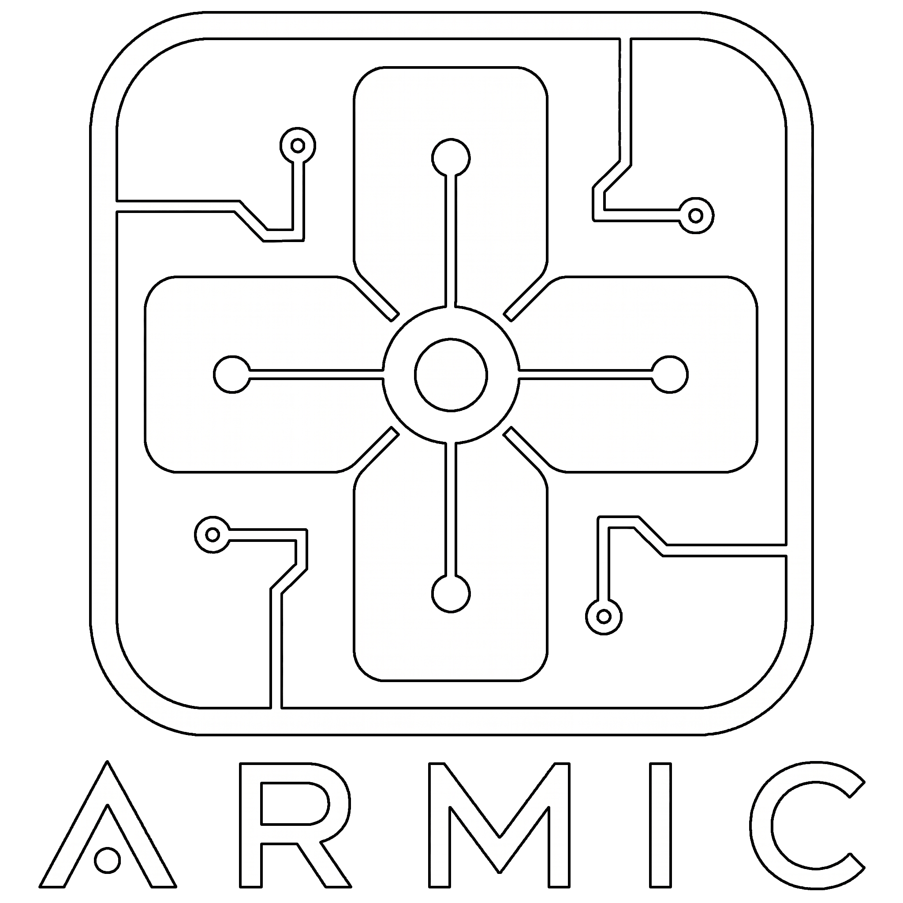

> ⚠️ **Proof-of-concept only. Not a medical or diagnostic device.**
>
> ARMIC is an engineering prototype built for a robotics contest. It is **not reviewed, cleared, or approved** by any regulatory body for use in clinical care, diagnosis, or treatment of any medical condition. The rehabilitation protocols, agent logic, and wearable IMU inferences described in this document are **demonstration examples only**. Do not use this hardware or software on patients or as a substitute for professional medical advice, diagnosis, or treatment. Always consult a licensed physical therapist or physician for any rehabilitation program.
>
> All "Maria" patient narratives, statistics, and outcomes below are **illustrative examples** (not real-world clinical results) and are used solely to explain the design intent of the system.

**ARMIC** is a 4-DOF rehabilitation robotic arm + edge AI agent system built on the **Arduino UNO Q**. A patient wears a small IMU band. An on-device ML model classifies their exercise form. An AI personalizes the range-of-motion in real time. The arm assists — and every verified rep becomes progress a doctor, insurer, or care team can actually trust.

| 🎮 Try now | 📖 Deep docs | 🤖 Agent spec |
|------------|--------------|---------------|
| [**Online Simulator →**](https://onlinesimulator.expo.app) | [docs/README.md](docs/README.md) | [AGENTS.md](AGENTS.md) |
| No board required | Kinematics, setup, serial | Judges & coding agents |

### At a glance

| | |
|---|---|
| **Hardware** | Arduino UNO Q + PCA9685 + 4-DOF MG90 arm · ~**$154** core BOM (4 GB UNO Q) |
| **Motion** | 3 rehab exercises · 9 demo protocols · 100 Hz MCU safety |
| **AI** | Edge Impulse wearable · Qwen 0.8B agent · 4-tool brick |
| **Interface** | `http://uno-q.local:7000` · MQTT wearable HUD · 20 Hz telemetry |

### Contents

| Section | Jump to |
|---------|---------|
| Build | [BOM](#things-used--bill-of-materials-bom) · [Hardware](#hardware--off-the-shelf-wired-cleanly) · [Deploy](#deploy-on-arduino-uno-q--the-real-system) · [Run](#how-to-run-it--6-steps-20-minutes) |
| Story | [Problem](#the-problem-we-built-this-for) · [Session loop](#what-if-therapy-happened-with-you--not-to-you) · [UNO Q](#why-arduino-uno-q-because-its-two-brains-in-one) |
| Motion | [Rehab protocols](#rehabilitation-in-motion--the-3-protocols) · [Demos](#demo-repertoire--calibration-check) |
| Software | [UI screens](#the-full-interface--four-screens-one-board) · [Simulator](#no-board-no-problem--enter-the-online-simulator) · [Agent](#the-agent-inside-qwen35-08b-on-the-uno-q-mpu) |
| Project | [Token](#why-we-launched-armic--making-the-project-real) · [Team](#the-team) · [Roadmap](#roadmap) · [Docs hub](#deep-dive--for-judges-who-want-the-math) |

---

## Things used — Bill of Materials (BOM)

Every item below is off-the-shelf. No custom machining. **Core arm station $154 USD** with the **4 GB RAM** UNO Q (**$134** with 2 GB). Add **$36** for the optional M5 Core2 wearable. Total = **sum of line items below**. Full line-item table below.

| # | Component | Qty | Cost (USD) | Where to buy | Why it matters |
|---|-----------|-----|------------|--------------|----------------|
| 1 | **Arduino UNO Q** (4 GB RAM; 2 GB **$59**) | 1 | $79 | [Arduino Store](https://store.arduino.cc/products/arduino-uno-q) · [Digikey](https://www.digikey.com/en/products/detail/arduino-srl/A000099/21279461) | **Dual brain.** MCU runs 100 Hz arm tick + safety; MPU runs App Lab containers (FastAPI, LLM, Web UI, MQTT broker, Edge Impulse). **4 GB recommended** for the full agent stack. |
| 2 | **12 V · 5 A DC adapter** (laptop-style brick, 5.5 × 2.1 mm) | 1 | $12 | [Amazon](https://www.amazon.com/s?k=12V+5A+DC+power+supply+5.5mm+x+2.1mm) · [Adafruit 1526](https://www.adafruit.com/product/1526) | **Main power.** 5× MG90 stalls need ≥2 A at 5 V. USB cannot power servos under load. |
| 2b | **5.5 mm × 2.1 mm DC barrel → screw terminal adapter** | 1 | $2 | [Amazon](https://www.amazon.com/s?k=5.5mm+x+2.1mm+barrel+to+screw+terminal) | Reliable 12 V bus wiring without soldering. |
| 3 | **HW-688** DC-DC step-down buck (9–36 V in → 5 V 5 A out) | 1 | $4 | [Amazon](https://www.amazon.com/s?k=HW-688+DC+DC+buck+5V+5A) · [AliExpress](https://www.aliexpress.com/wholesale?SearchText=hw-688+5a) | Stable 5 V rail for UNO Q logic, PCA9685, and MG90 servos. |
| 4 | **PCA9685** 16-channel 12-bit PWM + I2C | 1 | $4 | [Adafruit 815](https://www.adafruit.com/product/815) · [Amazon](https://www.amazon.com/s?k=pca9685+16+channel+pwm+servo+driver+i2c) | Hardware 50 Hz servo timing. No jitter, no MCU CPU burn. **ch0–4 = Base · Shoulder · Elbow · Wrist · Gripper.** |
| 5 | **4-DOF desktop arm kit** (MG90-class, assembled) | 1 | $50 | [Mercado Libre MX — Kit Brazo MG90s](https://listado.mercadolibre.com.mx/kit-brazo-robotico-armado-servo-mg90s) · [Amazon 4-DOF MG90 arm](https://www.amazon.com/s?k=4+dof+robot+arm+mg90s+kit) | Mechanical plant (KUKA-style MG90 kit). Firmware kinematics calibrated to LINK_1 = 90 mm / LINK_2 = 110 mm. Swap kit = re-calibrate 4 constants in `calibration.json`. |
| 6 | **M5Stack Core2** (optional AI Node / wearable) | 0–1 | $36 | [M5 Store](https://shop.m5stack.com/products/m5stack-core2-esp32-iot-development-kit) · [DigiKey](https://www.digikey.com/en/products/detail/m5stack-technology-co-ltd/K010/15606850) | Reference **AI Node**: Edge Impulse on-device classifier → 6-topic MQTT to UNO Q. Any Wi-Fi device can implement the same contract — see [armic-ai-node/](Arduino%20Files/armic-ai-node/). |
| — | Dupont / Qwiic cables, heat-shrink, breadboard | — | $3 | Any | UNO Q ↔ PCA9685 I2C + ground bus. |

**Full extended BOM** (servo counts, power budget, alternatives): [docs/bom.md](docs/bom.md).

| Editable schematics source (Fritzing — `.fzz` project) |
|---|
| **`Images/Armic.fzz`** · open in Fritzing desktop → Export PNG / PCB / SVG → Schematics view |

### Breadboard wiring — full schematic

  <a href="./Images/Armic_bb.png">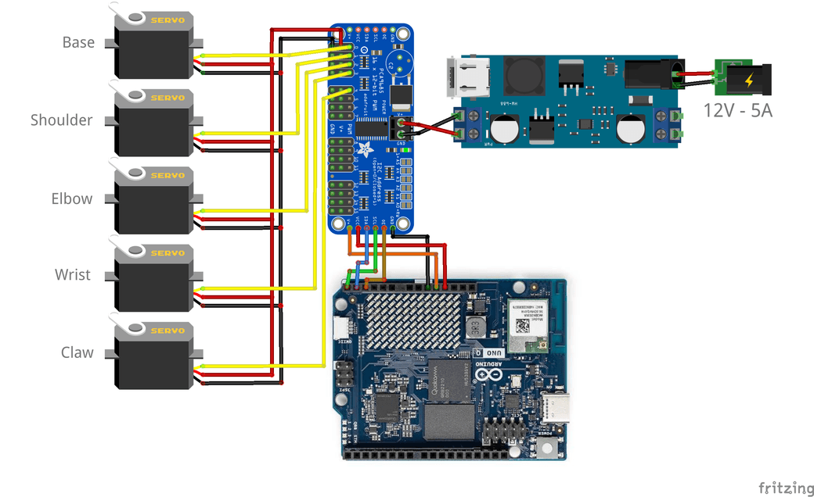</a>

*Click the diagram to open full size.*

---

| The Arduino UNO Q bench — dual-brain host for rehab AI | The 4-DOF arm at calibrated Bicep Curl pose (bottom / top / return), ready for a session |
|---|---|
| 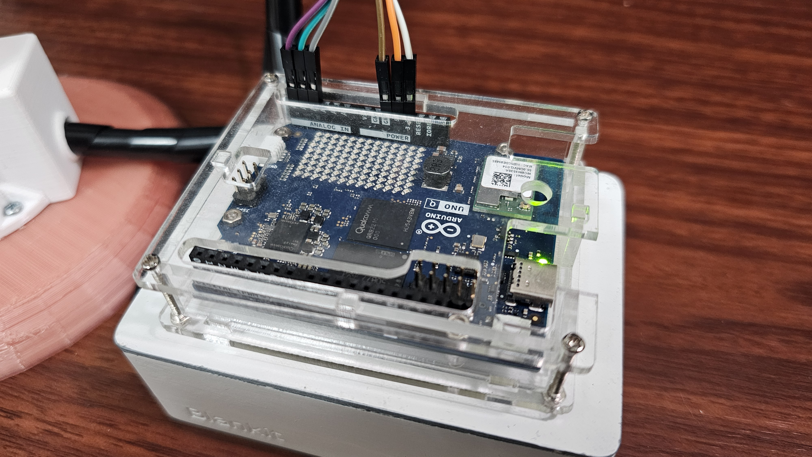 | 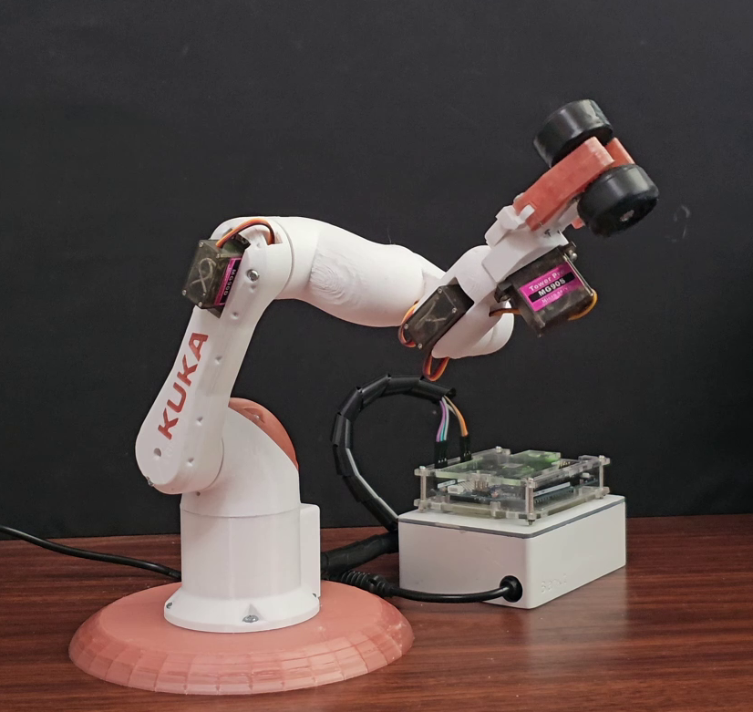 |

---

## The problem we built this for

> 📌 **Narrative example, not a real patient.** Maria's story is a design-pattern vignette we use to explain the problem space. The statistics cited below come from peer-reviewed and industry literature (links inline).

Maria had a stroke last March. Her doctor prescribed **12 weeks** of daily home PT — bicep curls, lateral raises, and elbow flexion, **3 sets per day**.

| Week | What happened |
|------|----------------|
| **1** | Perfect attendance |
| **3** | Form uncertainty · clinic booked **10 days** out |
| **5** | Stopped tracking · no feedback loop |
| **8** | Inconclusive follow-up · *"just keep going"* |

Maria is not an edge case. The gap is systemic:

| Stat | Finding | Source |
|------|---------|--------|
| **60%** | Home-PT patients drop out | [NCBI PMC5931387](https://www.ncbi.nlm.nih.gov/pmc/articles/PMC5931387/) |
| **70%** | Clinicians can't trust self-reported progress | [PubMed 29467038](https://pubmed.ncbi.nlm.nih.gov/29467038/) |
| **50%** | Post-stroke patients skip prescribed therapy (90 days) | [AHA Stroke 2019](https://www.ahajournals.org/doi/10.1161/STROKEAHA.119.025763) |
| **~$700B** | Annual global cost of stroke recovery | [WHO 2021](https://www.who.int/publications/i/item/9789240064221) |

> Rehabilitation is broken — manual, inconsistent, untrackable, and inaccessible without private in-home care.

ARMIC exists for Maria. And for millions more like her.

---

## What if therapy happened *with* you — not *to* you?

Imagine this loop running **every single session** — automatically, on your kitchen table, for the cost of an Arduino and a hobby arm kit:

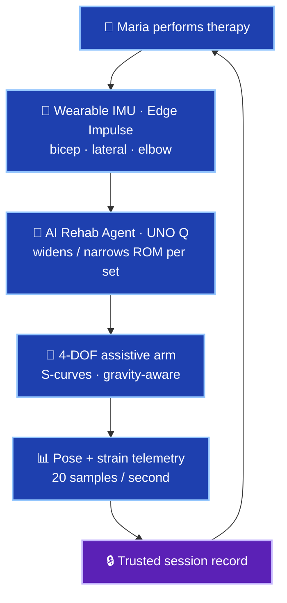
```mermaid
flowchart TD
    A["👤 Maria performs therapy"]
    B["📡 Wearable IMU · Edge Impulse\nbicep · lateral · elbow"]
    C["🧠 AI Rehab Agent · UNO Q\nwidens / narrows ROM per set"]
    D["🦾 4-DOF assistive arm\nS-curves · gravity-aware"]
    E["📊 Pose + strain telemetry\n20 samples / second"]
    F["🔒 Trusted session record"]

    A --> B --> C --> D --> E --> F --> A

    classDef step fill:#1e40af,color:#ffffff,stroke:#93c5fd,stroke-width:2px
    classDef record fill:#5b21b6,color:#ffffff,stroke:#c4b5fd,stroke-width:2px
    class A,B,C,D,E step
    class F record
```

**5 steps · zero clinician in the room · 100% measurable**

| Step | Who | What happens |
|------|-----|--------------|
| **1** | 👤 Patient | Moves through prescribed protocol at home |
| **2** | 📡 Wearable | Edge Impulse scores rep quality, ROM, hold time |
| **3** | 🧠 Agent | 3 strong reps → widen ROM **+5°** · fatigue → narrow + slow |
| **4** | 🦾 Arm | Photo-matched trajectories · S-curves · gravity-safe home |
| **5** | 🔒 Record | Telemetry logged for care teams · ROM and rep quality in session history |

> The arm isn't waving blindly — **3 smooth reps · hold at peak · return to elbow 95° home.** Same shape a PT would prescribe and document.

---

## Why Arduino UNO Q? Because it's two brains in one.

This project simply would not work on a regular UNO. Rehabilitation needs two things simultaneously:

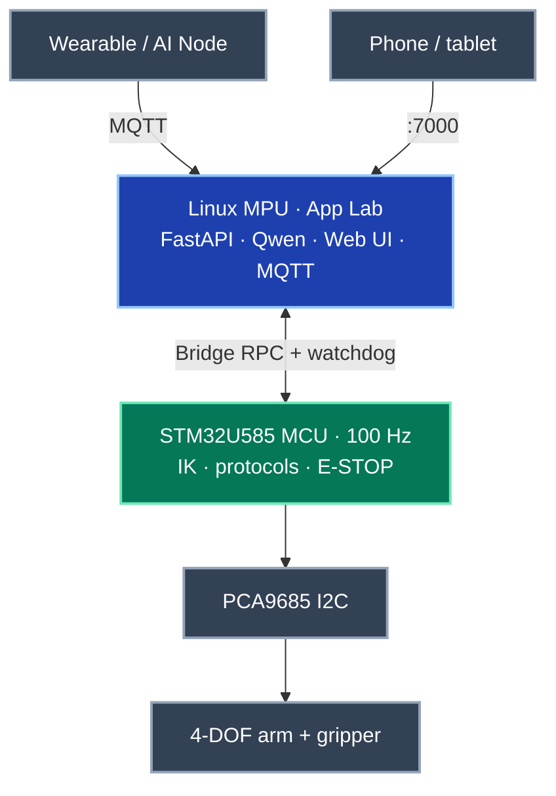
```mermaid
flowchart TB
  MPU["Linux MPU · App Lab\nFastAPI · Qwen · Web UI · MQTT"]
  MCU["STM32U585 MCU · 100 Hz\nIK · protocols · E-STOP"]
  MPU <-->|Bridge RPC + watchdog| MCU
  MCU --> PCA["PCA9685 I2C"] --> ARM["4-DOF arm + gripper"]
  WEAR["Wearable / AI Node"] -->|MQTT| MPU
  USER["Phone / tablet"] -->|:7000| MPU

  classDef mpu fill:#1e40af,color:#ffffff,stroke:#93c5fd,stroke-width:2px
  classDef mcu fill:#047857,color:#ffffff,stroke:#6ee7b7,stroke-width:2px
  classDef io fill:#334155,color:#ffffff,stroke:#94a3b8,stroke-width:2px
  class MPU mpu
  class MCU mcu
  class PCA,ARM,WEAR,USER io
```

| Layer | Component | Role |
|-------|-----------|------|
| **Brain** | **STM32U585 MCU** | Real-time arm control at 100 Hz. Motion planning, inverse kinematics, PWM to 5 servos. Physical safety layer. |
| **Brain** | **Linux MPU (App Lab)** | Python backend, LLM agent, Edge Impulse inference, static browser UI. Three App Lab containers per session. |
| **I/O** | Wi-Fi | Browser UI at `:7000` |
| **I/O** | USB-C | Power + serial debug |
| **I/O** | Qwiic / headers | PCA9685 joint driver |
| **I/O** | Bridge RPC | MCU↔MPU with safety gate |

> **Deploy form-factor:** not a $50k lab robot · not a dev-board that needs a PC — **the UNO Q is the whole computer** in Maria's living room.

---

## Meet the arm: 4 DOF, $40 servos, industrial-grade software

**MG90 hobby servos** on a standard 4-DOF kit — nothing custom machined. ARMIC adds FK/IK, S-curves, floor guards, HTL carries, and photo-matched rehab trajectories so a ~$50 kit moves like lab hardware.

| Without ARMIC | With ARMIC on UNO Q |
|---------------|---------------------|
| Stall · jitter · posture flip | FK/IK · micro-step planning · 18°/s therapy cap |
| ~$50 hardware | ~$40k-class *motion behavior* via firmware |

Full **10-layer software stack** (calibration, branch continuity, E-STOP, home @ elbow 95°): [docs/demos-and-exercises.md](docs/demos-and-exercises.md#why-this-is-not-a-raw-servo-arm) · [control-stack.md](docs/control-stack.md).

---

## Rehabilitation in motion — the 3 protocols

**3 upper-limb exercises** · **3 reps each** · cubic ease · hold at peak · gravity-safe home (elbow **95°**).

| ID | Protocol | Motion summary |
|----|----------|----------------|
| `bicep` | Bicep curl | Locked shoulder + elbow · wrist **180° → 25°** |
| `lateral` | Lateral raise | Locked shoulder + elbow · wrist tip-out → tip-down |
| `elbowflex` | Elbow flexion | Shoulder horizontal · elbow **95° → 180°** |

Waypoints and math: [docs/exercises.md](docs/exercises.md). Try motions now in the [**Online Simulator**](https://onlinesimulator.expo.app) (no board required).

---

## Demo repertoire — calibration check

Five demo protocols double as a **post-wiring self-check** — if all land without scrape, flip, or stall, `calibration.json` matches your kit.

| Demo | Validates |
|------|-----------|
| Orbital trace | IK + wrist calibration |
| HTL tucked carry | Floor guard · tip Z ≥ 15 mm |
| Cobra strike | Delta snap/brake clamp |
| Transport pose | 60 s hold · no hunt |
| Loaded dumbbell hold | Manipulability ≥ 0.4 |

Protocol IDs and demo media: [docs/demos-and-exercises.md](docs/demos-and-exercises.md).

---

## The full interface — four screens, one board

Everything lives on the UNO Q. **12 V in · Wi-Fi on · open `http://uno-q.local:7000`** — laptop, tablet, or phone. No PC required.

| Surface | URL / path | Refresh |
|---------|------------|---------|
| Main dashboard | `:7000` | Session control · calibration · agent chat |
| Wearable HUD | `/wearable-mqtt.html` | **20 Hz** · 6 MQTT topics live |
| App Lab | board containers | 3/3 UP = FastAPI + LLM + static UI |

| Main UI — session dashboard | MQTT wearable HUD — 6 live topics |
|---|---|
| 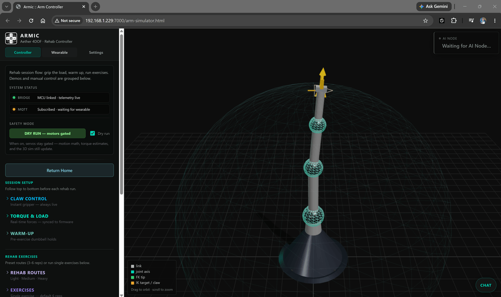 | 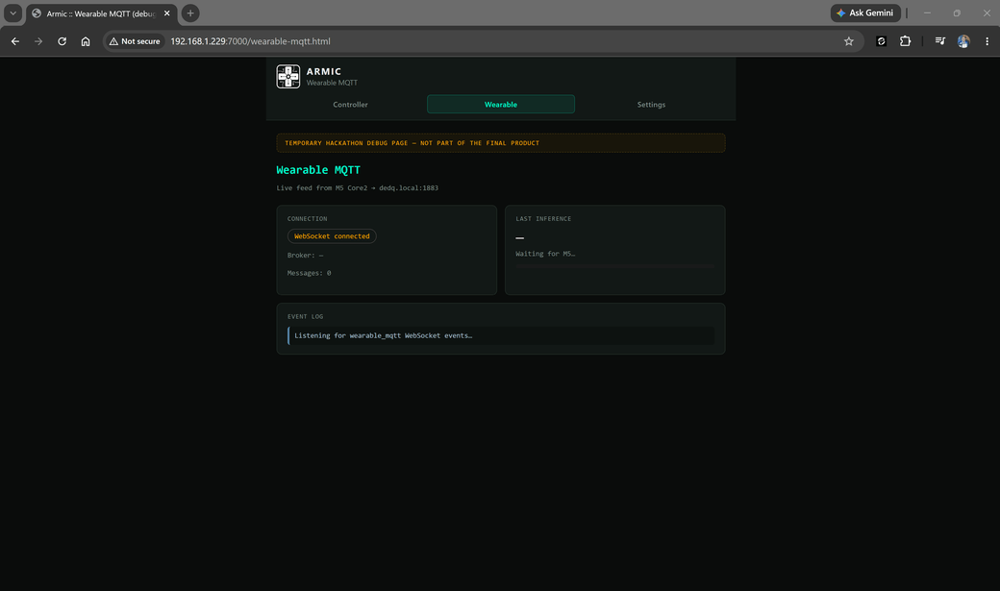 |
| **App Lab containers — 3/3 UP** | **Reference AI Node (M5 Core2 class)** |
| 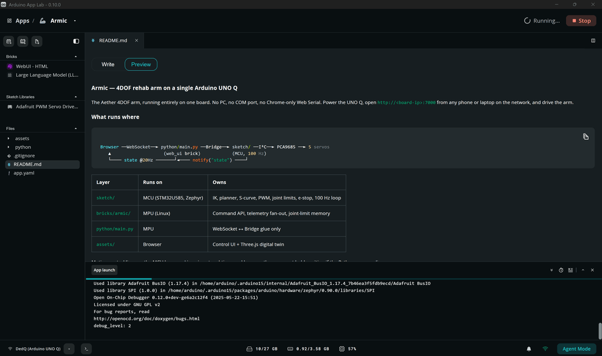 |  |

Wearable HUD refreshes at **20 Hz** — live inference, rep boundaries, and quality scores. Details: [docs/interface.md](docs/interface.md).

---

## Hardware — off the shelf, wired cleanly

| Power chain: 12 V → HW-688 → 5 V rail |
|---|
|  |

Breadboard schematic is in the [BOM section above](#breadboard-wiring--full-schematic). Wiring target: **~20 minutes** for a workshop build. Full power tree: [docs/hardware.md](docs/hardware.md).

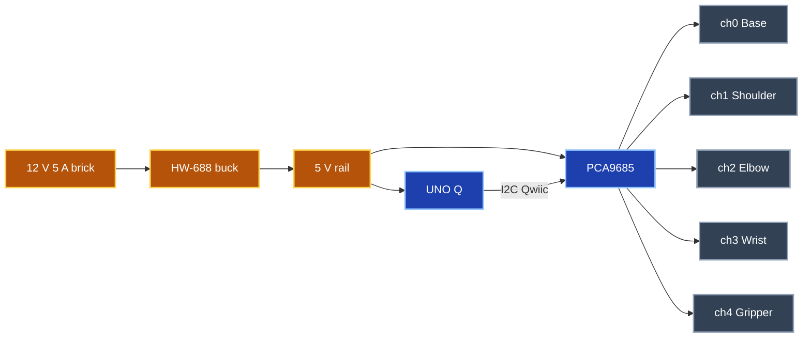
```mermaid
flowchart LR
  P12["12 V 5 A brick"] --> HW["HW-688 buck"]
  HW --> V5["5 V rail"]
  V5 --> UNO["UNO Q"]
  V5 --> PCA["PCA9685"]
  PCA --> S0["ch0 Base"]
  PCA --> S1["ch1 Shoulder"]
  PCA --> S2["ch2 Elbow"]
  PCA --> S3["ch3 Wrist"]
  PCA --> S4["ch4 Gripper"]
  UNO -->|I2C Qwiic| PCA

  classDef power fill:#b45309,color:#ffffff,stroke:#fcd34d,stroke-width:2px
  classDef logic fill:#1e40af,color:#ffffff,stroke:#93c5fd,stroke-width:2px
  classDef servo fill:#334155,color:#ffffff,stroke:#94a3b8,stroke-width:2px
  class P12,HW,V5 power
  class UNO,PCA logic
  class S0,S1,S2,S3,S4 servo
```

| Item | Detail |
|------|--------|
| **Core BOM $154** | 4 GB UNO Q · 12 V brick · barrel adapter · HW-688 · PCA9685 · MG90 arm kit · interconnect |
| **Full BOM + links** | [docs/bom.md](docs/bom.md) |
| **Schematic source** | `Images/Armic.fzz` → Fritzing **Schematic view → Export PNG** |

---

## Deploy on Arduino UNO Q — the real system

ARMIC is built to run **on the board**, in a real home or clinic — not as a browser-only demo. The UNO Q is the whole computer: MCU motion + MPU agent + Web UI + MQTT broker, all on one **$79** (4 GB) platform.

### What you deploy

| Layer | Where | What you get |
|-------|--------|--------------|
| **MCU firmware** | STM32U585 | 100 Hz safety, IK, rehab exercises, E-STOP, watchdog |
| **App Lab app** | MPU Linux | FastAPI, WebSocket 20 Hz, Qwen 0.8B agent, route runner |
| **Web UI** | `:7000` | `http://uno-q.local:7000` — arm control, calibration, agent chat, wearable HUD |
| **MQTT broker** | `:1883` | Wearable / AI Node → closed-loop rep counting + adaptation |
| **Optional AI Node** | M5 Core2 (or any device) | Edge Impulse → `armic/wearable/v1/*` — see [armic-ai-node/](Arduino%20Files/armic-ai-node/) |

### Quick deploy (20 minutes)

```mermaid
flowchart LR
  A[Wire BOM] --> B[Flash firmware]
  B --> C[Deploy App Lab]
  C --> D["Open :7000"]
  D --> E[Calibrate + Enable Motion]
  E --> F[Run bicep or Execute route]
  F --> G[MQTT HUD green]

  classDef step fill:#1e40af,color:#ffffff,stroke:#93c5fd,stroke-width:2px
  classDef done fill:#047857,color:#ffffff,stroke:#6ee7b7,stroke-width:2px
  class A,B,C,D,E,F step
  class G done
```

| Step | Action |
|------|--------|
| 1 | Wire [BOM](docs/bom.md) — UNO Q, HW-688, PCA9685, arm, 12 V |
| 2 | Flash [`armic-firmware/`](Arduino%20Files/armic-firmware/) |
| 3 | Deploy [`brick_compose.yaml`](Arduino%20Files/armic-brick/brick_compose.yaml) + [`armic-mpu/`](Arduino%20Files/armic-mpu/) |
| 4 | Open **`http://uno-q.local:7000`** → calibration → **Enable Motion** |
| 5 | **exercise bicep** (3 reps) or **Execute** on light/medium/heavy card |
| 6 | AI Node on → all six MQTT topics green at `/wearable-mqtt.html` |

Full bring-up: [docs/setup.md](docs/setup.md). Agent/judge spec: [AGENTS.md](AGENTS.md). Remote dev from laptop: [AgentSSH/](AgentSSH/).

---

## No board? No problem — enter the Online Simulator

  <a href="https://onlinesimulator.expo.app">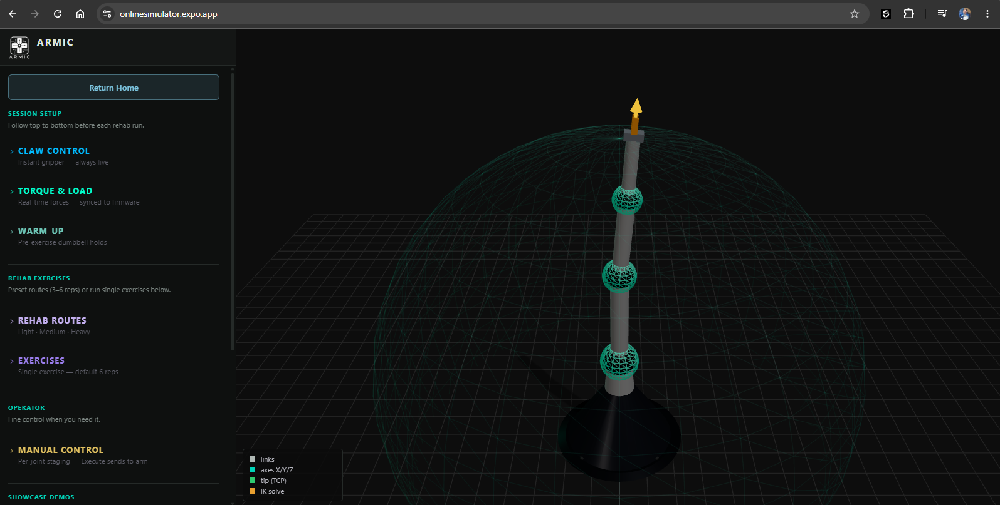</a>

*Click the screenshot to open the live simulator.*

| | |
|---|---|
| **→ [Open Online Simulator](https://onlinesimulator.expo.app)** | Same firmware math as hardware — presets · sliders · rehab routes · HTL · orbital · bicep/lateral/elbowflex |
| **No install · no wiring** | Phone or laptop · digital twin moves in real time |
| **Source** | [`OnlineSimulator/`](OnlineSimulator/) — read how the port mirrors MCU kinematics |

When you're ready for the full closed loop — real servos, edge LLM, MQTT wearable, calibration SSoT — deploy on UNO Q (`http://uno-q.local:7000`).

---

## The agent inside: Qwen3.5 0.8B on the UNO Q MPU

**Edge-first AI** — Qwen runs **locally** on the UNO Q via llama.cpp in the `arduino:llm` container. Not a cloud hook. Not a deferred cloud upgrade.

| Warming up (~8 s boot) | Ready — 4 tools registered |
|---|---|
| 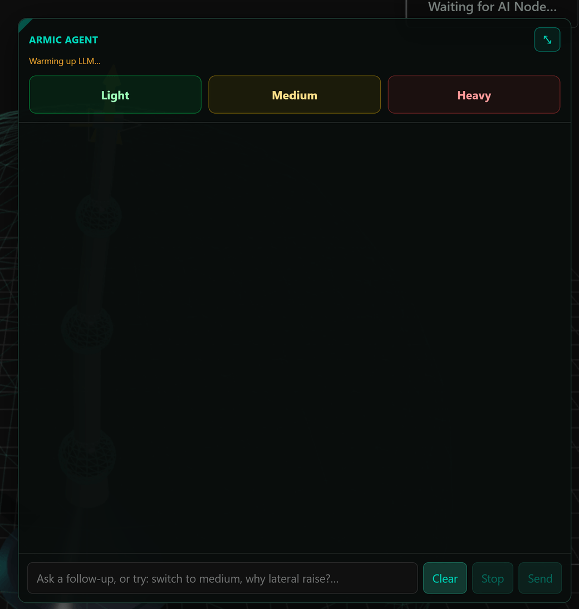 | 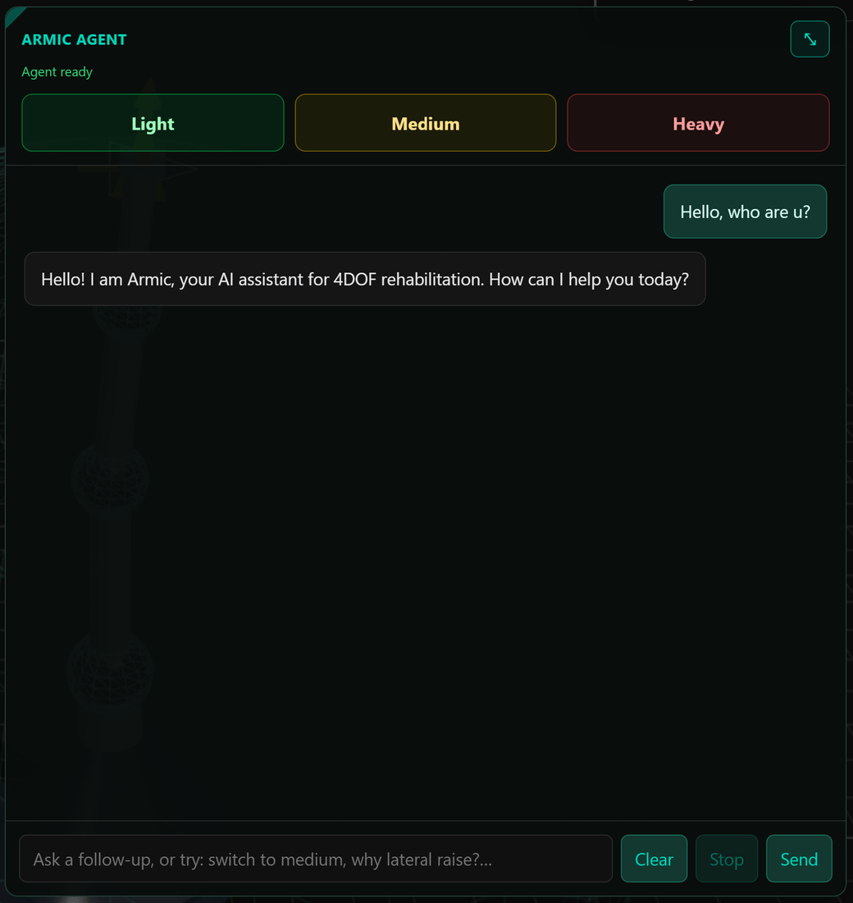 |

Deep dive (model matrix, prompt scenarios): [docs/agent.md](docs/agent.md).

---

### Why on-device?

| | | | |
|:---:|:---|:---|:---|
| 🔒 | **Privacy** — data stays on the table | ⚡ | **Latency** — adapts between reps |
| 🛡️ | **Resilience** — router down, arm still safe | 💰 | **Scale** — no per-rep cloud API bill |

---

### Why Qwen 0.8B? The UNO Q is not a $5,000 server.

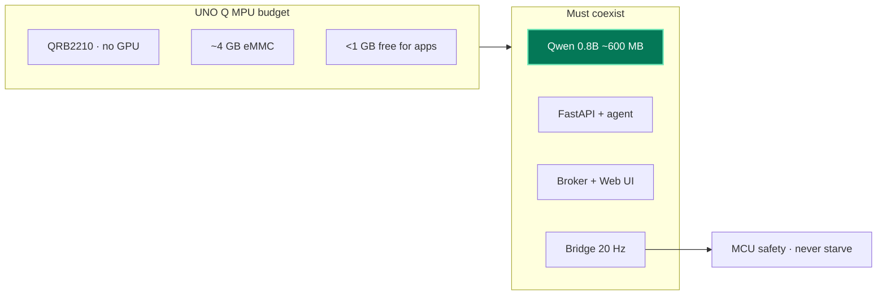
```mermaid
flowchart LR
  subgraph budget ["UNO Q MPU budget"]
    SOC["QRB2210 · no GPU"]
    DISK["~4 GB eMMC"]
    RAM["<1 GB free for apps"]
  end
  subgraph stack ["Must coexist"]
    LLM["Qwen 0.8B ~600 MB"]
    PY["FastAPI + agent"]
    MQTT["Broker + Web UI"]
    BR["Bridge 20 Hz"]
  end
  budget --> stack
  BR --> MCU["MCU safety · never starve"]

  classDef ok fill:#047857,color:#ffffff,stroke:#6ee7b7,stroke-width:2px
  class LLM ok
```

| Model | Q4 RAM | Fits UNO Q? | Verdict |
|-------|--------|-------------|---------|
| **Qwen3.5 0.8B** ✅ | **~600 MB** | Yes · headroom for broker + UI | **Our pick** — ~85–90% tool-call accuracy |
| Llama-3.1 8B | ~5.5 GB | ❌ | RAM + disk blow the budget |
| Phi-3 Mini 4K | ~2.7 GB | ❌ | Thrashes · half the eMMC gone |
| Gemma 2 2B | ~1.4 GB | ⚠️ Tight | Starves telemetry · no accuracy win |

> **Bottom line:** 0.8B is the **largest model that keeps App Lab + MQTT + Web UI + 20 Hz bridge alive** without OOM-killing the safety layer. GPT-4o / Llama-70B / Mixtral swap out and trip the watchdog.

---

### 4-tool brick — structured control, not raw joint angles

The LLM **never** emits joint targets. It calls JSON tools; the MCU enforces limits.

```mermaid
flowchart LR
  U["Patient / PT chat"] --> Q["Qwen 0.8B"]
  Q --> T["4 JSON tools"]
  T --> F["FastAPI route runner"]
  F --> B["Bridge RPC"]
  B --> M["MCU · IK · safety"]

  classDef edge fill:#1e40af,color:#ffffff,stroke:#93c5fd,stroke-width:2px
  classDef gate fill:#047857,color:#ffffff,stroke:#6ee7b7,stroke-width:2px
  class Q,T,F edge
  class M gate
```

| Tool | Params | Does |
|------|--------|------|
| `run_arm_protocol` | `protocol` | Demo motions only (`home`, `htl`, `snake`, …) |
| `list_rehab_routes` | — | Show light / medium / heavy cards |
| `suggest_rehab_intent` | `description` | Match route — **display only** |
| `show_rehab_route` | `route_id` | One route card — **display only** |

| Wearable signal | Agent action |
|-----------------|--------------|
| 3× rep quality **≥ 0.75** | Widen ROM **+5°** |
| 3× rep quality **< 0.40** | Narrow ROM **−5°** · slow speed |
| User asks to start rehab in chat | ❌ Must press **Execute** on route card |

Spec: [`AGENTS.md`](AGENTS.md) §4 · [`agent/tools.py`](Arduino%20Files/armic-mpu/agent/tools.py). Prompt scenarios and full model matrix: [docs/agent.md](docs/agent.md).

---

### Built on the real board

Firmware, backend, and rehab protocols were developed **on the UNO Q** via App Lab SSH and [AgentSSH/](AgentSSH/) — same **4-tool contract** as the patient agent. Safety (elbow 90–180°, 15 mm floor, 1500 ms watchdog, calibration SSoT) lives in **firmware**, not prompts.

| Asset | Role |
|-------|------|
| [`AGENTS.md`](AGENTS.md) | Judge/agent spec |
| [`AI Skills/`](AI%20Skills/) | 31 skills + 3 rules ([bundle](AI%20Skills/skills/ARDUINO-BUNDLE.md)) |
| [`AgentSSH/`](AgentSSH/) | 16 MCP SSH tools · laptop → `uno-q.local` |

---

## Why we launched $ARMIC — making the project real

**$ARMIC funds the build** — UNO Q stations, arm kits, bench time, and community. It is **not** a patient reward or clinical incentive layer.

| | |
|---|---|
| **Product** | UNO Q robot · edge agent · 5-layer safety · wearable · calibration SSoT |
| **Token** | Launch proof · hardware fund · **not** the therapy loop |

Creator fees route **100%** to a rehab hardware fund. Contract `DcTVUogWykX1JeBmTq48Fzj2Lc3Y7zwHQS1CyZ9SHnXf` · mint/freeze authority **disabled** · launched 2026-08-30.

Full facts: [docs/project-token.md](docs/project-token.md).

---

## The team

Three biomedical engineers · four prior Hackster wins · Maker Faire Rome alumni.

| Member | Prior highlights |
|--------|------------------|
| **Victor Alonso Altamirano Izquierdo** | Best Overall — AI cardiac · Helium Creative — AgroLoRa |
| **Alejandro Sanchez Gutierrez** | Spresense × Edge Impulse facemask prize |
| **Luis Eduardo Arevalo Oliver** | AgroNordic 3rd · AgroLoRa Helium winner |

Profiles: [Altaga](https://www.hackster.io/Altaga) · [EdOliver](https://www.hackster.io/Edoliver) · [Alejandro_S_G](https://www.hackster.io/Alejandro_S_G)

---

## Roadmap

| When | Milestone |
|------|-----------|
| **Hackster submission** | Docs · BOM · Fritzing · code · safety gates |
| Near term | UNO Q dry_run → live motion gate |
| Q4 2026 | Clinical pilot (3 patients, 4 weeks) |
| Q2 2027 | Open-hardware kit v2 — PCB · tuned linkages |

Contest context: [docs/project.md](docs/project.md).

---

## Deep dive — for judges who want the math

Narrative lives here · equations and layer diagrams in **[docs/](docs/)** (+ [docs/README.md](docs/README.md) hub).

| Topic | Doc |
|-------|-----|
| Architecture · dual brain | [architecture.md](docs/architecture.md) |
| FK / IK · PWM | [kinematics.md](docs/kinematics.md) |
| S-curves · jerk | [motion-planning.md](docs/motion-planning.md) |
| Torque · derating | [dynamics.md](docs/dynamics.md) |
| Safety stack (5 layers) | [control-stack.md](docs/control-stack.md) |
| BOM · hardware · setup | [bom.md](docs/bom.md) · [hardware.md](docs/hardware.md) · [setup.md](docs/setup.md) |
| Exercises · HTL · serial | [exercises.md](docs/exercises.md) · [htl-reference.md](docs/htl-reference.md) · [serial-protocol.md](docs/serial-protocol.md) |
| Agent · token · UI | [agent.md](docs/agent.md) · [project-token.md](docs/project-token.md) · [interface.md](docs/interface.md) |

---

## How to run it — 6 steps, 20 minutes

| Step | Action | Verify |
|------|--------|--------|
| **1** | Flash MCU firmware to UNO Q | Serial connects @ **115200** |
| **2** | Wire PCA9685 on I2C (Qwiic or headers) | I2C scan / boot logs |
| **3** | Power **12 V → HW-688 → 5 V** rail | Stable 5 V under load |
| **4** | Serial boot | Home pose · elbow **95°** · claw open |
| **5** | Open `http://uno-q.local:7000` | Main UI loads |
| **6** | **Enable Motion** → **exercise bicep** → 3 reps → **estop** | Returns home |

Full checklist: [docs/setup.md](docs/setup.md)

### Safety stack (firmware — not prompts)

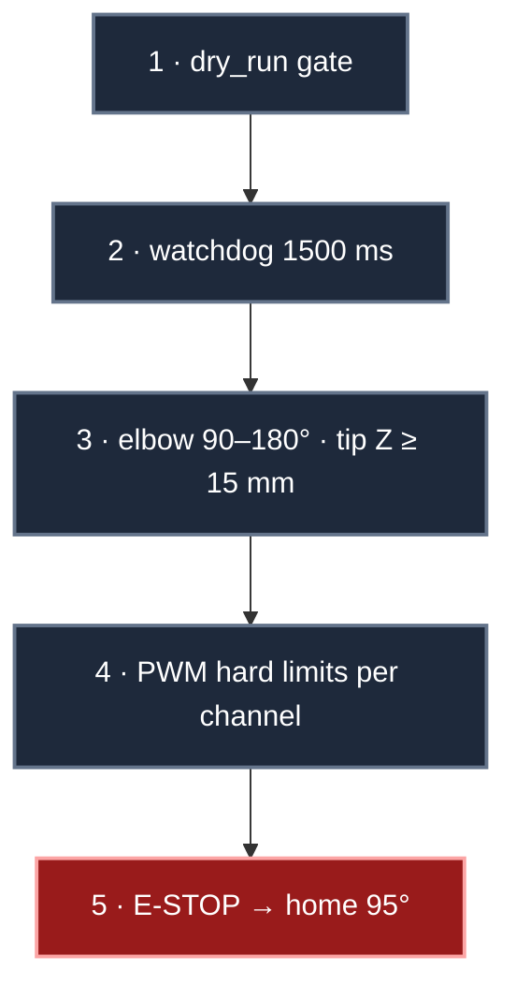
```mermaid
flowchart TB
  L1["1 · dry_run gate"] --> L2["2 · watchdog 1500 ms"]
  L2 --> L3["3 · elbow 90–180° · tip Z ≥ 15 mm"]
  L3 --> L4["4 · PWM hard limits per channel"]
  L4 --> L5["5 · E-STOP → home 95°"]

  classDef layer fill:#1e293b,color:#ffffff,stroke:#64748b,stroke-width:2px
  classDef estop fill:#991b1b,color:#ffffff,stroke:#fca5a5,stroke-width:2px
  class L1,L2,L3,L4 layer
  class L5 estop
```

| Invariant | Value |
|-----------|-------|
| E-STOP home | Elbow **95°** (not 90° — no gravity hunt) |
| Calibration SSoT | [`calibration.json`](Arduino%20Files/armic-brick/calibration.json) — 3-phase commit |
| Motion default | **Dry run ON** until UI **Enable Motion** |

Detail: [control-stack.md](docs/control-stack.md) · [AGENTS.md](AGENTS.md) §3

---

> **ARMIC — programmable, intelligent, human-centered rehabilitation on Arduino UNO Q.**  
> Because Maria shouldn't have to wait for a clinic opening. Neither should 750 million other people recovering from stroke, injury, or surgery every year.  
> We start with one arm, one UNO Q, one home at a time.

---

*Submitted to the Hackster "Invent the Future with Arduino UNO Q and App Lab" contest — September 2026. Robotics (primary) · Social Impact (secondary).*
