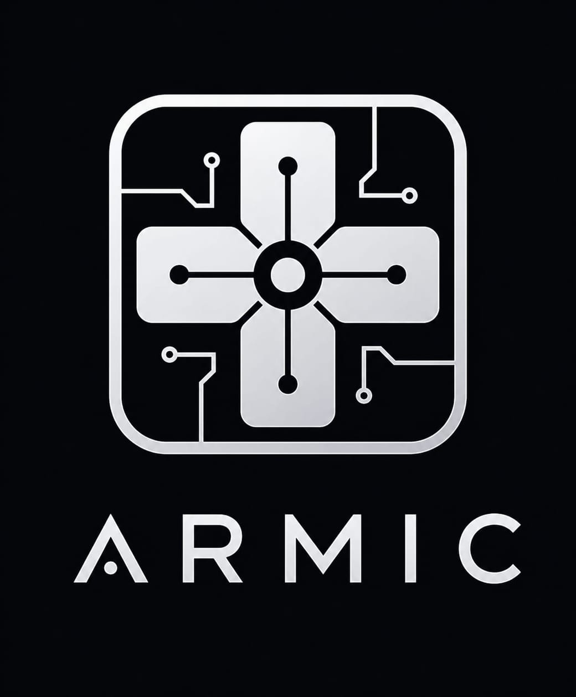
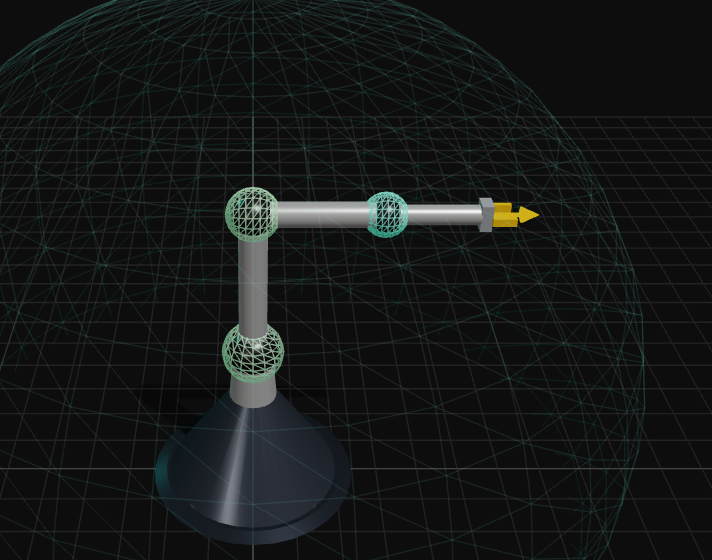
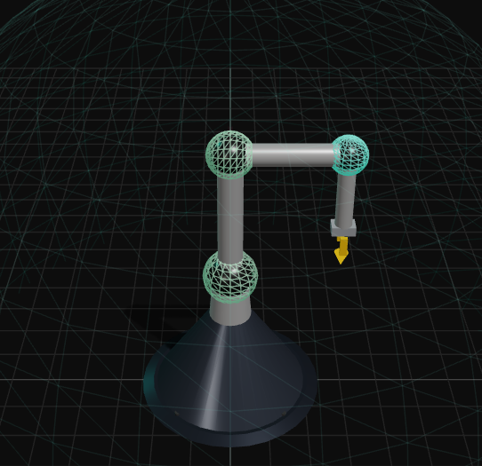

# Armic



**Autonomous rehabilitation with a 4-DOF assistive arm, edge AI, and the Arduino UNO Q.**

ARMIC turns physical therapy into a closed, measurable loop: the patient moves, on-device ML verifies the exercise, and a calibrated robotic arm assists in real time — powered by the **Arduino UNO Q** dual brain (STM32 MCU + Linux MPU).

---

## Table of contents

1. [Vision & problem](#vision--problem)
2. [The ARMIC loop](#the-armic-loop)
3. [Arduino UNO Q platform](#arduino-uno-q-platform)
4. [System architecture](#system-architecture)
5. [Hardware & bill of materials](#hardware--bill-of-materials)
6. [How the arm is controlled](#how-the-arm-is-controlled)
7. [Why these algorithms matter](#why-these-algorithms-matter)
8. [Rehabilitation exercises](#rehabilitation-exercises)
9. [Protocols & demos](#protocols--demos)
10. [Telemetry](#telemetry)
11. [Safety](#safety)
12. [Serial commands](#serial-commands)
13. [Setup & bring-up](#setup--bring-up)
14. [Locked conventions](#locked-conventions)
15. [Project status & roadmap](#project-status--roadmap)
16. [Team](#team)
17. [Deep-dive docs (math & equations)](#deep-dive-docs-math--equations)

---

## Vision & problem

Rehabilitation today is **manual, inconsistent, and hard to measure**. Patients drop out, progress is rarely quantified, and outcomes are difficult to trust.

**ARMIC** addresses this with:

| Pillar | How |
|--------|-----|
| **Detect** | Edge Impulse classifies patient exercises on-device (UNO Q MPU) |
| **Assist** | 4-DOF arm runs photo-matched therapy protocols (UNO Q MCU) |
| **Measure** | Live telemetry: pose, strain, session mode |
| **Scale** | Arduino UNO Q + App Lab — edge AI ready for contest & clinic demos |

**Hackster / Arduino UNO Q contest:** **Social Impact** (measurable rehab) and **Robotics** (assistive arm).

---

## The ARMIC loop

```
Patient performs therapy
        │
        ▼
Edge ML (UNO Q MPU / Edge Impulse) ── verifies exercise & reps
        │
        ▼
App Lab / Bridge ── session command (exercise, coach, log)
        │
        ▼
UNO Q MCU ── motion algorithms ── PCA9685 ── 4-DOF arm
        │
        ▼
Assistive motion + telemetry ──► dashboard / session record
```

The arm does not blindly wave around — it runs **locked rehab sequences** (bicep curl, lateral raise, elbow flexion): 3 reps, smooth pacing, then return to a safe home pose.

---

## Arduino UNO Q platform

All controller references in this project are **Arduino UNO Q only**.

| Brain | Role |
|-------|------|
| **MCU (STM32U585)** | Real-time arm control: planning, rehab protocols, servo PWM |
| **MPU (Linux / Dragonwing)** | App Lab UI, Edge Impulse, session logging |

| Feature | Use |
|---------|-----|
| Wi-Fi / Bluetooth | App Lab connectivity |
| USB-C | Power, serial, future video |
| UNO headers + **Qwiic** | PCA9685 PWM board, IMU |
| **Bridge RPC** | MCU sketch ↔ Linux App Lab (planned) |

Tooling: **Arduino App Lab** and/or **Arduino IDE 2.x** (MCU).

---

## System architecture

```
┌─────────────────────────────────────────────────────────────┐
│                     Arduino UNO Q                           │
│  ┌──────────────────────┐    ┌───────────────────────────┐  │
│  │  MPU (Linux)         │    │  MCU (STM32U585)          │  │
│  │  • Edge Impulse      │◄──►│  • Arm motion engine      │  │
│  │  • App Lab / UI      │Bridge│  • Rehab protocols      │  │
│  └──────────────────────┘    │  • PCA9685 @ 50 Hz        │  │
│                              └─────────────┬─────────────┘  │
└────────────────────────────────────────────┼────────────────┘
                                             │ I2C
                                      ┌──────▼──────┐
                                      │   PCA9685   │
                                      └──────┬──────┘
                         ch0..ch4 ──► 4-DOF arm + gripper
```

**MCU control path:** serial or Bridge command → motion engine → calibrated PWM → servos → telemetry back to host.

---

## Hardware list — and why each part matters

Contest build is **Arduino UNO Q + off-the-shelf motion hardware**. Every item below has a job; skip one and the demo fails in a predictable way.

| # | Hardware | Qty | Why it matters |
|---|----------|-----|----------------|
| 1 | **[Arduino UNO Q](https://www.arduino.cc/)** (4 GB) | 1 | **The brain.** MCU (STM32) runs arm firmware in real time; MPU (Linux) runs App Lab, Edge Impulse, and the session UI. Without it there is no dual-brain rehab loop — only a bare servo toy. |
| 2 | **MPU6886 IMU** (HW688-class 6-axis module) | 1 | **The patient sensor.** Streams accelerometer + gyro at rehab rates (~50 Hz) for Edge Impulse exercise classification (bicep curl, lateral raise, etc.). Without it the system cannot *verify* that the patient actually performed the therapy — only that the arm moved. |
| 3 | **12 V · 5 A DC supply** | 1 | **The muscle power.** MG90 servos stall around **~650 mA each**; shoulder + elbow under load can pull **>2 A** peaks. A weak USB/5 V rail causes **brown-out, jitter, and random MCU resets**. 12 V → servo rail (via PCA9685 VMOT or buck) keeps motion energetic and stable. |
| 4 | **PCA9685** 16-ch PWM driver | 1 | **The joint driver.** Generates clean **50 Hz** servo pulses for up to 16 channels over **I2C** — frees the UNO Q MCU from bit-banging PWM. Without it: timing jitter, missed frames, and shaky rehab motion. Drives **ch0–ch4** (base, shoulder, elbow, wrist, gripper). |
| 5 | **Lozada Dynamics arm** *(or equivalent cheap 4-DOF kit: MG90S servos + DC gearmotors)* | 1 | **The actuator.** Provides the physical degrees of freedom ARMIC assists. **MG90S/MG90D** on joints give proportional rehab motion; **DC motors** (relay-driven on many kits) handle grip/base variants. Our firmware is calibrated for this kinematic chain (L0–L3 link lengths). A random arm without calibration → wrong poses and floor crashes. |

### Wiring sketch

```
12 V 5 A PSU ──► PCA9685 (VMOT) ──► MG90 servos (ch0–4)
                    ▲ I2C
              Arduino UNO Q MCU
                    │
              MPU6886 (Qwiic) ── patient limb / wearable
                    │
              UNO Q MPU ── Edge Impulse + App Lab
```

### Servo channel map (PCA9685)

| CH | Joint | Notes |
|----|-------|--------|
| 0 | Base | Yaw |
| 1 | Shoulder | Primary gravity joint |
| 2 | Elbow | **[90°–180°]** band only |
| 3 | Wrist | Tip orientation |
| 4 | Gripper | Open / close |

### Arm geometry (mm)

| Segment | Length |
|---------|--------|
| Floor → base | 60 |
| Base → shoulder (L0) | 30 |
| Shoulder → elbow (L1) | 90 |
| Elbow → wrist (L2) | 70 |
| Wrist → gripper (L3) | 50 |

**Stable home pose:** `{90, 90, 95, 90}` — elbow at **95°** on purpose (see [algorithms](#why-these-algorithms-matter)).

Full BOM: [docs/bom.md](docs/bom.md)

---

## How the arm is controlled

Two motion engines on the UNO Q MCU share one PWM bus — only one runs at a time.

| Engine | Used for | Examples |
|--------|----------|----------|
| **ArmPipeline** | Moving the tip in 3D space | `target x y z`, loaded carries |
| **ProtocolRunner** | Named moves & rehab | `exercise bicep`, `protocol htl` |

Both run at **~100 Hz**. When idle, the firmware **stops sending PWM** so servos are not fighting gravity or hunting around a bent pose.

**High-level pipeline:**

```
Command → plan path → solve joints → check load → smooth motion → PWM → servo
                ↑                                    │
                └──────── telemetry ◄────────────────┘
```

Industrial arms hide complexity behind the same idea: **model the arm, plan the path, limit speed, then actuate.** ARMIC does that on MG90 servos instead of harmonic drives.

Module reference: `kinematics`, `Planner`, `ArmPipeline`, `MotionProfile`, `ProtocolRunner`, `DeviceState` — details in [docs/architecture.md](docs/architecture.md).

---

## Why these algorithms matter

> **Hobby servos have no encoders, no force control, and weak gearboxes.**  
> Without the right software, this arm **stalls, jitters, scrapes the table, flips posture mid-move, or burns out motors** — especially during rehab where motion must be slow, repeatable, and safe.

This is the **only place** we focus on algorithms. Equations live in [docs/kinematics.md](docs/kinematics.md) and [docs/motion-planning.md](docs/motion-planning.md).

---

### 1. Forward & inverse kinematics (FK / IK)

**What it does:** Translates between “where the hand should be” (x, y, z) and “what angle each joint needs.”

**Without it:**
- You cannot command `target 150 0 200` — only raw PWM guesses per servo.
- Joints fight each other; the tip misses the goal or takes a different path every time.
- Cartesian demos (orbital path, point-to-point assist) are impossible.

**Failure modes we avoid:** unreachable targets are rejected; dual elbow solutions are picked deliberately so the arm does not **snap** to a different posture mid-path.

---

### 2. Per-servo PWM calibration

**What it does:** Maps logical joint angles to **measured** MIN / CENTER / MAX ticks per channel (shoulder is inverted, gripper is open/close, etc.).

**Without it:**
- “90°” on one servo is not 90° on another — rehab poses drift.
- Commands exceed mechanical stops → **gear grind, stall, or reversed motion**.
- The same command damages servos over time (classic hobby-arm failure).

---

### 3. Cartesian waypoint planning (2 mm steps)

**What it does:** Splits a long move into many small straight-line steps; IK runs at **each** step, not just the destination.

**Without it:**
- One big IK jump → violent snap, overshoot, or IK branch flip.
- The tip cuts through space unpredictably — bad for demos and dangerous near patients.

---

### 4. Loaded-path planning (HTL / C-curve)

**What it does:** When the claw holds a load and the move is far, the arm **tucks inward** (compact radius, higher Z) before rotating and extending — like lifting close to your body before reaching out.

**Without it:**
- Shoulder servo stalls under **reach × weight** — arm sags, buzzes, or trips PSU.
- “Transport” demos fail; the arm looks weak and unreliable.
- Motors overheat; motion stops mid-protocol.

---

### 5. Motion profiles (rate limits, cubic ease, S-curves)

**What it does:** Caps how fast joints change; rehab uses smooth ease-in/out instead of linear snaps; gripper uses smoothstep open/close.

**Without it:**
- Instant velocity changes → **servo ringing, jitter, current spikes**.
- Rehab motion feels robotic and harsh — wrong for therapy assist.
- Gears wear faster; motion looks amateur compared to industrial arms.

---

### 6. Torque estimation & velocity derating

**What it does:** Estimates gravity load on shoulder/elbow/wrist from pose + payload; **slows down** when strain nears stall (~80% of safe limit).

**Without it:**
- Arm runs full speed into heavy poses → **thermal shutdown, buzzing, lost steps** (open-loop servos “fight” until they give up).
- Same speed when empty vs loaded — wastes energy and risks crash when gripping an object.
- Shoulder dies on reach-out poses; demos fail on the interesting moves.

---

### 7. IK branch continuity

**What it does:** When two elbow configurations can reach the same point, pick the one **closer to the current pose** or **lighter on gravity** — never flip randomly.

**Without it:**
- Mid-path **posture inversion** — arm appears to “break” or jump.
- Orbital and circle demos stutter or fail entirely.
- Judges and patients lose trust in the system instantly.

---

### 8. Floor & joint-limit guards

**What it does:** Forward kinematics checks tip height before accepting a pose; elbow locked to **[90°, 180°]**; exercise lerps are shortened if the tip would dip below ~15 mm.

**Without it:**
- Tip **drags on the table** during lateral or flexion moves.
- Elbow driven past safe band → mechanical crash or stripped gears.
- Rehab sequences that look fine in theory destroy the arm on hardware.

---

### 9. Stable home & joint-space parking

**What it does:** Home is always `{90, 90, 95, 90}` via **joint angles**, not “move tip to center with IK.” Elbow **95°** resists gravity hunt.

**Without it:**
- Home through IK near base axis (r ≈ 0) → **singularity**, wild joint rates.
- Elbow at exactly 90° under load → **endless micro-hunt / jitter** at rest.
- E-stop or stop leaves arm in a bent, high-strain pose.

---

### 10. Synced rehab trajectories

**What it does:** Photo-matched waypoints; all joints move together on a timed cubic ease; hold at peak; 3 reps; return home.

**Without it:**
- Shoulder leads when only wrist should move — **wrong exercise**, wrong muscle group.
- Linear joint lerp → jerky, non-therapeutic motion.
- No hold at peak → impossible to verify form or sync with patient ML.

---

### Summary — raw hobby vs ARMIC

| Without algorithms | What happens |
|--------------------|--------------|
| Raw PWM to targets | Stalls, reversals, gear damage |
| One-shot IK | Snaps, branch flips, missed goals |
| Full speed always | Overheat, buzz, PSU sag |
| Linear motion | Jitter, harsh rehab feel |
| Ignore load | Sag, fail on HTL / gripper demos |
| Ignore floor | Tip crash, table collisions |
| Bad home | Hunt, singularity, unsafe idle |

**With the stack:** a low-cost arm can run **repeatable rehab assist**, **loaded carry demos**, and **smooth orbital paths** — behavior people associate with industrial robotics, because the **software** does what the hardware cannot do alone.

---

## Rehabilitation exercises

Photo-matched poses only. Serial: `exercise bicep|lateral|elbowflex` — **3 reps** → stable home.

### Bicep curl

| Pose | `{b, sh, el, wr}` |
|------|-------------------|
| Bottom | `90, 120, 170, 180` |
| Top | `90, 120, 170, 25` |

Shoulder + elbow **locked**; wrist curls only.

### Lateral raise

 

| Pose | `{b, sh, el, wr}` |
|------|-------------------|
| Tip out | `90, 90, 180, 90` |
| Tip down | `90, 90, 180, 180` |

Shoulder + elbow **locked**; wrist only.

### Elbow flexion

| Pose | `{b, sh, el, wr}` |
|------|-------------------|
| Extended | `90, 0, 95, 90` |
| Peak | `90, 0, 180, 180` |

Shoulder fixed at **0°** (horizontal left — not 180°).

Full reference: [docs/exercises.md](docs/exercises.md)

---

## Protocols & demos

All protocols start from **safe home** unless mid-exercise.

| Command | Purpose |
|---------|---------|
| `protocol home` | Stable home |
| `protocol transport` | Compact carry pose |
| `protocol htl` | Heavy Tucked Lift — tuck load before carry |
| `protocol orbital` | Slow circular IK path |
| `protocol cobra` / `gimmefive` | Strike demo |
| `protocol pendulum` | Inertia + brake demo |
| `protocol stop` / `estop` | Halt → home hold |

**HTL sequence (locked):** reach wide → fold in → transport carry → home.  
Why: carrying with arm fully extended **stalls shoulder** — tuck first or the demo fails.

Details: [docs/htl-reference.md](docs/htl-reference.md) · [docs/serial-protocol.md](docs/serial-protocol.md)

---

## Telemetry

~20 Hz on serial (**115200** baud):

```
STATE mode=… b=…,…,…,… pwm=… strain=… w=… payload=… claw=… loaded=…
```

| Field | Meaning |
|-------|---------|
| `mode` | idle, bicep, pipeline, home, … |
| `b` / `pwm` | Joint angles and raw ticks |
| `strain` | Estimated load on shoulder / elbow / wrist (%) |
| `w` | Posture quality (manipulability — low = near bad pose) |
| `loaded` | Claw mid/closed → HTL routing active |

Used for App Lab dashboards, Hackster videos, and tuning without guessing.

---

## Safety

1. Per-channel PWM clamps + global hard limits  
2. Elbow never below **90°**  
3. Tip stays **≥ 15 mm** above floor on exercises  
4. **Stable home** — elbow 95°, claw open at boot  
5. **E-stop** — halt everything, park home  
6. **Idle = no PWM spam** — prevents hunt at rest  
7. Calibration by **manual ramp only** — no destructive autodetect sweeps  

---

## Serial commands

```
protocol home|cpose|transport|snake|cobra|gimmefive|orbital|htl|pendulum|stop|estop
exercise bicep|lateral|elbowflex
target <x> <y> <z> [pitch]
joints <b> <sh> <el> <wr>
payload <kg>
gripper open|close|mid|<0-100>
matrix | help | center | stop | estop
```

Service/calibration: `sweep`, `swipe`, `move`, `setup`, `release`, `fix` — see [docs/serial-protocol.md](docs/serial-protocol.md).

---

## Setup & bring-up

1. Flash MCU firmware to **Arduino UNO Q**  
2. Wire **PCA9685** on I2C (Qwiic or headers)  
3. Serial **115200** → confirm boot at home (elbow 95°, claw open)  
4. `matrix` → channels 0–4 OK  
5. `exercise bicep` → smooth 3-rep cycle  
6. `estop` → stable home  

Full checklist: [docs/setup.md](docs/setup.md)

---

## Locked conventions

| Rule | Value |
|------|--------|
| Stable home | `{90, 90, 95, 90}` |
| Elbow band | **[90°, 180°]** |
| Floor clearance | tip Z **≥ 15 mm** |
| Rehab reps | **3** |
| Controller | **Arduino UNO Q** only |

AI rule: [`.cursor/rules/arm-rehab-exercises.mdc`](.cursor/rules/arm-rehab-exercises.mdc)

---

## Project status & roadmap

| Area | Status |
|------|--------|
| Docs & algorithms (this repo) | ✅ |
| Firmware on UNO Q MCU | 🔄 In progress |
| App Lab + Edge Impulse (MPU) | 📋 Planned |
| Hackster submission | 📋 BOM, schematics, video |

---

## Team

- [Victor Alonso Altamirano](https://www.linkedin.com/in/victor-alonso-altamirano-izquierdo-311437137/)
- [Alejandro Sanchez Gutierrez](https://www.linkedin.com/in/alejandro-sanchez-gutierrez-11105a157/)
- [Luis Eduardo Arevalo Oliver](https://www.linkedin.com/in/luis-eduardo-arevalo-oliver-989703122/)

---

## Deep-dive docs (math & equations)

For judges, contributors, and porting firmware — full formulas and implementation detail:

| Doc | Contents |
|-----|----------|
| [docs/control-stack.md](docs/control-stack.md) | Layer diagram |
| [docs/kinematics.md](docs/kinematics.md) | FK / IK equations, PWM maps |
| [docs/motion-planning.md](docs/motion-planning.md) | Planner, S-curves, profiles |
| [docs/dynamics.md](docs/dynamics.md) | Torque model, derating |
| [docs/architecture.md](docs/architecture.md) | Dual-brain architecture |
| [docs/hardware.md](docs/hardware.md) | Hardware detail |
| [docs/exercises.md](docs/exercises.md) | Rehab poses |
| [docs/htl-reference.md](docs/htl-reference.md) | HTL |
| [docs/serial-protocol.md](docs/serial-protocol.md) | Full command list |
| [docs/setup.md](docs/setup.md) · [docs/bom.md](docs/bom.md) | Setup & BOM |

---

*ARMIC — programmable, intelligent rehabilitation on Arduino UNO Q.*
