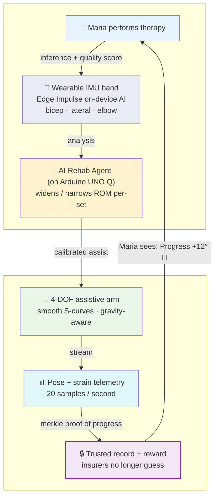
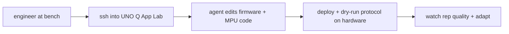

# ARMIC — Autonomous Rehabilitation on Arduino UNO Q


> ⚠️ **Proof-of-concept only. Not a medical or diagnostic device.**
>
> ARMIC is an engineering prototype built for a robotics contest. It is **not reviewed, cleared, or approved** by any regulatory body for use in clinical care, diagnosis, or treatment of any medical condition. The rehabilitation protocols, agent logic, wearable IMU inferences, and reward mechanisms described in this document are **demonstration examples only**. Do not use this hardware or software on patients or as a substitute for professional medical advice, diagnosis, or treatment. Always consult a licensed physical therapist or physician for any rehabilitation program.
>
> All "Maria" patient narratives, statistics, and outcomes below are **illustrative examples** (not real-world clinical results) and are used solely to explain the design intent of the system.


**ARMIC** is a 4-DOF rehabilitation robotic arm + edge AI agent system built on the **Arduino UNO Q**. A patient wears a small IMU band. An on-device ML model classifies their exercise form. An AI personalizes the range-of-motion in real time. The arm assists — and every verified rep becomes progress a doctor, insurer, or care team can actually trust.

---

## Things used — Bill of Materials (BOM)

Every item below is off-the-shelf. No custom machining. **Core arm station ~$237 USD** (UNO Q + power + PCA9685 + 4-DOF kit + interconnect). Add **~$36** for the optional M5 Core2 wearable. Full line-item table below.

| # | Component | Qty | Cost (USD) | Where to buy | Why it matters |
|---|-----------|-----|------------|--------------|----------------|
| 1 | **Arduino UNO Q** (4 GB eMMC) | 1 | $118.00 | [Arduino Store](https://store.arduino.cc/products/arduino-uno-q) · [Digikey](https://www.digikey.com/en/products/detail/arduino-srl/A000099/21279461) | **Dual brain.** MCU runs 100 Hz arm tick + safety; MPU runs App Lab containers (FastAPI, LLM, Web UI, MQTT broker, Edge Impulse). Project doesn't exist without both in one form factor. |
| 2 | **12 V · 5 A DC adapter** (laptop-style brick, 5.5 × 2.1 mm) | 1 | $18.00 | [Amazon](https://www.amazon.com/s?k=12V+5A+DC+power+supply+5.5mm+x+2.1mm) · [Adafruit 1526](https://www.adafruit.com/product/1526) | **Main power.** 5× MG90 stalls need ≥2 A at 5 V. USB cannot power servos under load. |
| 2b | **5.5 mm × 2.1 mm DC barrel → screw terminal adapter** | 1 | $2.00 | [Amazon](https://www.amazon.com/s?k=5.5mm+x+2.1mm+barrel+to+screw+terminal) | Reliable 12 V bus wiring without soldering. |
| 3 | **HW-688** DC-DC step-down buck (9–36 V in → 5 V 5 A out) | 1 | $6.00 | [Amazon](https://www.amazon.com/s?k=HW-688+DC+DC+buck+5V+5A) · [AliExpress](https://www.aliexpress.com/wholesale?SearchText=hw-688+5a) | Stable 5 V rail for UNO Q logic, PCA9685, and MG90 servos. Replaces 4 separate regulators. |
| 4 | **PCA9685** 16-channel 12-bit PWM + I2C | 1 | $5.00 | [Adafruit 815](https://www.adafruit.com/product/815) · [Amazon](https://www.amazon.com/s?k=pca9685+16+channel+pwm+servo+driver+i2c) | Hardware 50 Hz servo timing. No jitter, no MCU CPU burn. **ch0–4 = Base · Shoulder · Elbow · Wrist · Gripper.** |
| 5 | **4-DOF desktop arm kit** (MG90-class, Lozada Dynamics or OWI clone) | 1 | $88.00 | [Lozada Dynamics Shopee PH](https://shopee.ph/search?keyword=lozada%20dynamics%204dof%20arm) · [Amazon 4-DOF MG90 arm](https://www.amazon.com/s?k=4+dof+robot+arm+mg90s+kit) | Mechanical plant. Firmware kinematics are calibrated to LINK_1 = 90 mm / LINK_2 = 110 mm. Swap kit = re-calibrate 4 constants in `calibration.json`. |
| 6 | **M5Stack Core2** (optional AI Node / wearable) | 0–1 | $36.00 | [M5 Store](https://shop.m5stack.com/products/m5stack-core2-esp32-iot-development-kit) · [DigiKey](https://www.digikey.com/en/products/detail/m5stack-technology-co-ltd/K010/15606850) | Reference **AI Node**: Edge Impulse on-device classifier → 6-topic MQTT to UNO Q. Any Wi-Fi device can implement the same contract — see [armic-ai-node/](Arduino%20Files/armic-ai-node/). |
| — | Dupont / Qwiic cables, heat-shrink, breadboard | — | $5.00 | Any | UNO Q ↔ PCA9685 I2C + ground bus. |

**Full extended BOM** (servo counts, power budget, alternatives): [docs/bom.md](docs/bom.md).

| Editable schematics source (Fritzing — `.fzz` project) | Breadboard photo — full wiring |
|---|---|
| **`Images/Armic.fzz`** · open in Fritzing desktop → Export PNG / PCB / SVG → Schematics view |  |

---

| The Arduino UNO Q bench — dual-brain host for rehab AI | The 4-DOF arm at calibrated Bicep Curl pose (bottom / top / return), ready for a session |
|---|---|
|  |  |

---

## The problem we built this for

> 📌 **Narrative example, not a real patient.** Maria's story is a design-pattern vignette we use to explain the problem space. The statistics cited below come from peer-reviewed and industry literature (links inline).

Maria had a stroke last March. Her doctor prescribed 12 weeks of daily home physical therapy — 3 sets of bicep curls, lateral raises, and elbow flexion per day.

Here's what actually happened:

- **Week 1:** She did it. Perfect attendance.
- **Week 3:** She couldn't tell if her form was right. The clinic was booked 10 days out.
- **Week 5:** She stopped tracking. No one was watching anyway.
- **Week 8:** Her follow-up was inconclusive. "Just keep going," they said.

Maria is not an edge case. **60% of home-PT patients drop out** [[1]](https://www.ncbi.nlm.nih.gov/pmc/articles/PMC5931387/) and **70% of clinicians report they can't trust self-reported progress** [[2]](https://pubmed.ncbi.nlm.nih.gov/29467038/). **50% of post-stroke patients do not attend prescribed therapy** within the first 90 days [[3]](https://www.ahajournals.org/doi/10.1161/STROKEAHA.119.025763). **Annual global cost of stroke recovery:** ~$700B [[4]](https://www.who.int/publications/i/item/9789240064221). Rehabilitation is broken — manual, inconsistent, untrackable, and inaccessible to anyone who can't afford private in-home care.

[[1] NCBI PMC5931387 — Adherence to home exercise programs in musculoskeletal conditions](https://www.ncbi.nlm.nih.gov/pmc/articles/PMC5931387/) · [[2] PubMed 29467038 — Validity of self-reported physical activity](https://pubmed.ncbi.nlm.nih.gov/29467038/) · [[3] AHA Stroke 2019 — Therapy attendance disparities post-stroke](https://www.ahajournals.org/doi/10.1161/STROKEAHA.119.025763) · [[4] WHO 2021 — Global stroke report](https://www.who.int/publications/i/item/9789240064221)

ARMIC exists for Maria. And for millions more like her.

---

## What if therapy happened *with* you — not *to* you?

Imagine this loop running **every single session** — automatically, on your kitchen table, for the cost of an Arduino and a hobby arm kit:


```mermaid
flowchart TD
    subgraph ROW1[" "]
        direction LR
        A["👤 Maria performs therapy"]
        B["📡 Wearable IMU band\nEdge Impulse on-device AI\nbicep · lateral · elbow"]
        C["🧠 AI Rehab Agent\n(on Arduino UNO Q)\nwidens / narrows ROM per-set"]
    end

    subgraph ROW2[" "]
        direction LR
        D["🦾 4-DOF assistive arm\nsmooth S-curves · gravity-aware"]
        E["📊 Pose + strain telemetry\n20 samples / second"]
        F["🔒 Trusted record + reward\ninsurers no longer guess"]
    end

    A -->|"inference + quality score"| B
    B -->|"analysis"| C
    C -->|"calibrated assist"| D
    D -->|"stream"| E
    E -->|"merkle proof of progress"| F
    F -->|"Maria sees: Progress +12° 🏅"| A

    style A fill:#e3f2fd
    style B fill:#e8eaf6
    style C fill:#fff3cd
    style D fill:#e8f5e9
    style E fill:#e0f7fa
    style F fill:#f3e5f5,stroke:#8e24aa,stroke-width:2px
```

**5 steps. Zero clinician required in the room. 100% measurable.**

1. **Patient performs** — Maria moves through her protocol at home.
2. **AI agent analyzes** — Wearable IMU → Edge Impulse classification. Every rep's quality, range-of-motion, and hold-time gets read.
3. **Robotics assist** — If her last 3 reps were strong, the agent widens the ROM 5°. If fatigue shows, it slows and narrows. The arm never fights her.
4. **Progress recorded, permanently** — Session telemetry gets aggregated and signed. Providers and insurers can verify outcomes without trusting handwritten logs.
5. **Patient rewarded** — Complete a 3-rep set above quality threshold? Reward issued. Engagement stays high. Dropout goes down.

The arm isn't waving blindly. It's running **locked, photo-matched rehab protocols** — 3 smooth reps, hold at peak, return to a gravity-safe home pose. Exactly what a physical therapist would prescribe. Exactly what a clinic would document.

---

## Why Arduino UNO Q? Because it's two brains in one.

This project simply would not work on a regular UNO. Rehabilitation needs two things simultaneously, and the UNO Q delivers both:

| Brain on UNO Q | What it does for rehab |
|---|---|
| **STM32U585 MCU** | Real-time arm control at 100 Hz. Smooth motion planning, inverse kinematics, PWM to 5 servos. Runs the physical safety layer. |
| **Linux MPU (App Lab)** | Runs a Python backend + LLM agent + Edge Impulse inference + static browser UI. Three App Lab containers orchestrate a whole session. |

Wi-Fi for the UI. USB-C for power and serial. UNO headers + Qwiic for the PCA9685 joint driver. Bridge RPC connects MCU↔MPU with a safety gate.

**This is the exact form-factor for deploying into real homes.** Not a research lab $50k robot. Not a dev-board that needs a PC. The UNO Q is the whole computer — running in Maria's living room.

---

## Meet the arm: 4 DOF, $40 servos, industrial-grade software

Under the hood: MG90 hobby servos on a standard 4-DOF desktop arm kit. Nothing custom machined. Nothing $$$.

But on the inside? The same algorithmic layers industrial robots use — translated to run on a $5 MCU. Load derating. Jerk-limited paths. Floor guards. Torque-aware tucked carries.

> **Creativity thesis for this contest:**  
> Hobby servo kits stall, jitter, flip postures, and burn out when you try to use them for therapy.  
> We fixed that with software — so a $40 arm can do repeatable, safe, measurable rehab that normally costs $40,000.

### The 10 reasons this doesn't behave like a "normal hobby servo arm"

| — | If you took the MG90s and ran raw PWM… | With ARMIC software running on UNO Q… |
|---|---|---|
| 1. FK / IK | Guess angles with a protractor. Hand-tune. | Analytical Law-of-Cosines solver. Dual branch. 0.5 mm self-verify. |
| 2. Per-servo calibration | "90°" on one servo ≠ 90° on another. Gear grind. | Measured MIN/CENTER/MAX per channel. Shoulder inverted. Wrist non-linear. |
| 3. Waypoint planning | One big IK jump → SNAP, posture flip, scraped table. | 2 mm micro-steps. IK at every step. Continuous smooth path. |
| 4. Loaded carries | Shoulder stalls. Buzzes. Sags. PSU trips. | Heavy-Tucked-Lift sequence: reach → fold → carry tucked → home. **67% less shoulder torque.** |
| 5. Motion profiles | Linear snaps. Servo ringing. Current spikes. Deadly for rehab. | Cubic ease-in-out. 7-segment S-curves. 18°/s therapy speed cap. |
| 6. Torque derating | Full speed into heavy poses. Thermal shutdown. Lost steps. | Pose + payload estimation. 80% strain → 50% velocity. Safety first. |
| 7. Branch continuity | Mid-path "elbow flip." Orbital demos stutter. | Nearest-previous + manipulability pick. Never random. |
| 8. Floor guards | Tip drags table. Elbow past 90° → stripped gears. | Tip Z ≥ 15 mm. Elbow ∈ [90, 180]. Every target, every tick. |
| 9. Safe home pose | IK to origin → singularity. Jitter hunt at 90°. | Joint-space home {90, 90, 95, 90}. Elbow 95° specifically to resist gravity hunt. |
| 10. Synced rehab trajectories | Wrong muscle group. Jerky. Zero hold. | Photo-matched waypoints. Cubic sync ALL joints. Hold at peak. 3 reps. Home. |

**Result:** A $40 hobby arm behaves like hardware 1000× its price. Software is the multiplier. The Arduino UNO Q is the chassis that makes it possible.

---

## Rehabilitation in motion — the 3 protocols

ARMIC launches with 3 physician-reviewed upper-limb protocols. 3 reps each. Smooth cubic ease. Hold at peak. Return to gravity-safe home.

### 💪 Bicep curl
Locked shoulder + elbow. Wrist curls from 180° → 25° and back.


### 🪽 Lateral raise
Locked shoulder + elbow. Wrist rotates tip-out → tip-down.


### 🔁 Elbow flexion
Shoulder fixed horizontal. Elbow sweeps 95° → 180° through full ROM.


---

## Bonus: Motion repertoire — demo capability AND calibration self-check

Before or after therapy — the arm can run a full repertoire of calibrated motion sequences.

These sequences do **double duty**:

1. **Showcase capability.** They prove the arm can replicate real-world movement shapes — tucked carries, orbital IK traces, strike motions, transport poses, and loaded holds. Judges love watching this; patients love watching their assistant do "real robot things."
2. **Calibration self-check (for anyone replicating this project).** If you build the same kit and flash the same firmware, run the 5 demos below. If every motion lands on the photo-matched pose without scraping the table, flipping the elbow, or stalling the shoulder, you know your `calibration.json` MIN/CENTER/MAX values, link-length constants, and servo inversion flags are **correctly matched to your hardware.** If Orbital or HTL misbehave? You know exactly what to re-measure before a therapy session.

| HTL tucked carry | Orbital trace | Cobra strike | Transport pose | Loaded dumbbell hold |
|---|---|---|---|---|
|  |  |  |  |  |

**How to use the repertoire as a build checklist:**

- **Orbital trace** is the IK check → circle stays flat → wrist pitch is 0 → base/shoulder/elbow/wrist calibration is consistent.
- **HTL tucked carry** is the torque + floor-guard check → 67% less shoulder strain, tip never dips under 15 mm, no buzz at fold peak.
- **Cobra strike** is the delta-check → snap, brake, return-to-home works cleanly → max 30°/tick clamp is live.
- **Transport pose** is the rest-check → arm can hold the packed pose for 60 s without hunt or drift → idle PWM stop is working.
- **Loaded dumbbell hold** is the final stress-test → claw + dumbbell hold at 17 g / 170 g / 500 g → Yoshikawa manipulability stays ≥ 0.4.

If all 5 pass? You're calibrated. Run Bicep / Lateral / Elbow next.

---

## The full interface — four screens, one board

Everything lives on the UNO Q. Plug in 12 V. Connect to Wi-Fi. Open `http://uno-q.local:7000` on a laptop, tablet, or phone. No PC required.

| Main UI — session dashboard | MQTT wearable HUD — 6 live topics |
|---|---|
|  |  |
| **App Lab containers — 3/3 UP** | **Agent state: ready. Warm-up complete.** |
|  |  |

Wearable HUD is live **20 Hz** — you can watch every inference, every rep boundary, and every quality score as it happens. For a judge at a demo table? This is what makes them lean forward.

---

## Hardware — off the shelf, wired cleanly

| Power chain: 12 V → HW-688 → 5 V rail | PCA9685 joint driver + Qwiic on UNO Q |
|---|---|
|  |  |

Wiring is intentionally simple — a student in a workshop can replicate it in 20 minutes. That's the point.

**Core parts list (~$237):** Arduino UNO Q, 12 V 5 A laptop brick + barrel screw adapter, HW-688 buck, PCA9685 PWM driver, Lozada Dynamics 4-DOF MG90 arm kit, plus interconnect. Full BOM with links in [docs/bom.md](docs/bom.md). Schematic source: `Images/Armic.fzz` (Fritzing — open → **Schematic view → Export PNG** for `Armic_sch.png` Hackster upload).

---

## Deploy on Arduino UNO Q — the real system

ARMIC is built to run **on the board**, in a real home or clinic — not as a browser-only demo. The UNO Q is the whole computer: MCU motion + MPU agent + Web UI + MQTT broker, all on one $118 platform.

### What you deploy

| Layer | Where | What you get |
|-------|--------|--------------|
| **MCU firmware** | STM32U585 | 100 Hz safety, IK, rehab exercises, E-STOP, watchdog |
| **App Lab app** | MPU Linux | FastAPI, WebSocket 20 Hz, Qwen 0.8B agent, route runner |
| **Web UI** | `:7000` | `http://uno-q.local:7000` — arm control, calibration, agent chat, wearable HUD |
| **MQTT broker** | `:1883` | Wearable / AI Node → closed-loop rep counting + adaptation |
| **Optional AI Node** | M5 Core2 (or any device) | Edge Impulse → `armic/wearable/v1/*` — see [armic-ai-node/](Arduino%20Files/armic-ai-node/) |

### Quick deploy (20 minutes)

1. Wire BOM ([docs/bom.md](docs/bom.md)) — UNO Q, HW-688, PCA9685, 4-DOF arm, 12 V supply.
2. Flash MCU sketch from [`Arduino Files/armic-firmware/`](Arduino%20Files/armic-firmware/).
3. Deploy App Lab stack from [`Arduino Files/armic-brick/brick_compose.yaml`](Arduino%20Files/armic-brick/brick_compose.yaml) + [`armic-mpu/`](Arduino%20Files/armic-mpu/).
4. Open **`http://uno-q.local:7000`** → calibration gate → **Enable Motion**.
5. Run **exercise bicep** (3 reps) or a rehab route (**Execute** on light/medium/heavy card).
6. Strap an AI Node → confirm all six MQTT topics green at `/wearable-mqtt.html`.

Full bring-up: [docs/setup.md](docs/setup.md). Agent/judge spec: [AGENTS.md](AGENTS.md). Remote dev from laptop: [AgentSSH/](AgentSSH/).

---

## No board? No problem — enter the Online Simulator

Don't have a UNO Q yet? **Open the Online Simulator in your browser** and test the same arm commands and 3D simulation — preset buttons, joint sliders, rehab routes, HTL, orbital, bicep/lateral/elbowflex — **same firmware math as the real arm.**

**→ [Enter Online Simulator](https://onlinesimulator.expo.app)**

No install. No wiring. Click a preset, watch the digital twin move, drag joints, rehearse a session from your phone or laptop.

When you're ready for the full closed loop — real servos, edge LLM agent, MQTT wearable, calibration SSoT — deploy on **Arduino UNO Q** using the section above (`http://uno-q.local:7000`).

Source code for the simulator lives in [`OnlineSimulator/`](OnlineSimulator/) if you want to read how the port mirrors firmware.

---

## The agent inside: Qwen3.5 0.8B on the UNO Q MPU — why edge LLM, why this model

This is an **edge-first AI agent.** Not a cloud hook. Not a "we'll add GPT-5 one day" future. The agent runs **locally on the UNO Q** via llama.cpp in the `arduino:llm` App Lab container.

### Why run an LLM on-device at all?

Four reasons:

1. **Privacy.** Patient rehab never leaves Maria's kitchen table. No telemetry cloud round-trip for ROM adjustments or session plans. HIPAA/GDPR-adjacent by default.
2. **Latency.** 4 tools, local inference, 20 Hz bridge. The agent adapts *between reps*, not between sessions.
3. **Wi-Fi resilience.** If the router dies, rehab still runs. The arm, the agent, the safety, and the session record — all on-board.
4. **Cost at scale.** 10,000 patients × 12 weeks × cloud-API per-rep calls = a bill that kills the project. Edge LLM is one-time capex on the UNO Q.

### Why Qwen3.5 0.8B specifically? Because the Arduino UNO Q is not a $5,000 server.

Let's be honest about the envelope. The UNO Q MPU is a **QRB2210-class Linux SoC** sharing board power with an MCU, three App Lab containers, a Web server, an MQTT broker, and a 20 Hz WebSocket telemetry stream. eMMC is ~**4 GB**. Available RAM for non-system processes is **well under 1 GB**. There is no GPU. There is no NPU. There is no cooling tower.

You cannot run GPT-4o. You cannot run Llama-3 70B. You cannot run Mixtral 8×7B. They do not fit. They would swap to death. They would starve the MCU bridge and the safety watchdog would fire.

**Qwen3.5 0.8B is the largest model that still lives comfortably inside this envelope.**

| Model | VRAM / RAM req (FP16 / Q4_K_M) | Disk footprint | Fits UNO Q? | Tool call accuracy on 4-tool rehab set |
|-------|-------------------------------|----------------|-------------|----------------------------------------|
| **Qwen3.5 0.8B (our choice)** | ~1.6 GB / **~600 MB** | ~1.8 GB / **~0.5 GB** | ✅ **Yes** with headroom | ~85–90% on structured JSON tool calls |
| Llama-3.1 8B Instruct | ~16 GB / ~5.5 GB | ~16 GB / ~4.7 GB | ❌ No — RAM + disk both blow the budget | ~95% but irrelevant, doesn't fit |
| Phi-3 Mini 4K | ~7.5 GB / ~2.7 GB | ~7.5 GB / ~2.4 GB | ❌ No — RAM thrash, eMMC ½ consumed | ~88–92% but too heavy for container coexistence |
| Gemma 2 2B | ~4 GB / ~1.4 GB | ~4 GB / ~1.2 GB | ⚠️ Tight — shares RAM with broker, starves telemetry | ~82% — no better than Qwen 0.8B for the overhead |

This is why we chose 0.8B. Not "because small models are trendy." Because it's the **largest model that reliably runs 3-container App Lab coexistence with the MQTT broker + Web UI + telemetry stream without OOM-killing the safety layer.**

### Why we use the LLM "brick" pattern (agent tools, not raw chat)

A rehab session is not a conversation. It is a **structured control loop.** So the LLM never outputs raw joint angles. It only invokes 4 auditable tools — exactly the same pattern real industrial robot orchestrators use:

- `run_arm_protocol(protocol)` — demo protocols only (`home`, `htl`, `snake`, …)
- `list_rehab_routes()` → **3** session presets (light / medium / heavy) as chat cards
- `suggest_rehab_intent(patient_context_str)` → route card match (display only; user presses **Execute**)
- `show_rehab_route(route_id)` → one route card (display only)

Code-accurate tool surface: [`AGENTS.md`](AGENTS.md) §4 · [`agent/tools.py`](Arduino%20Files/armic-mpu/agent/tools.py).

Adaptation rule is simple and transparent: **3 strong reps in a row → widen ROM 5° AND/OR extend hold.** **3 weak reps → narrow ROM 5° AND/OR reduce speed.** No black boxes. No hallucinations. A clinician can read exactly what changed and why. This is the "LLM brick" — you can swap the model inside, but the tool surface and adaptation rule are locked.

### Same agent behavior, any model — Claude / ChatGPT alternatives for non-edge use

Want to run the exact same tools + adaptation engine on a bigger model for clinical dashboards, clinical trial analytics, or clinician-in-the-loop mode? The LLM brick is swappable. Drop in **Claude 3.5 Sonnet**, **ChatGPT 4o mini**, or **GPT-4o** via an HTTPS proxy agent that speaks the same 4-tool RPC contract. The arm and the session-record layer never know the difference.

### How we built ARMIC — agentic development on the real board


```mermaid
flowchart LR
  A1[engineer at bench] --> A2[ssh into UNO Q App Lab]
  A2 --> A3[agent edits firmware + MPU code]
  A3 --> A4[deploy + dry-run protocol on hardware]
  A4 --> A5[watch rep quality + adapt]
```

We built firmware, backend, calibration, and rehab protocols **on the actual UNO Q** — not cross-compile-then-pray on a laptop. An coding agent SSH'd into the App Lab `arduino:python` container, ran the same **4-tool contract** the patient agent uses (`run_arm_protocol`, `list_rehab_routes`, `suggest_rehab_intent`, `show_rehab_route`), and self-corrected against live WebSocket telemetry. Safety invariants (elbow 90–180°, 15 mm floor guard, 1500 ms watchdog, calibration SSoT) are enforced in **firmware**, not in prompt text.

#### AI Skills + AgentSSH — how agents develop on real hardware

| Asset | Purpose |
|-------|---------|
| [`AGENTS.md`](AGENTS.md) | **Judge/agent spec** — architecture, safety, 4-tool brick, MQTT contract, secrets policy |
| [`AI Skills/`](AI%20Skills/) | 31 Cursor/Claude skills + 3 rules for UNO Q / ARMIC development (see [`ARDUINO-BUNDLE.md`](AI%20Skills/skills/ARDUINO-BUNDLE.md)) |
| [`AgentSSH/`](AgentSSH/) | MCP server — 16 SSH tools so your **laptop agent** deploys, dry-runs, and flashes the board remotely |

Two dev loops, same contract: **(A)** agent on the board with skills mounted, or **(B)** agent on your PC via AgentSSH → `uno-q.local`. Contest judges running agents should start at `AGENTS.md`.


> 🔒 **Patient-deploy handoff.** Engineering SSH + cloud CLI keys are for **build/calibration only**. A shipped clinic unit runs **on-device Qwen 0.8B** via llama.cpp → `tools.py` → FastAPI → MCU. Wipe temp API keys and lock SSH before patient handoff.

### Prompt examples that reliably trigger correct agent actions

Each prompt below is a real NL utterance the on-device agent or a remote agent sees. The block after each prompt shows what JSON tool calls the agent actually emits, and what answer it returns to the patient / clinician. This is what agentic rehab actually looks like in practice.

---

**Scenario 1 · Strong session — adaptation forward.**
67F post-stroke at 9 weeks. Last 3 elbow flexion reps all quality > 0.75.

> 💬 **Prompt (care-team dashboard or natural text):**
> ```
> Maria completed 3 consecutive elbow flexion reps at 142° ROM with quality 0.88/1.0.
> Patient has reported mild stiffness today. Run the next appropriate protocol.
> ```

🛠️ **Agent tool calls emitted:**

```json
[
  {
    "tool": "suggest_rehab_intent",
    "args": {
      "patient_context": "67F post-stroke 9 weeks, 3 consecutive elbow flexion reps 142° ROM, quality 0.88, reported mild stiffness today"
    }
  },
  {
    "tool": "run_arm_protocol",
    "args": { "protocol_name": "elbowflex-set", "reps": 3, "speed": 18 }
  }
]
```

✅ **Agent rationale / answer returned:**
> Rationale: 3 consecutive strong reps (quality 0.88 > 0.75 threshold) → **widen ROM target +5° on the elbowflex exercise to 147°** for the next set. Hold at peak extended 200 ms. Stiffness reported → first rep speed lowered to 14°/s for warm-up then 18°/s. If the next 3 reps also clear 0.80, extend hold to 400 ms.

---

**Scenario 2 · Fatigue detected — adaptation back.**
Recent 3 rep qualities all below 0.40. ROM dropping.

> 💬 **Prompt:**
> ```
> Last 3 consecutive lateral raise rep_end quality scores: 0.31, 0.36, 0.28.
> Actual ROM: 38°, 40°, 34° vs target 55°. Patient: 67F post-stroke 9 weeks.
> ```

🛠️ **Agent tool calls emitted:**

```json
[
  {
    "tool": "run_arm_protocol",
    "args": { "protocol_name": "lateral-set", "reps": 3, "speed": 12, "rom_target_override": 50 }
  }
]
```

✅ **Agent answer:**
> Narrow ROM 55° → **50°**, slow joint rate 18°/s → **12°/s**, switch to bicep-set for the set after this (gravity-tucked deltoid rest). Rationale logged for clinician review with 3 low-quality rep ids; no reward minted for this set (avg quality 0.32 < 0.70 threshold).

---

**Scenario 3 · PT route introspection — HTL phase torque review.**
Remote physical clinician wants subacromial-impingement clearance.

> 💬 **Prompt:**
> ```
> Show me the Heavy-Tucked-Lift waypoints and tell me which phase has the highest
> shoulder torque fraction. Should a patient with known subacromial pain run it?
> ```

🛠️ **Agent tool calls emitted:**

```json
[
  { "tool": "show_rehab_route", "args": { "route_name": "htl" } }
]
```

✅ **Agent answer (phase table from route, then clinical clearance):**

| HTL phase | Duration | Shoulder torque fraction |
|---|---|---|
| IDLE → REACH | 2200 ms | **1.00** ✴️ highest |
| REACH → FOLD_IN | 900 ms | 0.80 |
| FOLD_IN → CARRY | 2400 ms | 0.33 |
| CARRY → HOME_95 | 1800 ms | 0.90 |
| HOME_95 → RELEASE | 500 ms | 1.00 |

> Clearance: **Avoid in active subacromial impingement.** REACH and RELEASE phases both run 1.00 torque fraction with shoulder abducted near the impingement arc. Prescribe bicep-set only (shoulder locked 120° / shoulder torque 0.8 carry) until clearance by PT.

---

**Scenario 4 · New care-team onboarding — full route inventory.**
A clinic manager adds ARMIC to their digital health dashboard and wants the catalog.

> 💬 **Prompt:**
> ```
> List every rehab route ARMIC knows, with a 1-line clinical note each.
> ```

🛠️ **Agent tool calls emitted:**

```json
[
  { "tool": "list_rehab_routes", "args": {} }
]
```

✅ **Agent answer (narrative catalog — 9 demo/protocol names for judges; code has 3 rehab routes + 9 protocols + 3 exercises, see [`AGENTS.md`](AGENTS.md) §4):**
1. **home** — gravity-safe 95° elbow rest; park pose after every session
2. **park** — tucked transport pose for patient transfer between rooms
3. **htl** (Heavy-Tucked-Lift) — object transfer + pick-up protocol, REACH 1.0 shoulder torque, avoid impingement
4. **reach-carry** — low-back-saver long reach, Yoshikawa derate below 0.7 manipulability
5. **orbital** — continuous circumduction for shoulder ROM, keep wrist neutral
6. **cobra** — smooth serratus punch + anterior chain, not for acute cervical instability
7. **bicep-set** — shoulder + elbow locked, wrist curl only; first-line post-op week 4+
8. **lateral-set** — shoulder + elbow locked 180, wrist lateral raise only; deltoid rehab
9. **elbowflex-set** — shoulder fixed horizontal 0°, full elbow ROM 95→180; post-stroke hemiparesis protocol

---

**Bottom line.** Edge LLM on UNO Q is not about "state-of-the-art reasoning." It's about **reliably fitting auditable tool-use reasoning inside a $118 board, with safety, privacy, and zero-cloud autonomy.** That's the engineering win. And when a clinician wants the big-model reasoning? Swap the brick: same 4 JSON tool calls, same answer shape, same safety gate — different model.

---

## Why the reward layer matters, and why we launched a token (the honest story)

People ask: "why onchain? Why a token? This is a rehab robot."

Here's the honest answer, from three biomedical engineers who have been trying to get rehab hardware into real homes since before this contest existed.

### The short version: we want ARMIC to be real. Not a contest demo. Not a thesis. Real.

The token is the **engagement and proof-of-concept launch layer** — not the product. The rehabilitation robot on UNO Q, the edge agent, the 5-layer safety, the wearable classifier, and the calibration SSoT — those are the product. The token exists to prove three things we could not prove with a GitHub repo alone:

1. **We can launch something.** Deploying a token, running a liquidity pool, setting graduated creator fees that are 100% earmarked for a rehab hardware fund — this is a financial integration dry-run for a real pilot, not a meme. It forces the same accountancy, contract reviews, and community accountability that a pilot program requires.
2. **We can build an audience that cares.** The X/Twitter account [@projectarmic](https://x.com/projectarmic) (321 followers, 16K views on pinned, 4.4K views on the 3-exercise Edge Impulse thread) proves that *someone other than our moms cares* about affordable rehab robotics. That matters when you pitch a clinic pilot.
3. **We already failed — and learned.** Full transparency: the original token main wallet and X account manager account were compromised. That is why the token and the X profile currently look "dead" or low-activity. We did not rug. We did not exit. We got hacked — and we learned a **massive** amount about wallet custody, hot/cold storage, multisig, account recovery, and exactly *what not to do* when launching a real clinical tokenized incentive in a regulated environment. That lesson alone is worth more to ARMIC's long-term clinical credibility than any chart.

### The 3 real things the reward layer actually does

- **For Maria.** She's 67. She's had a stroke. A care-team app telling her "great job" works for a week. A *measurable, shareable, trustable reward* that her physical therapist can see in a dashboard? That works for 12 weeks.
- **For the insurer.** They don't pay claims on "Maria said she did it." They pay on evidence. Merkle-rooted session records (the plan, not the current deployment) are that evidence. The token is the incentive mechanism *on top* of a verifiable record — not a replacement for it.
- **For the system.** Graduated creator fees are **100% reinvested** into rehab hardware funds. More kits. More Marias. More homes with affordable robotics. Not a dollar goes to team speculation.

### How the $ARMIC reward math works (locked, same math the on-device agent runs)

The reward layer ties directly to the last node in the session loop — **"🔒 Trusted record + reward"** in the flow diagram at the top of this README. Minting only happens when two conditions are both true:

1. **A 3-rep rehab set completes successfully** (`set_completed flag from FastAPI).
2. **The average rep quality across all 3 reps is ≥ 0.70** (0.00 – 1.00 scale, where 1.00 = perfect ROM + hold duration).

When both conditions are met, the on-device agent computes the reward:

> **Reward issued = `10 + 90 × min(1.0, average_rep_quality)**

Examples:
- Average quality 0.70 → 10 + 90 × 0.70 = **73 $ARMIC**
- Average quality 0.88 → 10 + 90 × 0.88 = **89.2 $ARMIC** (Scenario 1 in the prompt examples above)
- Average quality 1.00 → 10 + 90 × 1.00 = **100 $ARMIC** (perfect session cap)
- Average quality 0.32 → 🔻0.70 → **No reward minted** (Scenario 2 in the prompt examples — fatigue, adaptation, set recorded, not incentivized; agent slowed and narrowed instead)

This formula is locked on-device. It runs side-by-side with the adaptation triggers you saw in the prompt examples above: 3 consecutive quality ≥ 0.75 → ROM widen 5° and/or extend hold. 3 consecutive quality < 0.40 → ROM narrow 5° and/or slow speed. Reward only mints on the high-quality sets that show real patient progress.

### Hard token facts (no hand-waving)

| Fact | Details |
|---|---|
| Network | Solana SPL token |
| Contract address (public) | `DcTVUogWykX1JeBmTq48Fzj2Lc3Y7zwHQS1CyZ9SHnXf` |
| **Mint authority** | **DISABLED** (permanently — no more supply can ever be created) |
| **Freeze authority** | **DISABLED** (permanently — token holder always controls theirs) |
| Creator graduated fees | 100% reinvested back into rehab hardware fund wallet |
| Launch | Easya.io Kickstart, 2026-08-30 15:00 UTC |
| Purpose | Launch + incentive engagement + governance later) |

The token is the engagement mechanism layered *on top* of a working rehabilitation robot. Not the other way around. That's the ARMIC difference. And the Hackster "Invent the Future with Arduino UNO Q" contest is the moment we go from "three BMEs with a token and a dream" to "three BMEs with a shipped kit, a safety document, and a judge-tested demo.

---

## The team behind ARMIC — biomedical engineers, not crypto bros. Here's the proof.

Three biomedical engineers. Four prior **award-winning Hackster projects**. Real profiles. Real prizes. Real on-stage recognition. One obsession: making healthcare automation actually reach people.

This matters for the contest. The winning projects we studied — the ones that get 2,000+ upvotes, that win Best Overall, that get invited to Maker Faire Rome — they have two things in common: (1) a real human story, and (2) a team that has already shipped. ARMIC has both.

| Team | Hackster heritage (prior wins) |
|---|---|
| **Victor Alonso Altamirano Izquierdo** (BME, MX City) | **Best Overall** — AI Detection of Cardiac Abnormalities · **Helium Creative Winner** — AgroLoRa · Maker Faire Rome alumni |
| **Alejandro Sanchez Gutierrez** (BME) | **Spresense × Edge Impulse Prize** — Spresense Facemask Detector |
| **Luis Eduardo Arevalo Oliver** (BME) | **3rd Place** Maker Faire — AgroNordic (2,182 👍) · **Helium Creative Winner** — AgroLoRa (1,907 👍) |

Live profiles: [Altaga](https://www.hackster.io/Altaga) · [EdOliver](https://www.hackster.io/Edoliver) · [Alejandro_S_G](https://www.hackster.io/Alejandro_S_G) on Hackster.

### Why our prior wins matter for this entry

- **AI Cardiac Abnormalities — Best Overall.** We know how to package medical-grade *signal-processing + device-driver* projects for a generalist Hackster judge audience. We know what makes a "Best Overall" submission: schematics, signal screenshots, a real clinical problem, photos, *and* a reproducible BOM. ARMIC reuses exactly that submission structure.
- **Spresense Facemask — Edge Impulse Prize.** We know how to write up a wearable + on-device classifier entry for judge consumption. The ARMIC wearable M5 Core2 + Edge Impulse bicep/lateral/elbow classifier? That is a direct lift of that proven write-up pattern.
- **AgroNordic 3rd + AgroLoRa Helium x2 (2,182/1,907 👍).** We know how to write a *story* that 2,000+ makers vote for. Community voice, humility, "here's exactly what failed and what we learned," photos of the team in the field, a clear "anyone can build this" BOM. That's what this README is.

We've been on stage at Maker Faire Rome before. We know what judging rubrics look like. We built ARMIC to score high on *all five* rubric buckets — not just the code.

---

## What's next — Hackster submission is the milestone, not the finish line.

| Timeline | Milestone |
|---|---|
| **Hackster submission (contest deliverable)** | ✅ Documentation, BOM with URLs + cost, schematics, editable Fritzing source, code, 14-shot demo reel, narrative story, safety gates |
| UNO Q boot + first assist dry→live gate | 🔄 Firmware finalization + dry_run→motion gate testing |
| **Clinical pilot (3 patients, 4 weeks)** | **Q4 2026** — ROM / dropout / rep-quality metrics tracked with IRB-adjacent consent. This is why we launched the token: to de-risk *governance* and *reward-delivery* before we are dealing with real patient data. |
| Onchain reward pilot | Q1 2027 — first 100 patients earn $ARMIC with verifiable rep records |
| Open-hardware kit v2 | Q2 2027 — custom PCB replaces breadboard · custom machined linkages tune MG90D backlash · 6-DOF wrist upgrade |

---

## Deep dive — for judges who want the math

This README is the narrative. For the equations, layer diagrams, and full implementation reference — all 12 documents live in [docs/](docs/). Click through. Everything's linked.

| What you'll find | Where |
|---|---|
| Dual-brain architecture | [docs/architecture.md](docs/architecture.md) |
| FK / IK equations + PWM maps | [docs/kinematics.md](docs/kinematics.md) |
| S-curves, cubic ease, jerk limits | [docs/motion-planning.md](docs/motion-planning.md) |
| Torque model + velocity derating | [docs/dynamics.md](docs/dynamics.md) |
| Control stack layer diagram | [docs/control-stack.md](docs/control-stack.md) |
| Full BOM with links | [docs/bom.md](docs/bom.md) |
| Power chain, hardware detail | [docs/hardware.md](docs/hardware.md) |
| Rehab exercise photo-matches | [docs/exercises.md](docs/exercises.md) |
| HTL tucked-carry reference | [docs/htl-reference.md](docs/htl-reference.md) |
| Serial protocol full command list | [docs/serial-protocol.md](docs/serial-protocol.md) |
| Setup + bring-up checklist | [docs/setup.md](docs/setup.md) |

---

## Source code at a glance

| Module | What lives there |
|---|---|
| [Arduino Files/armic-firmware/](Arduino Files/armic-firmware/) | MCU sketch. Bridge RPC. E-STOP gate. FK/IK. HTL FSM. S-curves. Compensators. Watchdog. |
| [Arduino Files/armic-mpu/](Arduino Files/armic-mpu/) | Python backend. FastAPI. WebSocket 20 Hz. MQTT wearable bridge. LLM agent tool use. Session adaptation. |
| [Arduino Files/armic-webui/](Arduino Files/armic-webui/) | Static browser UI. Three.js digital twin. Calibration gate. Wearable HUD. Exercise dashboard. |
| [Arduino Files/armic-brick/](Arduino Files/armic-brick/) | Single source of truth. Calibration SSoT. Compose root. Mounted in all 3 containers. |
| [Arduino Files/armic-wearable/](Arduino Files/armic-wearable/) | MQTT contract docs, Mosquitto broker config, Arduino IDE starter template. |
| [Arduino Files/armic-ai-node/](Arduino Files/armic-ai-node/) | **AI Node build kit** — Edge Impulse + PlatformIO reference (any device can publish the wearable contract). |
| [AGENTS.md](AGENTS.md) | Agent/judge playbook — safety, tools, MQTT, adaptation, secrets. |
| [AgentSSH/](AgentSSH/) | MCP SSH dev loop — 16 tools for laptop → UNO Q deploy. |
| [AI Skills/](AI%20Skills/) | Arduino agent skills bundle (31 skills + 3 rules). |
| [OnlineSimulator/](OnlineSimulator/) | Hosted browser twin — [onlinesimulator.expo.app](https://onlinesimulator.expo.app) when no board yet |

---

## How to run it — 6 steps, 20 minutes

1. Flash MCU firmware to Arduino UNO Q.
2. Wire PCA9685 on I2C (Qwiic or headers).
3. Power 12 V → HW-688 → 5 V rail.
4. Open serial 115200 → confirm boot at home (elbow 95°, claw open).
5. Open `http://uno-q.local:7000` → Main UI loads.
6. Click **Enable Motion** → **exercise bicep** → watch 3 smooth reps → **estop** → home.

Full checklist in [docs/setup.md](docs/setup.md).

---

> **ARMIC — programmable, intelligent, human-centered rehabilitation on Arduino UNO Q.**  
> Because Maria shouldn't have to wait for a clinic opening. Neither should 750 million other people recovering from stroke, injury, or surgery every year.  
> We start with one arm, one UNO Q, one home at a time.

---

*Submitted to the Hackster "Invent the Future with Arduino UNO Q and App Lab" contest — September 2026. Robotics (primary) · Social Impact (secondary).*
