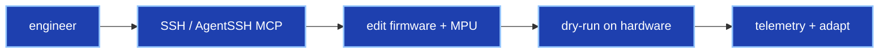

# Edge LLM agent

The rehab agent runs **on the UNO Q MPU** via llama.cpp in the `arduino:llm` App Lab container — not a cloud-only chatbot.

## Why on-device

| Reason | Benefit |
|--------|---------|
| Privacy | Session data stays local |
| Latency | Adapts between reps, not between visits |
| Resilience | Arm + safety run if Wi-Fi drops |
| Cost | No per-rep API bill at scale |

## Model: Qwen3.5 0.8B

The UNO Q MPU (~4 GB eMMC, well under 1 GB free RAM for apps) cannot host multi‑billion‑parameter models. **Qwen3.5 0.8B (~600 MB Q4)** fits alongside FastAPI, MQTT broker, and Web UI without OOM-killing the bridge.

| Model | Fits UNO Q? | Notes |
|-------|-------------|-------|
| **Qwen3.5 0.8B** | ✅ | Our default — ~85–90% structured tool accuracy |
| Llama-3.1 8B | ❌ | RAM + disk |
| Phi-3 Mini | ❌ | Container coexistence |
| Gemma 2 2B | ⚠️ | Tight — starves telemetry |

Cloud swap: same 4-tool contract via HTTPS proxy (Claude, GPT-4o mini, etc.) — arm and safety unchanged.

## 4-tool brick (code-accurate)

The LLM **never outputs raw joint angles**. It only calls:

| Tool | Purpose |
|------|---------|
| `run_arm_protocol(protocol)` | Demo protocols only — `home`, `htl`, `snake`, … |
| `list_rehab_routes()` | **3** session presets (light / medium / heavy) as cards |
| `suggest_rehab_intent(description)` | Match route card — **display only** |
| `show_rehab_route(route_id)` | One route card — **display only** |

**Rehab motion starts only when the user presses Execute** on a route card — not from chat alone.

Authoritative spec: [AGENTS.md](../AGENTS.md) §4 · implementation [`agent/tools.py`](../Arduino%20Files/armic-mpu/agent/tools.py).

## Adaptation rules

| Condition | Action |
|-----------|--------|
| 3 consecutive rep quality ≥ 0.75 | Widen ROM +5° |
| 3 consecutive rep quality < 0.40 | Narrow ROM −5°, reduce speed −2°/s |
| Mid band | Hold ROM/speed |

## Agent development



| Asset | Role |
|-------|------|
| [AGENTS.md](../AGENTS.md) | Judge/agent playbook |
| [AI Skills/](../AI%20Skills/) | 31 skills + 3 rules |
| [AgentSSH/](../AgentSSH/) | MCP — 16 SSH tools → `uno-q.local` |

Bench bring-up clip (local): `Images/0.5claude.mp4`.

> **Patient handoff:** Wipe engineering SSH keys and temp API credentials before clinical deployment. Shipped units use on-device Qwen → `tools.py` → FastAPI → MCU.

---

## Prompt examples

Each scenario shows typical NL input and the tool calls the agent should emit. Tool params in examples may include engineering extras; **trust `tools.py` for production**.

### Scenario 1 — Strong session (adapt forward)

> Maria completed 3 consecutive elbow flexion reps at 142° ROM with quality 0.88. Mild stiffness reported.

```json
[
  { "tool": "suggest_rehab_intent", "args": { "description": "…" } },
  { "tool": "run_arm_protocol", "args": { "protocol": "home" } }
]
```

Rationale: widen ROM +5° on next set; warm-up speed reduction if stiffness noted.

### Scenario 2 — Fatigue (adapt back)

> Last 3 lateral raise qualities: 0.31, 0.36, 0.28. ROM below target.

Agent narrows ROM, reduces speed, logs for clinician — **no reward** if avg quality < 0.70.

### Scenario 3 — Clinician introspection (HTL torque)

> Show HTL phases and highest shoulder torque fraction.

```json
[{ "tool": "show_rehab_route", "args": { "route_id": "heavy" } }]
```

Use route cards + [htl-reference.md](htl-reference.md) for phase tables. Avoid HTL REACH/RELEASE at 1.0 shoulder fraction in active subacromial impingement.

### Scenario 4 — Route catalog

```json
[{ "tool": "list_rehab_routes", "args": {} }]
```

Returns **3 rehab routes** (light / medium / heavy). Do not conflate with 9 demo protocols or 3 single exercises — see [AGENTS.md](../AGENTS.md) §4.
