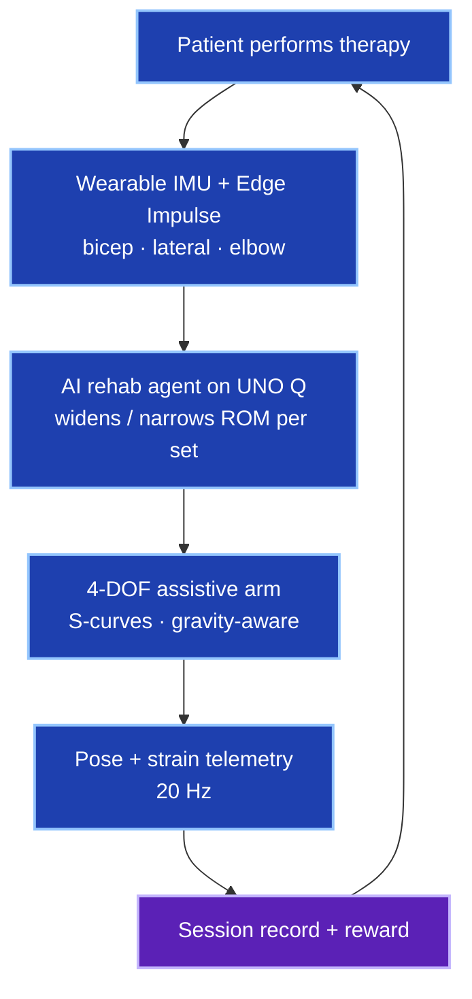

# Overview — problem, vision, and session loop

> Illustrative patient narratives in this doc are **design examples**, not real clinical outcomes.

## The problem

Home physical therapy often fails on three axes: **adherence**, **form feedback**, and **trustworthy progress records**. ARMIC targets that gap with a closed loop: wearable sensing → on-device agent → assistive arm → signed session telemetry.

## Session loop

1. **Patient performs** — prescribed upper-limb protocol at home.
2. **Wearable classifies** — rep quality, ROM, hold time from on-device ML.
3. **Agent adapts** — 3 strong reps → widen ROM 5°; 3 weak reps → narrow and slow.
4. **Arm assists** — firmware runs photo-matched trajectories; safety on MCU.
5. **Progress recorded** — telemetry for care teams; optional token reward on quality threshold.

## Why Arduino UNO Q

| Brain | Role |
|-------|------|
| **STM32U585 MCU** | 100 Hz motion, IK, PWM, E-STOP, watchdog |
| **Linux MPU (App Lab)** | FastAPI, LLM agent, Web UI, MQTT, Edge Impulse |

One board runs the whole station — no tethered PC for daily sessions.

## Software vs hobby hardware

Hobby MG90 arms stall and jitter under load. ARMIC adds industrial-style layers on a $40 kit: FK/IK, micro-step planning, S-curves, torque derating, floor guards, branch continuity, and gravity-safe home (elbow **95°**, not 90°).

Full comparison table: [demos-and-exercises.md](demos-and-exercises.md#why-this-is-not-a-raw-servo-arm).

## Next

- [demos-and-exercises.md](demos-and-exercises.md) — rehab GIFs and demo repertoire
- [architecture.md](architecture.md) — dual-brain detail
- [setup.md](setup.md) — deploy on hardware
